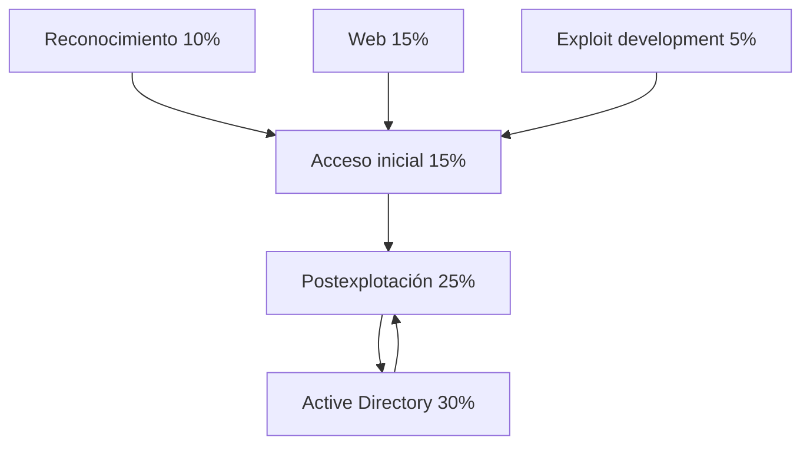

# Mapa del examen

Los porcentajes siguientes proceden de los objetivos oficiales vigentes de INE. Deben usarse para priorizar, no para ignorar bloques: una cadena puede comenzar en web, continuar en Linux y terminar en Active Directory.

| Dominio | Peso | Debes poder hacer |
|---|---:|---|
| Information Gathering & Reconnaissance | 10 % | Descubrir hosts, puertos y servicios; enumerar lo relevante |
| Initial Access | 15 % | Enumerar usuarios; spraying; fuerza bruta controlada; abusar de servicios remotos |
| Web Application Penetration Testing | 15 % | Enumerar aplicaciones; explotar fallos comunes; extraer datos y credenciales |
| Exploitation & Post-Exploitation | 25 % | Explotar servicios; escalar; localizar, volcar y romper credenciales |
| Exploit Development | 5 % | Leer y adaptar exploits; comprender corrupción de memoria básica |
| Active Directory Penetration Testing | 30 % | Enumerar AD; AS-REP; PTH/PTT; movimiento lateral; alcanzar Domain Admin |

## Dependencias entre dominios

AD y postexplotación forman el núcleo. AD proporciona relaciones entre identidades y equipos; la postexplotación proporciona credenciales y privilegios para aprovecharlas.

## Prioridad de preparación

| Prioridad | Contenido | Motivo |
|---|---|---|
| 1 | AD, Kerberos, NTLM, BloodHound | Mayor peso y mayor salto desde eJPT |
| 2 | PrivEsc, credenciales y movimiento lateral | Convierte una entrada pequeña en control real |
| 3 | Enumeración metódica | Reduce los bloqueos en todos los dominios |
| 4 | Web orientada a foothold | Frecuente fuente de acceso y secretos |
| 5 | Exploit modification y buffer overflow | Menor peso, pero no se puede dejar a cero |

## Qué no significa el porcentaje

Un 5 % en exploit development no significa «memorizar un buffer overflow y olvidarlo». Significa poder reconocer las partes de un exploit, adaptar IP, puerto, offsets, arquitectura, payload y restricciones. Del mismo modo, el 10 % de reconocimiento alimenta prácticamente el 100 % de las decisiones posteriores.

