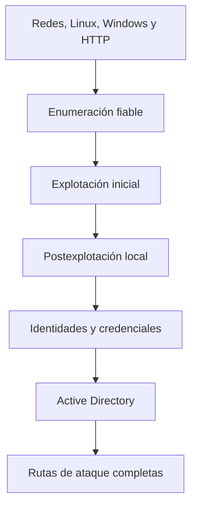
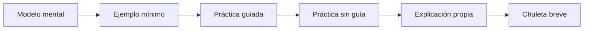

# Mapa de aprendizaje

## Capas de conocimiento

Si una capa falla, las superiores se convierten en recetas memorizadas. Por ejemplo, Pass-the-Hash se entiende de verdad cuando sabes qué representa un hash NT, cómo funciona NTLM y por qué ciertos servicios aceptan ese material sin conocer la contraseña en claro.

## Resultados que debes alcanzar

### Nivel 1: reconocer

Puedes definir dominio, DC, TGT, TGS, SPN, SID, ACL, hash NT, shell inversa, túnel y buffer overflow.

### Nivel 2: relacionar

Puedes explicar por qué:

- DNS es esencial para AD;
- AS-REP Roasting y Kerberoasting atacan momentos distintos de Kerberos;
- un administrador local no es automáticamente Domain Admin;
- un hash reutilizable puede valer tanto como una contraseña;
- BloodHound no «hackea» el dominio, sino que convierte relaciones en rutas.

### Nivel 3: ejecutar

Puedes obtener los datos necesarios, elegir una herramienta, ejecutar una técnica en el laboratorio e interpretar el resultado.

### Nivel 4: encadenar

Puedes pasar de un usuario de dominio de bajo privilegio a otro principal más valioso mediante varias relaciones, justificando cada salto.

### Nivel 5: transferir

Puedes resolver un entorno que no replica exactamente el laboratorio estudiado.

## Ciclo de estudio de cada técnica

La chuleta se escribe al final. Si se escribe antes, suele acumular comandos que todavía no tienen significado.

