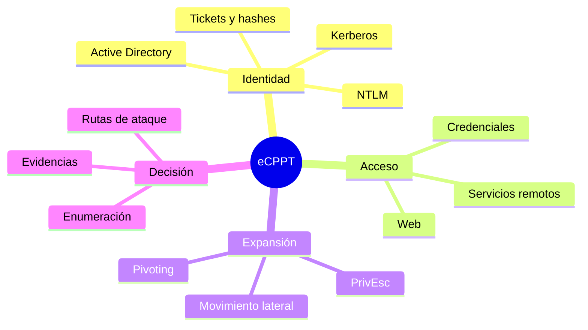

# Conceptos y herramientas clave

## Conceptos con mayor impacto

### Active Directory

Es el sistema con el que una organización centraliza identidades, equipos, grupos y permisos. No es una aplicación concreta: es una combinación de base de datos, servicios, protocolos y reglas de confianza. [Explicación completa](../01-Conceptos-esenciales/Active-Directory/README.md).

### Kerberos

Es el protocolo preferido de autenticación en un dominio. Sustituye la entrega repetida de contraseñas por tickets emitidos por el KDC. Comprender TGT, TGS, SPN y claves de cuenta hace que AS-REP Roasting, Kerberoasting y Pass-the-Ticket dejen de parecer trucos inconexos. [Explicación completa](../01-Conceptos-esenciales/Kerberos/README.md).

### NTLM

Es una familia de protocolos de autenticación basada en challenge-response. El hash NT funciona como material criptográfico de la cuenta; en determinados protocolos puede reutilizarse sin conocer la contraseña, originando Pass-the-Hash. [Explicación completa](../01-Conceptos-esenciales/NTLM/README.md).

### Rutas de ataque

Una ruta es una cadena de relaciones abusables: «controlo a este usuario», «ese usuario puede modificar este grupo», «el grupo administra este equipo», «en ese equipo inicia sesión un administrador». BloodHound representa la cadena como un grafo. [Explicación completa](../01-Conceptos-esenciales/BloodHound-y-rutas-de-ataque/README.md).

## Herramientas principales

| Herramienta | Pregunta que ayuda a responder |
|---|---|
| Nmap | ¿Qué hosts, puertos y servicios existen? |
| NetExec | ¿Qué puedo enumerar o validar a escala contra SMB, WinRM, LDAP y otros protocolos? |
| Impacket | ¿Cómo interactúo desde Python con protocolos y autenticación de Windows? |
| BloodHound/SharpHound | ¿Qué relaciones de privilegio conectan mi acceso con activos críticos? |
| Metasploit | ¿Existe un módulo fiable para validar o explotar esta vulnerabilidad? |
| Burp Suite | ¿Qué está intercambiando realmente el navegador con la aplicación? |
| ffuf/Gobuster | ¿Qué rutas, virtual hosts o parámetros no están enlazados? |
| Hashcat/John | ¿Es recuperable una contraseña a partir de este material? |
| Ligolo-ng/Chisel/SSH | ¿Cómo alcanzo una red que solo ve el host comprometido? |
| WinPEAS/LinPEAS | ¿Qué indicios de escalada debo verificar manualmente? |

Una herramienta no sustituye al protocolo. Si NetExec devuelve un error, debes distinguir entre credenciales incorrectas, restricción del protocolo, permisos insuficientes, firma SMB, firewall o sintaxis equivocada.

