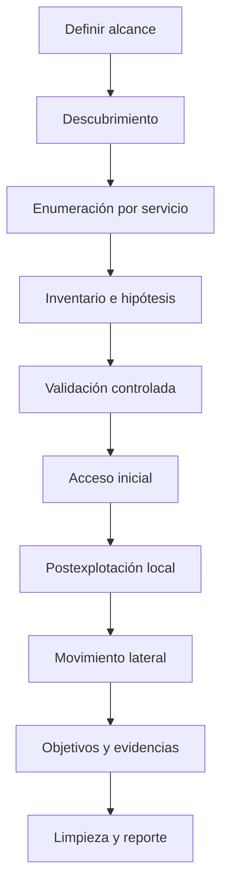

# Metodología de trabajo

## Estructura de un pentest de laboratorio

## Inventario mínimo

Mantén una tabla por host:

| Campo | Ejemplo |
|---|---|
| IP / nombre | `10.10.10.20` / `DC01.corp.local` |
| Sistema probable | Windows Server 2022 |
| Puertos | 53, 88, 135, 389, 445, 5985 |
| Rol inferido | Domain Controller |
| Evidencia | LDAP + Kerberos + DNS + nombre de dominio |
| Credenciales probadas | `CORP\edu` en SMB y WinRM |
| Acceso | SMB válido; WinRM denegado |
| Hipótesis | Enumerar LDAP; comprobar AS-REP |

## Bucle de enumeración

Después de cada acceso nuevo:

1. Identifica usuario, grupos, privilegios, hostname, interfaces y rutas.
2. Busca credenciales en configuración, historial, tareas, servicios y aplicaciones.
3. Enumera conexiones, sesiones y servicios locales.
4. Comprueba qué redes ve el equipo.
5. Repite la enumeración del dominio con la nueva identidad.
6. Actualiza el grafo y las hipótesis.

## Gestión de hipótesis

Ejemplo:

| Hipótesis | Prueba | Resultado | Decisión |
|---|---|---|---|
| El usuario no requiere preautenticación | Solicitar AS-REP sin contraseña | No vulnerable | Descartar esta técnica |
| Tiene un SPN de servicio | Consultar LDAP/SPN | `MSSQLSvc/...` | Solicitar TGS y auditar offline |
| La cuenta administra `SRV02` | BloodHound + validación SMB | Admin local confirmado | Acceder con técnica autorizada |

## Evidencias y notas

- Guarda comando, hora, objetivo y salida relevante.
- Distingue hechos de inferencias.
- No dependas del historial de terminal.
- Registra intentos fallidos importantes: evitan repetir caminos.
- Anota la procedencia de cada credencial.
- En laboratorios compartidos, evita acciones destructivas o ruidosas innecesarias.

## Criterio de salida

No sigas explotando por inercia. Detente cuando hayas alcanzado el objetivo definido, reunido evidencias suficientes y comprendido la cadena. La calidad está en demostrar control y explicar el riesgo, no en ejecutar el mayor número posible de herramientas.

