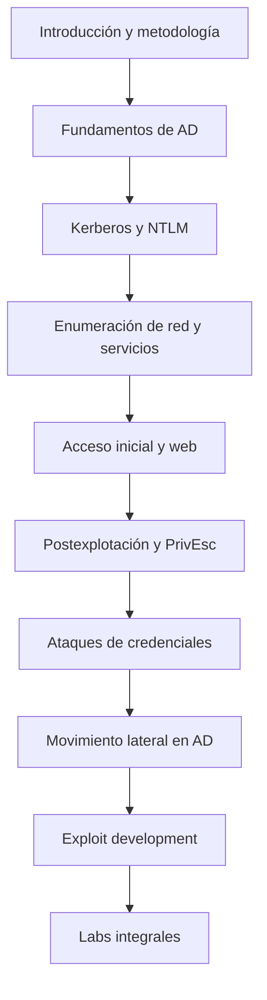

# Introducción

El eCPPT no es un examen de herramientas aisladas. Evalúa si sabes conectar fases. Una contraseña encontrada en una copia de seguridad puede permitir WinRM; ese acceso puede revelar un usuario de dominio; ese usuario puede tener un SPN vulnerable a Kerberoasting; la contraseña resultante puede controlar un grupo con permisos sobre un administrador. Cada hallazgo cambia el mapa.

## De eJPT a eCPPT

| eJPT | eCPPT |
|---|---|
| Enumeración y explotación de servicios relativamente directas | Cadenas de ataque con varias dependencias |
| Uso frecuente de Metasploit | Más explotación manual y modificación de código |
| Pivoting básico | Movimiento lateral y túneles elegidos según el contexto |
| Web introductoria | Explotación web orientada a acceso y extracción de datos |
| Redes con cuentas locales | Active Directory, NTLM, Kerberos y relaciones de privilegio |
| Escalada limitada | Escalada sistemática en Windows, Linux y dominio |

El cambio más importante es mental: dejar de preguntar «¿qué exploit uso?» y empezar a preguntar «¿qué sé, qué me falta y qué prueba separa una hipótesis de otra?».

## Orden de lectura recomendado

## Tres preguntas durante toda la preparación

- **¿Qué evidencia tengo?** Una versión detectada por Nmap no equivale a una vulnerabilidad confirmada.
- **¿Qué privilegio gano?** Obtener otra shell con el mismo usuario puede no acercarte al objetivo.
- **¿Qué nueva superficie aparece?** Cada host comprometido ofrece rutas, credenciales, servicios internos y relaciones antes invisibles.

## Documentos de esta sección

- [Mapa del examen](01-Mapa-del-examen.md)
- [Mapa de aprendizaje](02-Mapa-de-aprendizaje.md)
- [Conceptos y herramientas clave](03-Conceptos-y-herramientas-clave.md)
- [Metodología de trabajo](04-Metodologia-de-trabajo.md)

