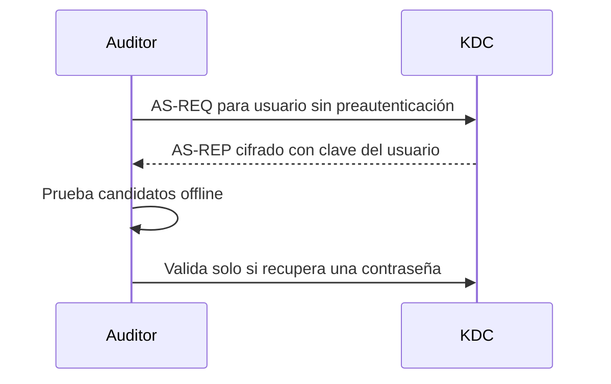

# AS-REP Roasting

## Idea esencial

AS-REP Roasting aprovecha cuentas de Kerberos que tienen deshabilitada la preautenticación. Cualquiera que conozca el nombre de la cuenta puede solicitar un AS-REP con una parte cifrada usando una clave derivada de la contraseña del usuario y probar candidatos offline.

No obtiene la contraseña automáticamente. Obtiene material que permite comprobar diccionarios sin generar un intento de inicio de sesión por cada candidato.

## Flujo



## Condiciones

- conocer o enumerar un nombre de usuario válido;
- que la cuenta tenga `DONT_REQ_PREAUTH`;
- alcanzar el KDC;
- que la contraseña sea suficientemente débil para recuperarla.

No hace falta disponer previamente de la contraseña de la víctima. Para enumerar sistemáticamente la configuración mediante LDAP sí puede ser útil otra cuenta válida.

## Ejemplos de laboratorio

Con Impacket:

```bash
GetNPUsers.py corp.local/ -dc-ip 10.10.10.10 \
  -usersfile usuarios.txt -no-pass -format hashcat -outputfile asrep.hashes
```

Si ya tienes credenciales para consultar el dominio:

```bash
GetNPUsers.py 'corp.local/edu:Laboratorio123!' \
  -dc-ip 10.10.10.10 -request -format hashcat
```

Auditoría offline:

```bash
hashcat -m 18200 asrep.hashes diccionario.txt
```

Verifica el modo con la ayuda de la versión instalada; no copies números de modo a ciegas.

## Diferencia con Kerberoasting

| AS-REP Roasting | Kerberoasting |
|---|---|
| Ataca cuentas sin preautenticación | Ataca cuentas asociadas a SPN |
| Solicita AS-REP | Solicita TGS |
| Puede partir solo de usernames | Normalmente requiere una identidad de dominio válida |
| Cifra relacionada con clave del usuario | Parte del TGS cifrada con clave de la cuenta de servicio |

## Si falla

- usuario inexistente;
- preautenticación requerida;
- dominio/DC incorrecto;
- desfase de hora o DNS;
- formato de cuenta erróneo;
- material obtenido pero diccionario insuficiente.

Un crackeo fallido no invalida la vulnerabilidad de configuración; indica que tus candidatos no recuperaron la contraseña.

## Mitigación

Exigir preautenticación, usar contraseñas largas y únicas, revisar las cuentas excepcionadas y monitorizar solicitudes anómalas.

