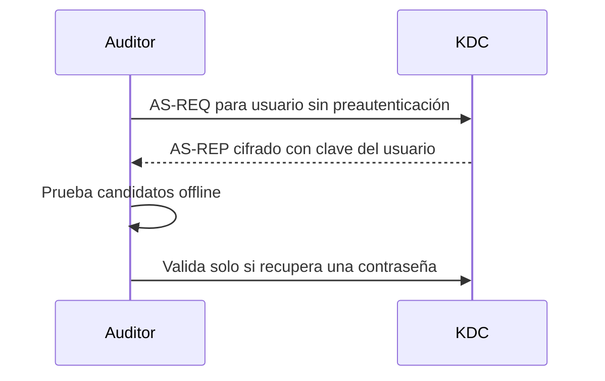

# AS-REP Roasting

Piensa en esta analogía:

El KDC te entrega una caja cerrada (TGT) y una llave guardada dentro de otro sobre cifrado con la contraseña de Eduardo.

Tú tienes la caja, pero sin esa llave no puedes usarla correctamente.

Por eso se crackea el AS-REP: no para “romper el TGT”, sino para averiguar la contraseña/clave del usuario y obtener la clave de sesión necesaria.

La frase que te tienes que quedar es:

AS-REP Roasting = consigo una respuesta Kerberos sin conocer la contraseña, pero necesito crackearla porque el TGT por sí solo no me permite pedir tickets de servicio.


# Si al final necesito la contraseña, ¿por qué cojones la intento averiguar ahora y no al principio?

La diferencia clave es **dónde consigues el material para probar contraseñas**.

Si intentaras averiguar la contraseña “desde el principio” contra Kerberos, tendrías que ir probando contraseñas **contra el DC**, es decir, online. Eso genera tráfico, bloqueos de cuenta, alertas, límites, etc. En cambio, con **AS-REP Roasting**, una mala configuración te permite pedir una respuesta Kerberos sin conocer la contraseña. Esa respuesta contiene una parte cifrada con una clave derivada de la contraseña del usuario, y entonces puedes llevarte esa información y probar millones de contraseñas **offline**, sin seguir preguntando al DC.

Así que no es que AS-REP Roasting “evite para siempre” necesitar la contraseña. Lo valioso es que convierte el problema de:

**“Tengo que adivinar la contraseña hablando con el DC una y otra vez”**

en:

**“Obtengo una muestra cifrada una sola vez y luego intento romperla offline todas las veces que quiera.”**

Por eso es útil. Si la contraseña es fuerte, probablemente no conseguirás nada. Pero si es débil, AS-REP Roasting te da una forma mucho más cómoda y menos ruidosa de intentar recuperarla.

---
---

## Idea esencial

AS-REP Roasting aprovecha cuentas de Kerberos que tienen deshabilitada la preautenticación. Cualquiera que conozca el nombre de la cuenta puede solicitar un AS-REP con una parte cifrada usando una clave derivada de la contraseña del usuario y probar candidatos offline.

No obtiene la contraseña automáticamente. Obtiene material que permite comprobar diccionarios sin generar un intento de inicio de sesión por cada candidato.

## Flujo



## Condiciones

- conocer o enumerar un nombre de usuario válido;
- que la cuenta tenga `DONT_REQ_PREAUTH`;
- alcanzar el KDC;
- que la contraseña sea suficientemente débil para recuperarla.

No hace falta disponer previamente de la contraseña de la víctima. Para enumerar sistemáticamente la configuración mediante LDAP sí puede ser útil otra cuenta válida.

## Ejemplos de laboratorio

Con Impacket:

```bash
GetNPUsers.py corp.local/ -dc-ip 10.10.10.10 \
  -usersfile usuarios.txt -no-pass -format hashcat -outputfile asrep.hashes
```

Si ya tienes credenciales para consultar el dominio:

```bash
GetNPUsers.py 'corp.local/edu:Laboratorio123!' \
  -dc-ip 10.10.10.10 -request -format hashcat
```

Auditoría offline:

```bash
hashcat -m 18200 asrep.hashes diccionario.txt
```

Verifica el modo con la ayuda de la versión instalada; no copies números de modo a ciegas.

## Diferencia con Kerberoasting

| AS-REP Roasting | Kerberoasting |
|---|---|
| Ataca cuentas sin preautenticación | Ataca cuentas asociadas a SPN |
| Solicita AS-REP | Solicita TGS |
| Puede partir solo de usernames | Normalmente requiere una identidad de dominio válida |
| Cifra relacionada con clave del usuario | Parte del TGS cifrada con clave de la cuenta de servicio |

## Si falla

- usuario inexistente;
- preautenticación requerida;
- dominio/DC incorrecto;
- desfase de hora o DNS;
- formato de cuenta erróneo;
- material obtenido pero diccionario insuficiente.

Un crackeo fallido no invalida la vulnerabilidad de configuración; indica que tus candidatos no recuperaron la contraseña.

## Mitigación

Exigir preautenticación, usar contraseñas largas y únicas, revisar las cuentas excepcionadas y monitorizar solicitudes anómalas.

