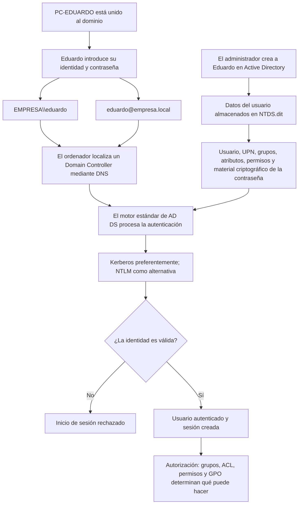
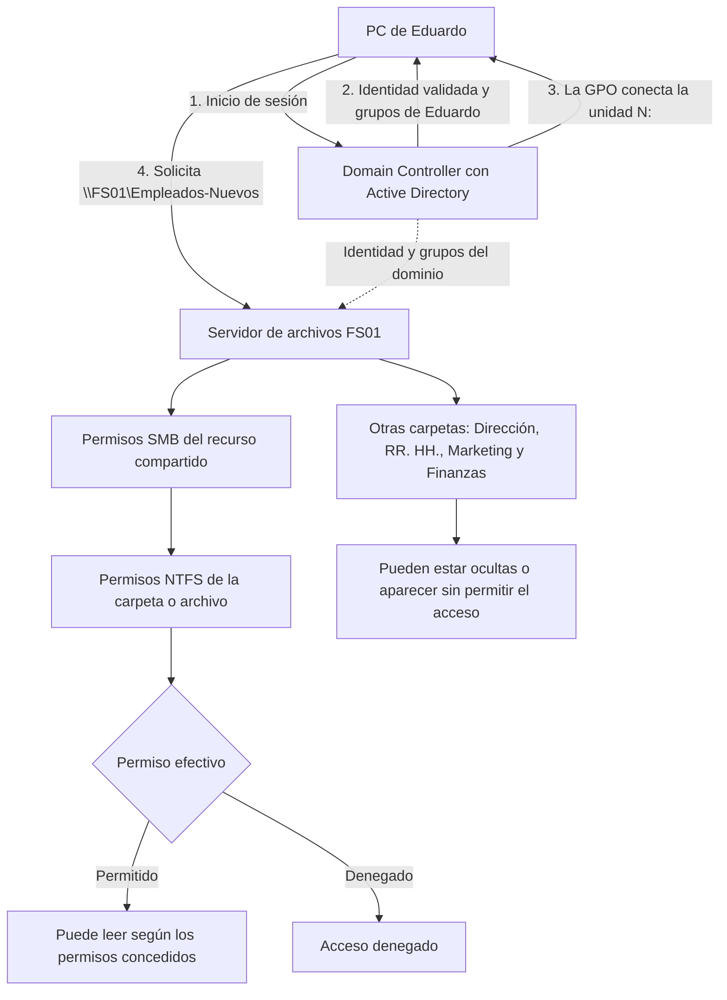
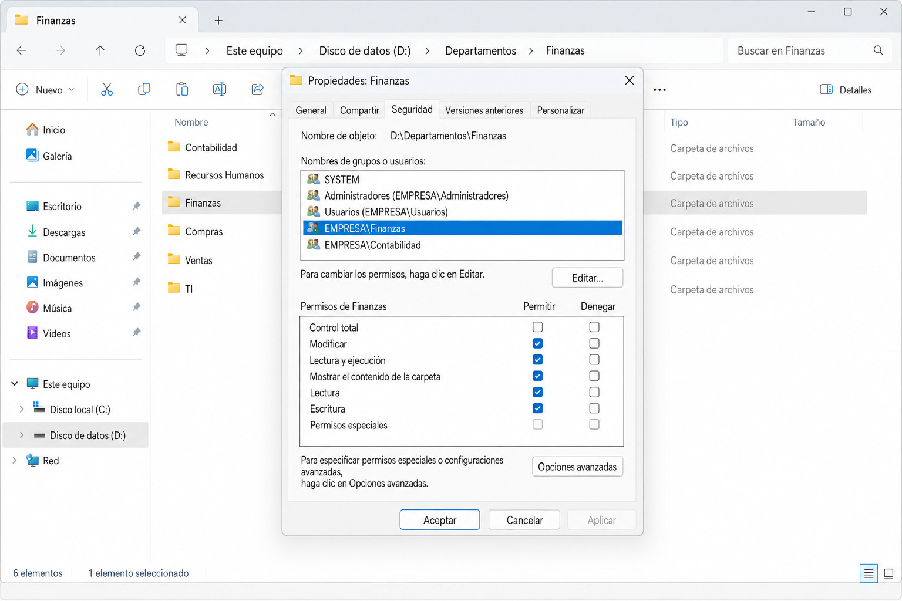

# Crear un usuario e iniciar sesión en Active Directory



## 1. El administrador crea el usuario

El administrador no necesita trabajar físicamente sobre el controlador de dominio. Normalmente utiliza herramientas administrativas desde un equipo autorizado para crear un objeto de usuario en Active Directory.

Por ejemplo:

```text
Nombre: Eduardo Romera
Usuario: eduardo
UPN: eduardo@empresa.local
Dominio: EMPRESA
Grupos: Empleados, Informática
Contraseña inicial: establecida por el administrador
```

El administrador puede configurar que Eduardo tenga que cambiar la contraseña durante el primer inicio de sesión.

La información del usuario se almacena principalmente en la base de datos `NTDS.dit` de los controladores de dominio. La contraseña no se guarda normalmente como texto legible: se conserva material criptográfico derivado de ella, como el hash NT y claves utilizadas por Kerberos.

Si existen varios controladores del mismo dominio, esta información se replica entre ellos.

## 2. El ordenador también pertenece al dominio

Para iniciar sesión normalmente en el dominio, el ordenador de la oficina debe estar unido a él. Active Directory también mantiene un objeto para ese equipo:

```text
PC-EDUARDO$
```

El signo `$` identifica convencionalmente una cuenta de equipo. El ordenador mantiene una relación segura con el dominio y utiliza DNS para encontrar los controladores y sus servicios.

## 3. Formatos del nombre de usuario

Eduardo puede indicar su identidad de dominio mediante dos formatos principales.

Formato tradicional o *down-level logon name*:

```text
EMPRESA\eduardo
```

Aquí `EMPRESA` es normalmente el nombre NetBIOS del dominio.

Formato UPN (*User Principal Name*):

```text
eduardo@empresa.local
```

Muchas veces Windows permite escribir solamente `eduardo` porque el dominio ya aparece seleccionado en la pantalla de inicio de sesión. Esto no convierte la cuenta en local: Windows completa el contexto del dominio.

Una cuenta local se distinguiría así:

```text
PC-EDUARDO\eduardo
```

En ese caso, el propio ordenador comprobaría la cuenta contra su base de datos local `SAM`, no contra Active Directory.

## 4. Qué ocurre al introducir la contraseña

El ordenador recibe las credenciales y contacta con un controlador de dominio. El software estándar de AD DS procesa la solicitud y consulta el entorno particular de la empresa almacenado en `NTDS.dit`.

En un dominio moderno, Kerberos es el mecanismo preferido. El ordenador utiliza una clave derivada de la contraseña para demostrar que el usuario la conoce; la contraseña no se envía normalmente como texto por la red. Si la autenticación tiene éxito, el controlador puede entregar un TGT que permitirá solicitar tickets para otros servicios.

NTLM puede utilizarse como alternativa cuando Kerberos no está disponible o no puede emplearse. NTLM utiliza un mecanismo de desafío-respuesta basado en el hash de la contraseña.

El contenido de `SYSVOL` no se utiliza para comprobar directamente la contraseña. `SYSVOL` contiene principalmente plantillas de políticas de grupo y scripts que pueden aplicarse al usuario o al ordenador.

## 5. Autenticación y autorización

Una autenticación correcta solo demuestra quién es el usuario:

> **Autenticación:** «El dominio ha comprobado que eres `EMPRESA\eduardo`».

Después se decide qué puede hacer:

> **Autorización:** «Según tus grupos, permisos, ACL y políticas, puedes acceder a unos recursos y a otros no».

Por ejemplo:

```text
EMPRESA\eduardo
├── Puede iniciar sesión en PC-EDUARDO
├── Puede acceder a \\SERVIDOR\Empleados
├── No puede acceder a \\SERVIDOR\Direccion
└── No puede crear ni modificar usuarios del dominio
```

## Idea clave

> El usuario introduce su identidad y demuestra que conoce su contraseña. El motor estándar de AD DS procesa la solicitud y la contrasta con la información particular que la organización guarda en `NTDS.dit`. Si la autenticación es correcta, los grupos, permisos, ACL y políticas determinan posteriormente qué puede hacer el usuario.
---

## 6. Unidades organizativas y grupos

En Active Directory existen dos clasificaciones diferentes.

### Unidades organizativas (OU)

Indican **dónde está colocado** el usuario dentro de la organización:

```text
empresa.local
└── Usuarios
    ├── Finanzas
    │   └── Eduardo
    └── Informática
        └── Pepe
```

Sirven principalmente para organizar usuarios y equipos y aplicarles GPO.

### Grupos

Indican **a qué colectivos pertenece** el usuario:

```text
Eduardo
├── Finanzas
├── Empleados
└── Acceso-VPN
```

Los sistemas de permisos pueden utilizar estos grupos:

```text
Eduardo
   ↓ pertenece
Grupo Finanzas
   ↓ tiene permiso
Carpeta Finanzas
```

> **Idea clave:** la OU indica dónde está organizado Eduardo; los grupos indican sus funciones o accesos. Eduardo está colocado en una OU, pero puede pertenecer a muchos grupos. Moverlo de OU no modifica automáticamente sus grupos.

---

## 7. Después de autenticarse: acceso al servidor de archivos

Una vez autenticado, el usuario puede solicitar recursos almacenados en otros servidores. En este escenario intervienen tres roles: el equipo cliente, el Domain Controller y el servidor de archivos.



### Los tres roles

1. **Equipos cliente:** ordenadores de Eduardo, Pepe y otros empleados. Desde ellos se inicia sesión y se solicitan recursos.
2. **Domain Controller:** ejecuta Active Directory, autentica al usuario y permite conocer su identidad y los grupos a los que pertenece.
3. **Servidor de archivos:** almacena físicamente las carpetas, fotografías, vídeos, documentos y otros archivos.

El Domain Controller no almacena normalmente los archivos de trabajo ni concede por sí solo el acceso a una carpeta. Active Directory puede indicar que Eduardo pertenece a `EMPRESA\Empleados-Nuevos`, pero es el servidor de archivos el que mantiene una ACL que utiliza ese grupo:

```text
Carpeta: \\FS01\Empleados-Nuevos

EMPRESA\Empleados-Nuevos
└── Acceso permitido
```

Una GPO puede presentar el recurso conectándolo como unidad de red:

```text
N: → \\FS01\Empleados-Nuevos
```

Que la unidad aparezca no sustituye la comprobación de permisos. Cuando Eduardo intenta abrirla, `FS01` examina su identidad y aplica los permisos correspondientes.

Las otras carpetas del servidor pueden no aparecer si está habilitada la **enumeración basada en acceso**. Si aparecen, al intentar abrirlas pueden devolver **Acceso denegado**.

### Permisos SMB y NTFS

En un servidor Windows que comparte carpetas mediante SMB normalmente se combinan dos capas:

- **Permisos SMB:** regulan el acceso al recurso compartido a través de la red, con niveles como lectura, cambio o control total.
- **Permisos NTFS:** regulan operaciones concretas sobre las carpetas y archivos del disco: listar, leer, leer y ejecutar, escribir, modificar o eliminar.

#### Ejemplo visual: un grupo de Active Directory aplicado en NTFS



En la imagen está seleccionado `EMPRESA\\Finanzas`, un grupo del dominio creado y administrado en Active Directory. Las casillas inferiores son los permisos NTFS asignados a ese grupo sobre `D:\\Departamentos\\Finanzas`: modificar, leer y ejecutar, mostrar el contenido, leer y escribir.

> **Separación de responsabilidades:** Active Directory mantiene el grupo y determina qué usuarios pertenecen a él; la ACL NTFS de esta carpeta utiliza la identidad del grupo —técnicamente su SID— para permitir o denegar operaciones.

El resultado efectivo por red queda limitado por la capa más restrictiva. Por ejemplo:

```text
Permiso SMB: cambiar
Permiso NTFS: solo leer
Resultado efectivo: solo lectura
```

Eduardo podría abrir documentos de `Empleados-Nuevos`, pero no modificarlos, eliminarlos ni ejecutar programas allí almacenados si los permisos NTFS no incluyen esas capacidades.

> **Idea clave:** Active Directory autentica al usuario y proporciona su identidad y grupos; una GPO puede mostrar o conectar el recurso; y el servidor de archivos aplica los permisos SMB y NTFS que determinan lo que el usuario puede hacer realmente.
