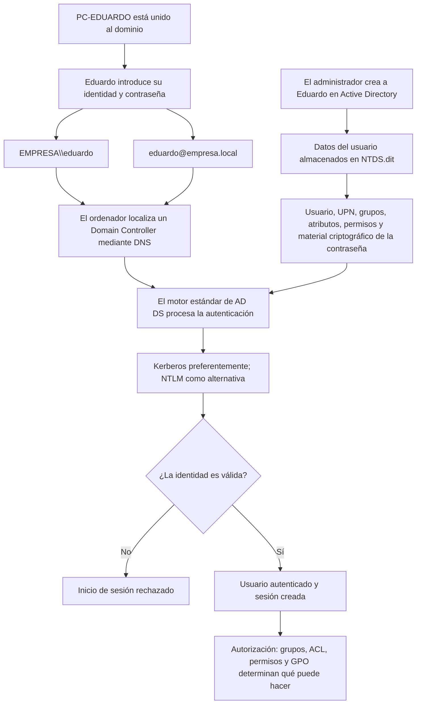

# Crear un usuario e iniciar sesión en Active Directory



## 1. El administrador crea el usuario

El administrador no necesita trabajar físicamente sobre el controlador de dominio. Normalmente utiliza herramientas administrativas desde un equipo autorizado para crear un objeto de usuario en Active Directory.

Por ejemplo:

```text
Nombre: Eduardo Romera
Usuario: eduardo
UPN: eduardo@empresa.local
Dominio: EMPRESA
Grupos: Empleados, Informática
Contraseña inicial: establecida por el administrador
```

El administrador puede configurar que Eduardo tenga que cambiar la contraseña durante el primer inicio de sesión.

La información del usuario se almacena principalmente en la base de datos `NTDS.dit` de los controladores de dominio. La contraseña no se guarda normalmente como texto legible: se conserva material criptográfico derivado de ella, como el hash NT y claves utilizadas por Kerberos.

Si existen varios controladores del mismo dominio, esta información se replica entre ellos.

## 2. El ordenador también pertenece al dominio

Para iniciar sesión normalmente en el dominio, el ordenador de la oficina debe estar unido a él. Active Directory también mantiene un objeto para ese equipo:

```text
PC-EDUARDO$
```

El signo `$` identifica convencionalmente una cuenta de equipo. El ordenador mantiene una relación segura con el dominio y utiliza DNS para encontrar los controladores y sus servicios.

## 3. Formatos del nombre de usuario

Eduardo puede indicar su identidad de dominio mediante dos formatos principales.

Formato tradicional o *down-level logon name*:

```text
EMPRESA\eduardo
```

Aquí `EMPRESA` es normalmente el nombre NetBIOS del dominio.

Formato UPN (*User Principal Name*):

```text
eduardo@empresa.local
```

Muchas veces Windows permite escribir solamente `eduardo` porque el dominio ya aparece seleccionado en la pantalla de inicio de sesión. Esto no convierte la cuenta en local: Windows completa el contexto del dominio.

Una cuenta local se distinguiría así:

```text
PC-EDUARDO\eduardo
```

En ese caso, el propio ordenador comprobaría la cuenta contra su base de datos local `SAM`, no contra Active Directory.

## 4. Qué ocurre al introducir la contraseña

El ordenador recibe las credenciales y contacta con un controlador de dominio. El software estándar de AD DS procesa la solicitud y consulta el entorno particular de la empresa almacenado en `NTDS.dit`.

En un dominio moderno, Kerberos es el mecanismo preferido. El ordenador utiliza una clave derivada de la contraseña para demostrar que el usuario la conoce; la contraseña no se envía normalmente como texto por la red. Si la autenticación tiene éxito, el controlador puede entregar un TGT que permitirá solicitar tickets para otros servicios.

NTLM puede utilizarse como alternativa cuando Kerberos no está disponible o no puede emplearse. NTLM utiliza un mecanismo de desafío-respuesta basado en el hash de la contraseña.

El contenido de `SYSVOL` no se utiliza para comprobar directamente la contraseña. `SYSVOL` contiene principalmente plantillas de políticas de grupo y scripts que pueden aplicarse al usuario o al ordenador.

## 5. Autenticación y autorización

Una autenticación correcta solo demuestra quién es el usuario:

> **Autenticación:** «El dominio ha comprobado que eres `EMPRESA\eduardo`».

Después se decide qué puede hacer:

> **Autorización:** «Según tus grupos, permisos, ACL y políticas, puedes acceder a unos recursos y a otros no».

Por ejemplo:

```text
EMPRESA\eduardo
├── Puede iniciar sesión en PC-EDUARDO
├── Puede acceder a \\SERVIDOR\Empleados
├── No puede acceder a \\SERVIDOR\Direccion
└── No puede crear ni modificar usuarios del dominio
```

## Idea clave

> El usuario introduce su identidad y demuestra que conoce su contraseña. El motor estándar de AD DS procesa la solicitud y la contrasta con la información particular que la organización guarda en `NTDS.dit`. Si la autenticación es correcta, los grupos, permisos, ACL y políticas determinan posteriormente qué puede hacer el usuario.
