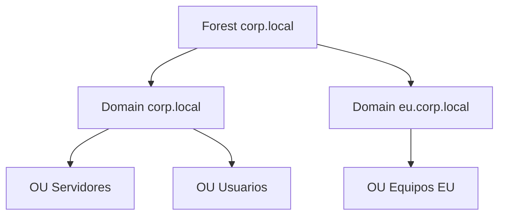
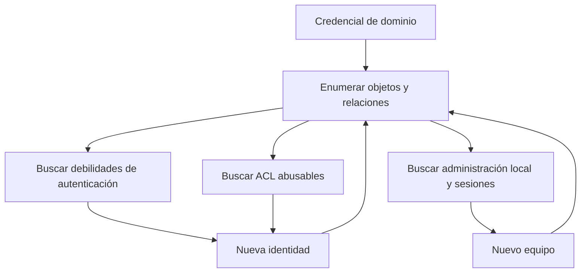

# Active Directory

## La idea en una frase

Active Directory Domain Services (AD DS) es el sistema con el que una organización guarda identidades y aplica relaciones de confianza y permisos de forma centralizada.

Una analogía útil es una universidad:

- el **dominio** es la institución;
- el **Domain Controller** es secretaría y control de acceso;
- los **usuarios y equipos** son miembros identificados;
- los **grupos** agrupan funciones;
- las **GPO** son normas aplicadas a colectivos;
- Kerberos y NTLM son formas de demostrar la identidad;
- LDAP es la forma de consultar el directorio;
- DNS es el mapa para encontrar sus servicios.

La analogía tiene límites: AD es distribuido, sus controladores replican datos y los permisos pueden heredarse y encadenarse.

## Objetos fundamentales

| Objeto | Significado práctico |
|---|---|
| User | Identidad humana o de servicio |
| Computer | Identidad propia de un equipo unido al dominio |
| Group | Conjunto de principales al que se asignan permisos |
| Organizational Unit | Contenedor administrativo y destino habitual de GPO |
| Group Policy Object | Configuración aplicable a usuarios o equipos |
| Domain Controller | Servidor que aloja AD DS, autentica y replica |
| Service account | Cuenta usada por una aplicación o servicio |

Un **principal de seguridad** es un objeto que puede autenticarse o recibir permisos. Normalmente tiene un SID. Los nombres pueden cambiar; el SID es la identidad estable dentro del modelo de seguridad.

## Dominio, árbol y bosque

- **Dominio:** frontera administrativa y de identidad con una base de datos compartida.
- **Árbol:** dominios con un espacio DNS jerárquico relacionado.
- **Bosque:** conjunto de dominios que comparte esquema, configuración y relaciones de confianza internas. Es una frontera de seguridad crítica.

## Qué contiene un DC

El controlador mantiene la base de datos del directorio (`NTDS.dit`), actúa como KDC para Kerberos, ofrece LDAP y normalmente DNS. También publica recursos mediante SMB y participa en replicación. Por eso un escaneo con 53, 88, 389, 445, 464, 636 y 3268 sugiere fuertemente un DC, aunque debes confirmarlo.

## Permisos y ACL

Los objetos de AD tienen listas de control de acceso. No solo importa quién pertenece a Domain Admins. También importa quién puede:

- cambiar la contraseña de otra cuenta;
- añadir miembros a un grupo;
- modificar la ACL de un objeto;
- escribir un SPN;
- enlazar o modificar una GPO;
- administrar un equipo donde inicia sesión una cuenta privilegiada.

Así surgen rutas indirectas. Un usuario corriente puede no ser administrador, pero quizá controle un grupo que controla un equipo que almacena una sesión privilegiada.

## Flujo mental de un ataque de laboratorio

## Lo que debes dominar

Debes poder diferenciar cuenta local y de dominio, usuario y equipo, dominio y bosque, grupo y OU, autenticación y autorización, administrador local y Domain Admin. También debes comprender SID, SPN, ACL, GPO, trust, DC, DNS, LDAP, NTLM y Kerberos.

## Error frecuente

Tratar AD como una lista de ataques. El enfoque correcto es construir un grafo de control: qué identidad controlas, qué puede leer o modificar, dónde puede autenticarse y qué nueva identidad aparece después.

