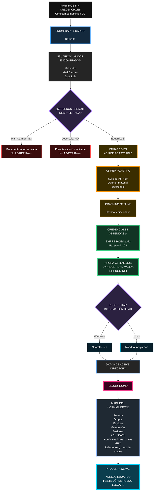

Sí, exactamente. Y hay un matiz importante: **SharpHound y `bloodhound-python` son dos colectores alternativos**. No necesitas usar los dos necesariamente. Ambos recopilan información para luego cargarla/analizarla en **BloodHound**.

Tu idea del **“esqueleto del hormiguero”** es bastante buena:

> **Kerbrute descubre qué hormigas existen. → AS-REP Roasting puede darte la contraseña de una. → SharpHound/bloodhound-python recopilan cómo está construido el hormiguero. → BloodHound te lo dibuja y te enseña por dónde podría avanzar Eduardo.**

Ese es un salto importante respecto a limitarte a probar usuarios uno a uno con NXC.
