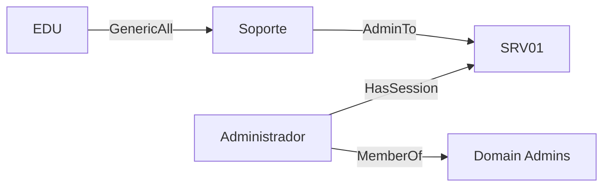
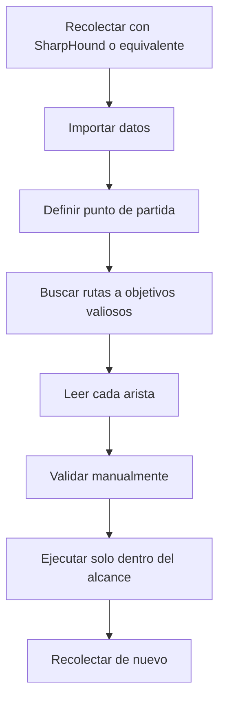

# BloodHound y rutas de ataque

## Qué problema resuelve

En AD hay miles de relaciones: membresías, sesiones, administración local, ACL, delegaciones y GPO. Leer listas no revela fácilmente cómo se combinan. BloodHound modela identidades y recursos como un **grafo**:

- los nodos son usuarios, grupos, equipos, dominios y otros objetos;
- las aristas expresan relaciones como `MemberOf`, `AdminTo`, `GenericAll` o `CanRDP`.

BloodHound no explota el dominio. Recoge o importa datos, calcula relaciones y ayuda a formular rutas que después debes validar.

## Ejemplo mínimo

Lectura: si EDU puede controlar el grupo Soporte y ese grupo administra SRV01, quizá pueda obtener administración local. Si en SRV01 existe una sesión de un administrador del dominio, podría aparecer una vía para acceder a credenciales más privilegiadas. Cada arista tiene requisitos, efectos y detecciones distintos.

## Recogida, análisis y validación

### Punto de partida

Marca las identidades y equipos que controlas. Una ruta desde «todos los usuarios» puede ser teóricamente interesante, pero necesitas saber si es alcanzable desde tu acceso real.

### Objetivo

Domain Admins es un objetivo frecuente, pero no el único. También importan controladores, servidores de copias, PKI, sistemas de gestión, cuentas de servicio críticas y otros activos Tier Zero.

## Aristas comunes

| Arista | Pregunta que plantea |
|---|---|
| `MemberOf` | ¿Qué permisos hereda por pertenecer a un grupo? |
| `AdminTo` | ¿Puede administrar localmente ese equipo? |
| `HasSession` | ¿Hay una sesión que podría exponer una identidad? |
| `GenericAll` | ¿Tiene control amplio sobre el objeto? |
| `GenericWrite` | ¿Puede modificar atributos abusables? |
| `WriteDacl` | ¿Puede cambiar quién tiene permisos? |
| `ForceChangePassword` | ¿Puede cambiar la contraseña sin conocer la actual? |
| `CanRDP` / `CanPSRemote` | ¿Puede iniciar una sesión remota? |

No ejecutes una arista solo por su nombre. Abre la ayuda integrada y estudia «abuse», «opsec» y «references». Algunas rutas interrumpen cuentas o cambian el entorno.

## Cypher y consultas

BloodHound CE ofrece búsquedas predefinidas. Aprende además la lógica de consultas: seleccionar nodos por etiquetas y unirlos por relaciones. No necesitas convertirte en especialista en Cypher para el eCPPT, pero sí filtrar usuarios controlados, sesiones, administración local y caminos de menor longitud.

## Falsos atajos

- Una ruta corta no siempre es la más viable.
- `CanRDP` no implica administrador.
- `AdminTo` no garantiza que el protocolo remoto esté accesible.
- Una sesión observada puede haber terminado.
- Los datos envejecen; vuelve a recolectar.
- La colección incompleta produce un grafo incompleto.

## Criterio de dominio

Debes poder leer una ruta, explicar cada arista en palabras, enumerar sus precondiciones, validar la primera sin BloodHound y predecir qué nuevo control obtendrías.

