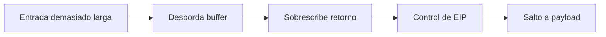

# Buffer overflow

## Idea esencial

Un buffer overflow ocurre cuando un programa escribe más datos de los que caben en un área reservada y sobrescribe memoria adyacente. En un stack overflow clásico de x86, el objetivo educativo es demostrar control sobre el flujo de ejecución.



## Modelo de pila simplificado

```text
[ buffer ][ datos adyacentes ][ EBP guardado ][ dirección de retorno ]
```

Si controlas la dirección de retorno, puedes redirigir la ejecución a una instrucción adecuada —por ejemplo un salto al registro que apunta a tu buffer— y finalmente a shellcode, siempre que las mitigaciones y restricciones lo permitan.

## Fases de un ejercicio clásico

1. **Fuzzing:** encontrar una longitud que provoca el fallo.
2. **Offset:** enviar un patrón único y calcular qué bytes alcanzan EIP.
3. **Control:** sustituir EIP por un marcador y verificarlo.
4. **Bad characters:** identificar bytes transformados o terminadores.
5. **Redirección:** buscar una dirección estable compatible, como `JMP ESP`.
6. **Espacio y NOP sled:** organizar el buffer.
7. **Shellcode:** generar un payload compatible con arquitectura y badchars.
8. **Fiabilidad:** repetir desde estado limpio.

## Estructura del exploit

```python
offset = b"A" * OFFSET
eip = b"\x12\x34\x56\x78"      # ejemplo, little endian
nops = b"\x90" * 16
payload = b"..."
buffer = offset + eip + nops + payload
```

La dirección es solo ilustrativa. Nunca copies una dirección de otro sistema: depende del binario, módulos y mitigaciones.

## Little endian

Una dirección `0x625011AF` suele escribirse en el payload como bytes `\xaf\x11\x50\x62`. No es una inversión conceptual de la dirección; es el orden en que la arquitectura almacena los bytes en memoria.

## Mitigaciones

- **ASLR:** aleatoriza direcciones.
- **DEP/NX:** marca regiones no ejecutables.
- **Stack canaries:** detectan sobrescritura antes del retorno.
- **SafeSEH/SEHOP/CFG:** dificultan distintas rutas de desvío.
- compilación y lenguajes con mejores controles de memoria.

El ejercicio clásico suele elegir un binario deliberadamente vulnerable y módulos sin ciertas mitigaciones para enseñar fundamentos.

## Modificar exploits existentes

Antes de ejecutar código público:

1. Léelo completo.
2. Identifica objetivo, arquitectura y versión.
3. Revisa IP, puerto, protocolo y payload.
4. Elimina acciones no necesarias.
5. Comprueba dependencias y compatibilidad Python.
6. Ensaya contra snapshot.
7. Captura tráfico o depura para entender el fallo.

El 5 % de exploit development premia entender y adaptar, no convertirse en investigador de vulnerabilidades de memoria avanzada.

