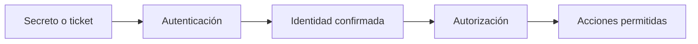

# Credenciales y hashes

## Materiales que puedes encontrar

| Material | Qué representa | Uso típico en laboratorio |
|---|---|---|
| Contraseña en claro | Secreto original | Autenticación normal; posible reutilización |
| Hash NT | Verificador derivado de contraseña | Auditoría offline; PTH en protocolos compatibles |
| NetNTLMv2 | Respuesta a un desafío | Crackeo offline; análisis de relay autorizado |
| TGT/TGS | Ticket Kerberos | Autenticación o auditoría según el tipo |
| `ccache` | Caché Kerberos en Linux | Uso de tickets con herramientas compatibles |
| Token de sesión web | Identificador de sesión | Reutilización de sesión dentro de alcance |
| Clave/API token | Secreto de aplicación | Acceso al servicio correspondiente |
| Clave SSH | Credencial asimétrica | SSH si permisos, formato y cuenta coinciden |

## Autenticación frente a autorización

Una credencial válida responde «eres esta identidad». No responde «puedes hacer cualquier cosa». Después de validarla debes medir permisos sobre cada servicio y host.



## Dónde buscar tras comprometer un host

- archivos de configuración y variables de entorno;
- scripts de despliegue y copias de seguridad;
- historial de shell y archivos recientes;
- servicios, tareas programadas y unidades montadas;
- gestores de credenciales y perfiles de aplicaciones;
- bases de datos locales;
- procesos y sesiones, si el privilegio y el alcance lo permiten.

La búsqueda debe ser dirigida. Volcar todo indiscriminadamente produce ruido, puede dañar el entorno y dificulta demostrar procedencia.

## Crackeo offline

El crackeo prueba candidatos contra un verificador capturado. Su valor depende de la calidad del diccionario y de las reglas, no solo de la GPU.

```bash
hashcat -m <modo> hashes.txt diccionario.txt --rules-file reglas.rule
john --wordlist=diccionario.txt hashes.txt
```

Antes de ejecutar:

1. Identifica el tipo exacto.
2. Conserva una copia del material original.
3. Elige el modo correcto.
4. Estima coste y evita ataques absurdamente grandes.
5. Registra qué contraseña corresponde a qué principal.

## Reutilización

Prueba una credencial solo contra objetivos del alcance y con control de bloqueos. Distingue:

- reutilización de contraseña;
- password spraying: pocas contraseñas contra muchos usuarios;
- brute force: muchas contraseñas contra una cuenta;
- credential stuffing: pares usuario/contraseña previamente obtenidos;
- PTH/PTT: reutilización de material no equivalente a la contraseña en claro.

## Higiene de notas

Etiqueta siempre `origen`, `identidad`, `tipo`, `fecha`, `validado_en` y `privilegio`. Una lista de hashes sin contexto conduce a errores y repeticiones.

