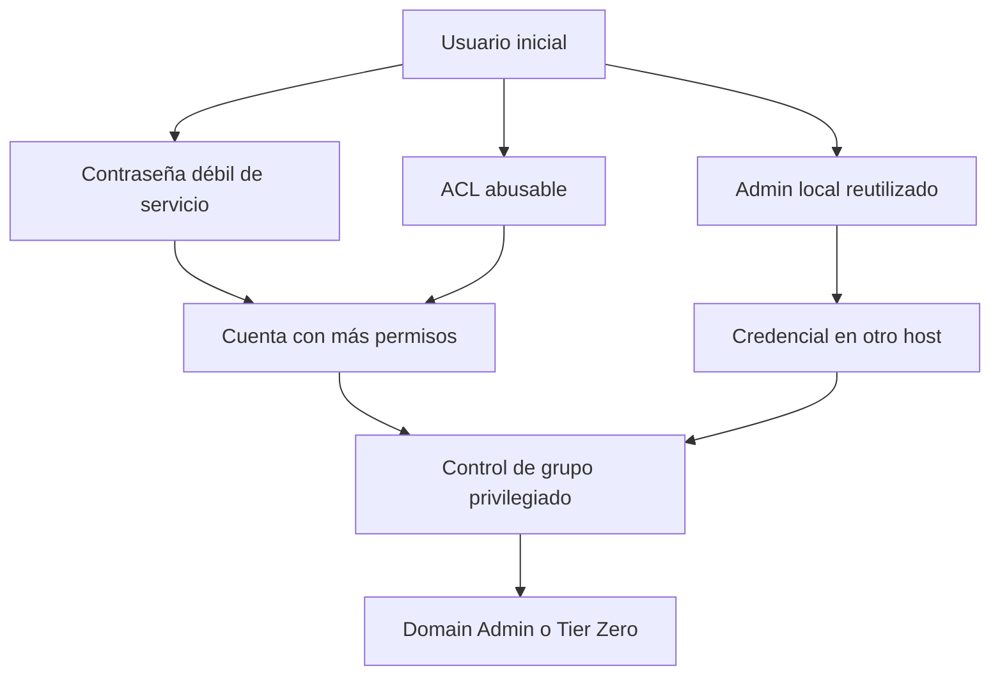

# Domain Admin y Tier Zero

## Domain Admin no es «administrador de un PC»

Un administrador local controla un equipo. Un miembro de **Domain Admins** suele tener capacidad administrativa sobre los sistemas del dominio y sobre la propia infraestructura de identidad. El alcance es radicalmente distinto.

| Identidad | Alcance habitual |
|---|---|
| Usuario estándar | Recursos explícitamente autorizados |
| Administrador local | Un equipo o conjunto de equipos |
| Operador/grupo delegado | Funciones concretas de AD |
| Domain Admin | Dominio y, por diseño habitual, muchos sistemas miembros |
| Enterprise Admin | Capacidades a escala de bosque |

## Tier Zero

Tier Zero incluye identidades y sistemas cuyo compromiso permite controlar la plataforma de identidad. Los DC y grupos administrativos son ejemplos obvios, pero también pueden ser Tier Zero:

- servidores de PKI/AD CS;
- sistemas de copias capaces de restaurar o leer DC;
- herramientas de administración que ejecutan código sobre DC;
- cuentas y grupos con ACL críticas;
- hipervisores o plataformas que alojan DC;
- rutas indirectas persistentes hacia estos activos.

Por eso «llegar a Domain Admin» es una simplificación del objetivo real: demostrar control sobre la seguridad del dominio.

## Caminos típicos de laboratorio

## Escalada vertical y movimiento lateral

- **Vertical:** aumentas privilegios dentro del mismo host o dominio.
- **Lateral:** cambias de host o identidad con privilegios parecidos.

Una cadena real alterna ambos. Administrador local en un servidor puede ser un movimiento lateral desde otro host, pero también un paso vertical respecto al usuario inicial.

## Evidencia suficiente

En un laboratorio no necesitas causar daño. Demuestra el control con la acción mínima acordada: leer un flag, comprobar pertenencia, acceder a un recurso de prueba o ejecutar un comando benigno. No modifiques grupos críticos ni persistencia si no es parte explícita del ejercicio.

## Idea defensiva

El tiering separa cuentas y estaciones por nivel de confianza para impedir que una credencial de alto privilegio aparezca en un sistema menos seguro. Comprender la defensa ayuda a prever dónde deberían y dónde no deberían existir sesiones privilegiadas.

