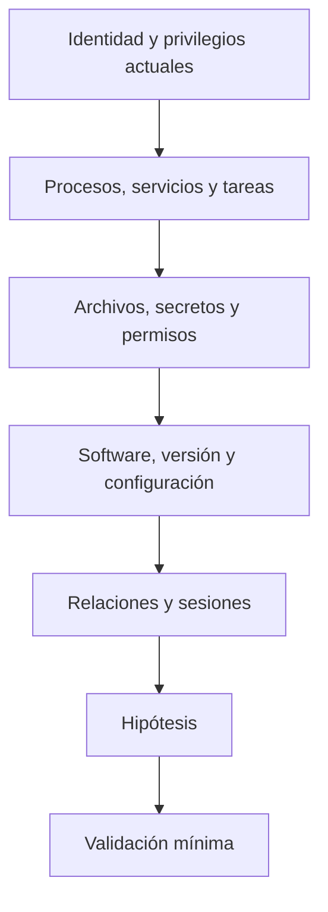
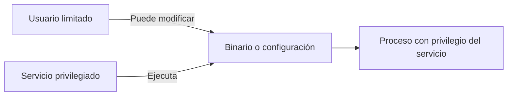

# Escalada de privilegios

## Qué significa

Escalar privilegios es pasar de una identidad con menos capacidad a otra con más. Puede ocurrir:

- localmente: usuario a `root` o `SYSTEM`;
- en AD: usuario a una identidad o grupo con mayor control;
- en una aplicación: cuenta normal a administrador de la aplicación.

No se reduce a ejecutar WinPEAS o LinPEAS. Es comparar el estado real del sistema con el modelo de permisos esperado y encontrar una ruta controlable.

## Método universal



## Linux

Revisa sistemáticamente:

- `sudo -l`;
- binarios SUID/SGID;
- capabilities;
- cron y timers;
- servicios y scripts ejecutados por root;
- rutas o archivos modificables;
- credenciales en configuración e historial;
- grupos como `docker`, `lxd` o equivalentes;
- NFS y montajes;
- versión de kernel solo después de agotar misconfiguraciones.

Comandos base:

```bash
id
sudo -l
find / -perm -4000 -type f 2>/dev/null
getcap -r / 2>/dev/null
systemctl list-timers --all
ss -lntup
```

## Windows

Revisa:

- usuario, grupos y privilegios del token;
- servicios con binario, ruta o ACL débil;
- tareas programadas;
- instaladores y políticas;
- credenciales almacenadas;
- sesiones y procesos;
- permisos sobre registros y archivos;
- AlwaysInstallElevated cuando ambas claves aplicables lo permiten;
- privilegios como `SeImpersonatePrivilege` en su contexto;
- versión y parches, sin empezar por exploits de kernel.

```powershell
whoami /all
whoami /priv
sc.exe query state= all
schtasks /query /fo LIST /v
cmdkey /list
netstat -ano
```

## Servicio vulnerable: modelo



La vulnerabilidad no es «hay un servicio». Es que una identidad menos privilegiada puede alterar algo que una identidad privilegiada ejecutará.

## Automatización bien usada

WinPEAS y LinPEAS generan candidatos. Para cada hallazgo:

1. Reproduce con comandos nativos.
2. Comprueba quién puede modificar el recurso.
3. Identifica quién lo ejecuta y cuándo.
4. Evalúa impacto y riesgo.
5. Ejecuta la prueba menos destructiva.

## Exploits de kernel

Son último recurso en muchos laboratorios: pueden bloquear el sistema, dependen de arquitectura y parcheado y añaden incertidumbre. Si se consideran, verifica versión exacta, mitigaciones, código fuente, efectos secundarios y existencia de snapshot.

