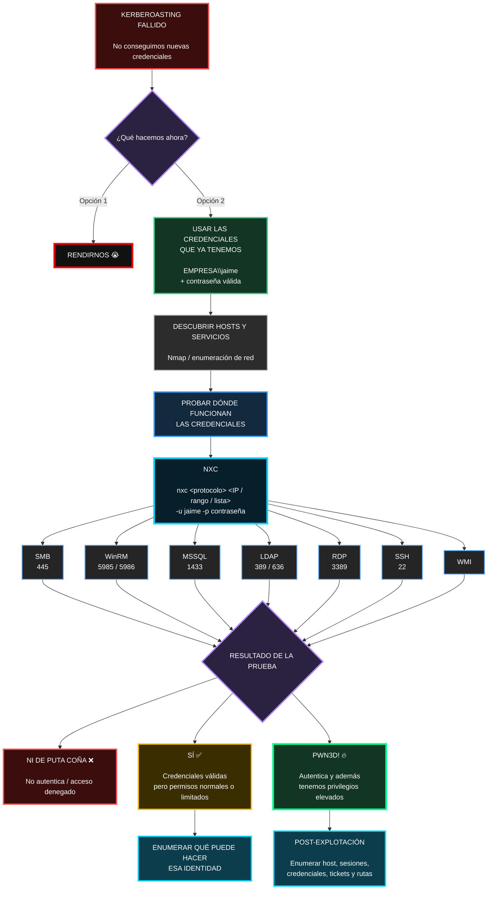
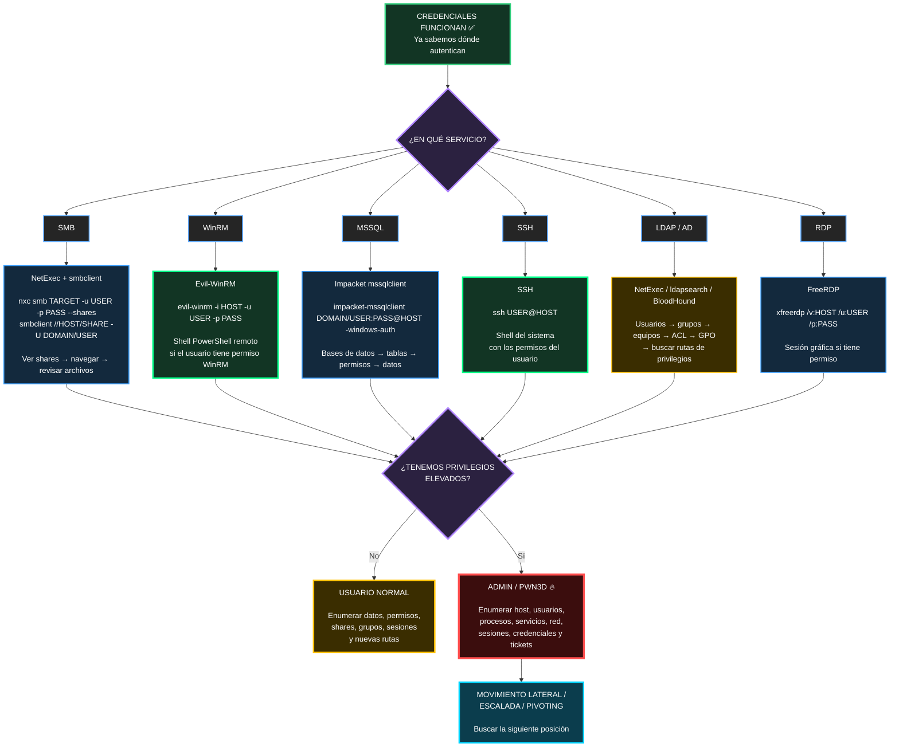
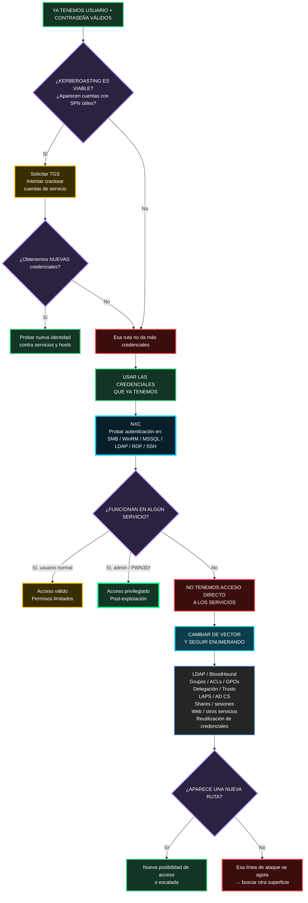

```mermaid
flowchart TD

    A["YA TENEMOS CREDENCIALES VÁLIDAS<br/><br/>Usuario: EMPRESA\\jaime<br/>Contraseña: ********"]:::good

    A --> B["¿Cómo las conseguimos?<br/><br/>• AS-REP Roasting<br/>• Credenciales filtradas<br/>• Post-it<br/>• Reutilización de contraseña<br/><br/>El origen ya no es lo importante"]:::neutral

    B --> C["Primer paso habitual en AD:<br/><br/>ENUMERAR CUENTAS CON SPN<br/><br/>Ejemplo conceptual:<br/>GetUserSPNs"]:::action

    C --> D{"¿Aparecen cuentas de usuario<br/>con SPN interesantes?"}:::decision

    D -- "Sí" --> E["Existe una posible ruta<br/>de KERBEROASTING<br/><br/>Ejemplo:<br/>sqlsvc → MSSQLSvc/SQL01"]:::kerb

    D -- "No" --> F["NO aparecen cuentas de usuario<br/>con SPN kerberoasteables"]:::failed

    F --> G["PERO sabemos que existen servicios:<br/><br/>• SMB / CIFS<br/>• SQL<br/>• HTTP<br/>• otros"]:::failed

    G --> H["Esto puede indicar que sus SPN<br/>están asociados a otras identidades:<br/><br/>• Cuenta de equipo → FILES01$<br/>• gMSA → gmsa-sql$<br/>• otras identidades administradas"]:::failed

    H --> I["Intentar crackear TGS asociados<br/>a estas identidades suele ser<br/>MUY POCO RENTABLE<br/><br/>Secretos largos, aleatorios<br/>y normalmente gestionados automáticamente"]:::failed

    I --> J["KERBEROASTING<br/>NO NOS DA UNA NUEVA<br/>CREDENCIAL ÚTIL"]:::deadend

    J --> K["PERO NO HEMOS PERDIDO<br/>NUESTRAS CREDENCIALES INICIALES"]:::good

    K --> L["Seguimos teniendo:<br/><br/>EMPRESA\\jaime<br/>+<br/>contraseña válida<br/>+<br/>identidad de dominio"]:::good

    L --> M["SIGUIENTE PREGUNTA<br/><br/>¿QUÉ PUEDO HACER REALMENTE<br/>CON ESTE USUARIO Y CONTRASEÑA?"]:::next

    classDef good fill:#123524,stroke:#35d07f,color:#ffffff,stroke-width:3px;
    classDef neutral fill:#252525,stroke:#888888,color:#ffffff,stroke-width:2px;
    classDef action fill:#13293d,stroke:#3ca0ff,color:#ffffff,stroke-width:3px;
    classDef decision fill:#2b2140,stroke:#b084ff,color:#ffffff,stroke-width:3px;
    classDef kerb fill:#3a2d00,stroke:#ffc107,color:#ffffff,stroke-width:3px;
    classDef failed fill:#3b0d0d,stroke:#ff4d4d,color:#ffffff,stroke-width:3px;
    classDef deadend fill:#111111,stroke:#ff0000,color:#ffffff,stroke-width:4px;
    classDef next fill:#0b3d4d,stroke:#00d4ff,color:#ffffff,stroke-width:4px;
```

La idea visual queda así: **intentamos Kerberoasting → esa puerta no da frutos → la rama se pone roja/negra → volvemos a nuestra posición inicial fuerte: seguimos teniendo una identidad válida del dominio**.

El siguiente bloque natural del diagrama sería precisamente abrir desde `¿QUÉ PUEDO HACER CON JAIME?` hacia **SMB, SQL, WinRM, shares, LDAP, hosts y permisos reales**.




Así queda mucho más claro visualmente:

**NXC → muchos servicios → un único punto de decisión → 3 resultados posibles.**

Y además te deja preparado el siguiente bloque: qué hacer cuando **autentica pero no eres admin** frente a qué hacer cuando sale **PWN3D!**.
1. Sí puedes pasar rangos a NXC. Por ejemplo, conceptualmente 10.10.10.0/24, una IP concreta o una lista de objetivos. Pero para estudiar metodología, tiene más sentido primero descubrir servicios con Nmap y después probar solo donde corresponda, porque lanzar credenciales contra todo el rango y todos los protocolos es más ruidoso.

2. Pwn3d! no significa exactamente lo mismo en todos los protocolos. NetExec lo usa como indicador de que ha detectado capacidad relevante de ejecución o privilegios altos; en SMB suele apuntar a administrador local, mientras que WinRM, RDP, LDAP, etc. tienen criterios distintos. La propia documentación de NetExec advierte de esa diferencia.

Sí, te explicas. Y aquí hay una idea importante: **“credenciales válidas” no significa automáticamente “tengo shell”**. Depende del protocolo y de los permisos. En Linux, yo lo resumiría así para un laboratorio autorizado:



Las herramientas que yo memorizaría para **Linux** son muy pocas:

* **SMB:** `NetExec` + `smbclient`
* **WinRM:** `Evil-WinRM`
* **MSSQL:** `impacket-mssqlclient`
* **SSH:** `ssh`
* **LDAP/AD:** `NetExec`, `ldapsearch`, `bloodhound-python`
* **RDP:** `xfreerdp`

Y sí: con SMB, por ejemplo, puedes abrir un share y **copiar archivos concretos del laboratorio a Kali para analizarlos tranquilamente**. Con WinRM o SSH puedes obtener directamente una shell si la cuenta tiene ese derecho. Con SQL normalmente empiezas enumerando bases de datos, tablas y privilegios.

Si además eres administrador, entonces cambia mucho la situación: ya no estás solamente mirando “qué archivos puedo leer”, sino **qué control tengo sobre el host**. Ahí entran enumeración de procesos, servicios, usuarios conectados, red, credenciales/tickets y posibles rutas hacia otras máquinas.

Lo único que separaría de tus apuntes es lo de **“descargar malware y ejecutarlo”** o sacar datos masivamente a servidores externos: para estudiar eCPPT no necesitas eso. Quédate con **acceso → enumeración → credenciales/permisos → movimiento lateral/pivoting**.

---


Sí, **técnicamente se puede**, pero ahí ya entras en dos cosas distintas: **ejecución de payloads/malware** y **exfiltración de datos**. Puedo explicarte cómo funciona y cómo practicarlo en tu laboratorio, pero no darte un procedimiento operativo para desplegar malware real o vaciar datos de una máquina hacia un servidor externo.

La idea es esta: una vez tienes acceso suficiente a un host, dependiendo del protocolo puedes **subir archivos, ejecutar programas o sacar archivos**.

```text
Credenciales válidas
        ↓
acceso al servicio
        ↓
¿permite ejecución?
   ├─ WinRM → PowerShell / comandos
   ├─ SSH   → shell
   ├─ SMB + admin → posibles técnicas de ejecución remota
   └─ SQL → depende de permisos/configuración

¿permite acceder a archivos?
   ├─ SMB → descargar archivos del share
   ├─ SSH → SCP/SFTP
   ├─ WinRM → upload/download
   └─ SQL → datos de la BD según permisos
```

Para practicarlo de forma segura en tus propias VMs, puedes sustituir “malware” por un **payload inocuo**, por ejemplo un script que únicamente cree un archivo o muestre `hostname`/`whoami`. Así practicas exactamente el mecanismo de **subir → ejecutar → recibir resultado** sin necesitar código malicioso.

Y con los datos igual: en lugar de “sacar todo”, crea unos archivos ficticios como:

```text
clientes_demo.txt
passwords_fake.txt
informe_confidencial_demo.pdf
```

y practica el flujo:

```text
Host víctima de laboratorio
        ↓
descubrir archivo interesante
        ↓
transferirlo a Kali
        ↓
analizarlo offline
```

Eso, conceptualmente, es lo mismo que una exfiltración, pero controlada.

Un detalle importante para tus apuntes: **tener admin no significa que cualquier protocolo te dé automáticamente una shell**. Por ejemplo, SMB puede autenticarte como administrador, pero después necesitas una técnica de ejecución remota compatible; WinRM o SSH, en cambio, sí están diseñados para darte ejecución remota directamente.

Para eCPPT y para aprender Red Team, la idea que merece la pena memorizar es:

> **Acceso → ejecución remota si es posible → transferencia de archivos → enumeración de información/credenciales → movimiento lateral.**

El “malware/C2/exfiltración real” sería ya una capa posterior sobre esos mismos mecanismos.

---


Sí. Te lo haría así, manteniendo justo esa lógica y dejando claro que cuando una vía falla, **pasas a otra**, no que el ataque termine.



La idea central sería:

> **Kerberoasting falla → probamos la cuenta que ya tenemos → NXC no da acceso → no nos rendimos: volvemos a enumeración de AD y buscamos otra ruta.**

