```mermaid
flowchart TD

    A["YA TENEMOS CREDENCIALES VÁLIDAS<br/><br/>Usuario: EMPRESA\\jaime<br/>Contraseña: ********"]:::good

    A --> B["¿Cómo las conseguimos?<br/><br/>• AS-REP Roasting<br/>• Credenciales filtradas<br/>• Post-it<br/>• Reutilización de contraseña<br/><br/>El origen ya no es lo importante"]:::neutral

    B --> C["Primer paso habitual en AD:<br/><br/>ENUMERAR CUENTAS CON SPN<br/><br/>Ejemplo conceptual:<br/>GetUserSPNs"]:::action

    C --> D{"¿Aparecen cuentas de usuario<br/>con SPN interesantes?"}:::decision

    D -- "Sí" --> E["Existe una posible ruta<br/>de KERBEROASTING<br/><br/>Ejemplo:<br/>sqlsvc → MSSQLSvc/SQL01"]:::kerb

    D -- "No" --> F["NO aparecen cuentas de usuario<br/>con SPN kerberoasteables"]:::failed

    F --> G["PERO sabemos que existen servicios:<br/><br/>• SMB / CIFS<br/>• SQL<br/>• HTTP<br/>• otros"]:::failed

    G --> H["Esto puede indicar que sus SPN<br/>están asociados a otras identidades:<br/><br/>• Cuenta de equipo → FILES01$<br/>• gMSA → gmsa-sql$<br/>• otras identidades administradas"]:::failed

    H --> I["Intentar crackear TGS asociados<br/>a estas identidades suele ser<br/>MUY POCO RENTABLE<br/><br/>Secretos largos, aleatorios<br/>y normalmente gestionados automáticamente"]:::failed

    I --> J["KERBEROASTING<br/>NO NOS DA UNA NUEVA<br/>CREDENCIAL ÚTIL"]:::deadend

    J --> K["PERO NO HEMOS PERDIDO<br/>NUESTRAS CREDENCIALES INICIALES"]:::good

    K --> L["Seguimos teniendo:<br/><br/>EMPRESA\\jaime<br/>+<br/>contraseña válida<br/>+<br/>identidad de dominio"]:::good

    L --> M["SIGUIENTE PREGUNTA<br/><br/>¿QUÉ PUEDO HACER REALMENTE<br/>CON ESTE USUARIO Y CONTRASEÑA?"]:::next

    classDef good fill:#123524,stroke:#35d07f,color:#ffffff,stroke-width:3px;
    classDef neutral fill:#252525,stroke:#888888,color:#ffffff,stroke-width:2px;
    classDef action fill:#13293d,stroke:#3ca0ff,color:#ffffff,stroke-width:3px;
    classDef decision fill:#2b2140,stroke:#b084ff,color:#ffffff,stroke-width:3px;
    classDef kerb fill:#3a2d00,stroke:#ffc107,color:#ffffff,stroke-width:3px;
    classDef failed fill:#3b0d0d,stroke:#ff4d4d,color:#ffffff,stroke-width:3px;
    classDef deadend fill:#111111,stroke:#ff0000,color:#ffffff,stroke-width:4px;
    classDef next fill:#0b3d4d,stroke:#00d4ff,color:#ffffff,stroke-width:4px;
```

La idea visual queda así: **intentamos Kerberoasting → esa puerta no da frutos → la rama se pone roja/negra → volvemos a nuestra posición inicial fuerte: seguimos teniendo una identidad válida del dominio**.

El siguiente bloque natural del diagrama sería precisamente abrir desde `¿QUÉ PUEDO HACER CON JAIME?` hacia **SMB, SQL, WinRM, shares, LDAP, hosts y permisos reales**.
