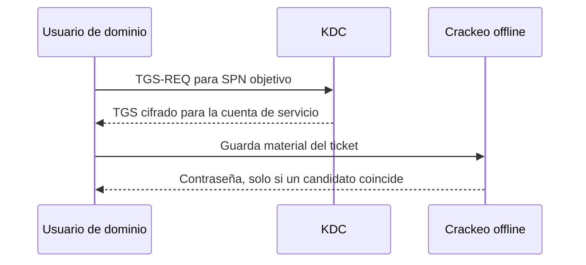

# Kerberoasting

**Kerberoasting** es parecido en espíritu al AS-REP Roasting, pero ataca otra parte del flujo.

Aquí **sí necesitas una cuenta válida del dominio** para empezar. Con tu **TGT**, le pides al KDC un **Service Ticket** para un servicio concreto, por ejemplo:

**TGT + `cifs/FILESERVER` → KDC → Service Ticket**

La clave está en que parte de ese Service Ticket está cifrada con una clave derivada de la **contraseña de la cuenta que ejecuta ese servicio**. Entonces el atacante se lleva ese ticket y prueba contraseñas **offline** hasta encontrar una que encaje.

La idea mental es:

**AS-REP Roasting**
→ cuenta sin preautenticación
→ obtengo material cifrado del AS-REP
→ intento recuperar la contraseña del usuario

**Kerberoasting**
→ ya tengo una cuenta válida
→ pido un Service Ticket para un SPN
→ me llevo ese ticket
→ intento recuperar la contraseña de la cuenta de servicio

La frase para memorizarlo:

**Kerberoasting = pedir legítimamente un ticket de servicio y usarlo como material para intentar crackear offline la contraseña de la cuenta que presta ese servicio.**

---


## Idea esencial

Un usuario autenticado puede solicitar un ticket para un servicio cuyo SPN conoce. Parte de ese TGS está cifrada con una clave vinculada a la contraseña de la cuenta que ejecuta el servicio. El ticket puede auditarse offline.

Kerberoasting no exige ser administrador y no explota el servidor del servicio. Explota la combinación de una función normal de Kerberos con contraseñas débiles o antiguas en cuentas de servicio.

## Flujo



## Qué es un SPN

Un Service Principal Name vincula una instancia de servicio con una cuenta, por ejemplo:

```text
MSSQLSvc/SQL01.corp.local:1433
HTTP/intranet.corp.local
```

Los servicios que funcionan con cuentas de usuario administradas manualmente suelen ser más interesantes que los ejecutados por cuentas de equipo con contraseñas largas y rotadas automáticamente.

## Ejemplo de laboratorio

```bash
GetUserSPNs.py 'corp.local/edu:Laboratorio123!' \
  -dc-ip 10.10.10.10 -request -outputfile tgs.hashes
```

Con un ticket o hash compatible, usa la opción de autenticación correspondiente de la versión instalada. Después, identifica el formato y audita offline:

```bash
hashcat -m 13100 tgs.hashes diccionario.txt
```

El tipo de cifrado puede cambiar el modo. Compruébalo antes.

## Priorización

No ataques todos los SPN sin pensar. Prioriza:

- cuentas de usuario de servicio;
- contraseñas que nunca expiran;
- cuentas antiguas;
- servicios críticos;
- cuentas con membresías o ACL privilegiadas;
- material con cifrado susceptible de auditoría eficiente.

## Resultado y siguiente paso

Si recuperas una contraseña:

1. Identifica exactamente la cuenta.
2. Valida con el menor impacto posible.
3. Enumera sus grupos, sesiones, administración local y ACL.
4. Actualiza BloodHound.
5. No asumas que el nombre «svc» implica privilegios altos.

## Mitigación

Usar gMSA cuando sea posible, contraseñas largas y aleatorias, rotación, mínimo privilegio, cifrado moderno y monitorización de solicitudes TGS inusuales.

