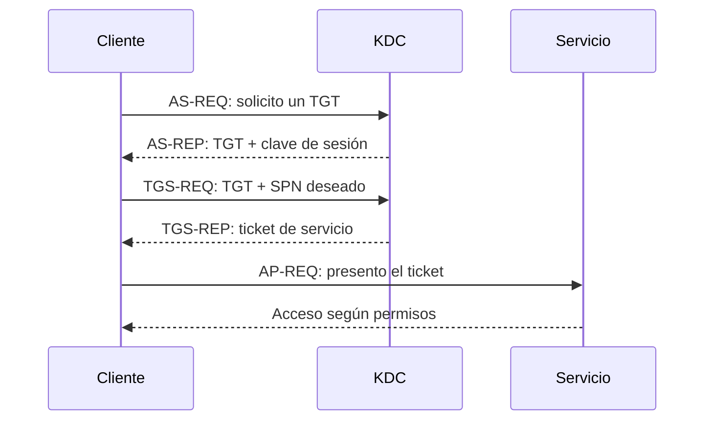

# Kerberos


## Qué es

Kerberos es el protocolo de autenticación preferido dentro de Active Directory. Permite que un usuario demuestre su identidad y acceda a varios servicios mediante tickets, sin enviar su contraseña a cada servidor.

Piensa en un festival:

1. En la entrada demuestras quién eres y recibes una pulsera general: el **TGT**.
2. Con esa pulsera solicitas un pase para un escenario concreto: el **TGS**.
3. Enseñas ese pase al escenario, no tu documento original.

El KDC se ejecuta en el Domain Controller y tiene dos funciones lógicas: **Authentication Service (AS)** y **Ticket Granting Service (TGS)**.

## Elementos

| Elemento | Función |
|---|---|
| KDC | Emite tickets; está integrado en el DC |
| TGT | Ticket para pedir posteriores tickets de servicio |
| TGS / service ticket | Ticket para acceder a un servicio concreto |
| SPN | Identificador de una instancia de servicio |
| `krbtgt` | Cuenta cuya clave protege los TGT del dominio |
| Realm | Ámbito Kerberos; suele corresponder al dominio DNS en mayúsculas |

## Flujo normal



### AS-REQ / AS-REP

En condiciones normales, la solicitud inicial incluye una marca temporal cifrada con una clave derivada de la contraseña del usuario. Eso es la **preautenticación**: dificulta que cualquiera solicite material cifrado para una cuenta arbitraria.

### TGS-REQ / TGS-REP

El cliente presenta su TGT y pide acceso a un SPN como `cifs/SRV01.corp.local` o `MSSQLSvc/SQL01.corp.local:1433`. El ticket de servicio contiene una parte cifrada con la clave de la cuenta que ejecuta el servicio.

## Por qué permite ataques offline

Kerberos no está «roto». Ciertas configuraciones permiten obtener estructuras cifradas con claves derivadas de contraseñas. El auditor puede probar candidatos offline:

- sin preautenticación: [AS-REP Roasting](../AS-REP-Roasting/README.md);
- cuenta con SPN: [Kerberoasting](../Kerberoasting/README.md).

El éxito depende de que la contraseña sea débil. El ticket no revela mágicamente la contraseña.

## Tickets y reloj

Kerberos depende de nombres correctos, DNS funcional y tiempo suficientemente sincronizado. Un error de reloj, resolución o SPN puede parecer una credencial incorrecta. Antes de cambiar de técnica, comprueba:

```bash
date
nslookup -type=SRV _kerberos._tcp.corp.local 10.10.10.10
```

## Comandos de observación

En Windows:

```powershell
klist
klist sessions
whoami /user
```

En un laboratorio desde Linux, una caché de credenciales Kerberos suele indicarse mediante:

```bash
export KRB5CCNAME=/ruta/usuario.ccache
klist
```

## Lo que debes saber explicar

Debes dibujar de memoria el flujo TGT/TGS, identificar quién cifra cada parte relevante, explicar el papel del SPN y distinguir contraseña, hash, clave de sesión y ticket. Después, Pass-the-Ticket deja de ser «usar un archivo raro» y pasa a ser reutilizar una prueba de autenticación válida.

