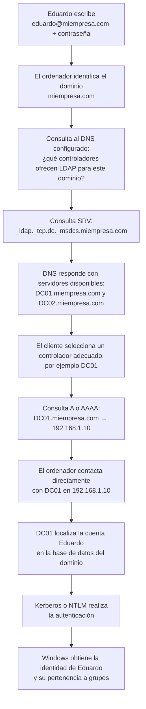

# LDAP y DNS en Active Directory

## La idea que debes tener en la cabeza

LDAP y DNS hacen trabajos completamente distintos:

- **DNS encuentra el servidor adecuado:** responde dónde hay un controlador de dominio y cuál es su dirección IP.
- **LDAP permite hablar con el directorio:** consultar o modificar, si se tienen permisos, usuarios, grupos, equipos y otros objetos de Active Directory.
- **Kerberos o NTLM autentican:** comprueban la identidad del usuario cuando corresponde.

> **DNS encuentra el controlador de dominio; LDAP consulta su directorio; Kerberos o NTLM demuestran la identidad.**

No son tres nombres para lo mismo. Son tres piezas que colaboran.

| Pieza | Pregunta que responde | Ejemplo |
|---|---|---|
| DNS | ¿Dónde está el servicio que necesito? | `DC01.miempresa.com → 192.168.1.10` |
| LDAP | ¿Qué objetos y datos existen en el directorio? | ¿Qué usuarios pertenecen a Finanzas? |
| Kerberos/NTLM | ¿Puedes demostrar que eres Eduardo? | Autenticación del usuario |
| NTFS/Share Permissions | Ya autenticado, ¿puedes abrir este recurso? | Leer `\\FS01\Finanzas` |

---

## El flujo completo: desde el inicio de sesión hasta el controlador

Supongamos que existe este entorno:

```text
Dominio: miempresa.com
Usuario: eduardo@miempresa.com
Controladores: DC01 y DC02
DNS interno: 192.168.1.5
```

Cuando Eduardo inicia sesión, ocurre de forma simplificada lo siguiente:



La precisión más importante es esta:

> **DNS no recibe la contraseña, no autentica al usuario y no busca a Eduardo en Active Directory. DNS solo proporciona la información necesaria para localizar un controlador. Después, el ordenador se comunica directamente con ese controlador.**

Por eso se puede decir informalmente que DNS «indica la ruta», aunque técnicamente no transporta ni reenvía la autenticación: devuelve nombres de servidores y direcciones para que el cliente sepa con quién conectarse.

---

## Parte I: DNS

### Qué es DNS

DNS significa **Domain Name System**. Su función general es traducir nombres comprensibles a información de red.

El ejemplo más conocido es:

```text
DC01.miempresa.com → 192.168.1.10
```

Pero en Active Directory no basta con conocer la IP de un nombre concreto. El equipo necesita preguntar algo más útil:

> «¿Qué servidor realiza la función de controlador de dominio, Kerberos o catálogo global para `miempresa.com`?»

Para responder a esto, Active Directory utiliza principalmente **registros SRV**.

### Registros A/AAAA frente a registros SRV

#### Registro A o AAAA

Asocia el nombre de un equipo con su dirección:

```text
DC01.miempresa.com → 192.168.1.10        Registro A, IPv4
DC01.miempresa.com → 2001:db8::10        Registro AAAA, IPv6
```

Responde:

> «¿Qué IP tiene este servidor?»

#### Registro SRV

Anuncia qué servidores ofrecen un servicio determinado:

```text
_ldap._tcp.dc._msdcs.miempresa.com
```

Responde:

> «¿Qué servidores ofrecen el servicio LDAP como controladores del dominio `miempresa.com`, por qué puerto y con qué prioridad?»

Una respuesta simplificada podría ser:

```text
Prioridad  Peso  Puerto  Servidor
0          100   389     DC01.miempresa.com
0          100   389     DC02.miempresa.com
```

Después, el cliente consulta el registro A o AAAA del servidor seleccionado para obtener su IP.

Por tanto, la resolución se produce en dos ideas:

```text
1. SRV: ¿qué servidor ofrece este servicio?
2. A/AAAA: ¿qué dirección IP tiene ese servidor?
```

### Registros importantes en Active Directory

| Consulta DNS | Para qué sirve |
|---|---|
| `_ldap._tcp.dc._msdcs.miempresa.com` | Localizar controladores del dominio mediante LDAP |
| `_kerberos._tcp.miempresa.com` | Localizar el servicio Kerberos |
| `_kerberos._udp.miempresa.com` | Localizar Kerberos por UDP cuando se anuncie |
| `_ldap._tcp.gc._msdcs.miempresa.com` | Localizar servidores de Global Catalog |
| `_ldap._tcp.Alicante._sites.dc._msdcs.miempresa.com` | Buscar un DC asociado al sitio de Alicante |

Los controladores registran estos datos en DNS para anunciar las funciones que ofrecen. Si existen varios DC, DNS puede devolver varios candidatos. El proceso **DC Locator** ayuda al cliente a elegir uno adecuado y puede tener en cuenta el sitio de Active Directory, la disponibilidad y las características requeridas.

### Por qué pueden existir varios controladores

Una empresa no tiene por qué depender de un único servidor:

```text
miempresa.com
├── DC01.miempresa.com   192.168.1.10   Alicante
├── DC02.miempresa.com   192.168.2.10   Madrid
└── DC03.miempresa.com   192.168.3.10   Respaldo
```

Los registros SRV permiten anunciar varios controladores. Así se consigue:

- redundancia si uno falla;
- reparto y proximidad de los servicios;
- selección de un DC del sitio adecuado;
- mantenimiento sin dejar todo el dominio inutilizado.

DNS no decide si la contraseña es correcta. Únicamente ayuda a encontrar candidatos. El cliente selecciona uno y se conecta con él.

### Por qué DNS es tan importante para Active Directory

DNS interviene, entre otras cosas, para:

- unir un equipo al dominio;
- encontrar un controlador al iniciar sesión;
- localizar Kerberos, LDAP y el Global Catalog;
- aplicar GPO y encontrar recursos del dominio;
- permitir que los controladores se localicen durante la replicación;
- trabajar con nombres coherentes, necesarios para numerosos usos de Kerberos.

Si el equipo utiliza como DNS únicamente el router doméstico o un DNS público, ese servidor normalmente no conocerá los registros privados de `miempresa.com`. Internet puede funcionar perfectamente y, aun así, fallar el dominio.

En un entorno de dominio, el cliente debe usar un DNS capaz de resolver la zona de Active Directory. Habitualmente será el DNS integrado con AD. Ese DNS podrá reenviar las consultas de Internet a otros resolutores cuando sea necesario.

### Lo que DNS hace y lo que no hace

| DNS sí hace | DNS no hace |
|---|---|
| Localiza servicios mediante SRV | No comprueba contraseñas |
| Resuelve nombres mediante A/AAAA | No realiza Kerberos ni NTLM |
| Devuelve uno o varios DC candidatos | No busca la cuenta en `NTDS.dit` |
| Ayuda a localizar servicios cercanos por sitio | No decide permisos sobre archivos |
| Permite encontrar LDAP, Kerberos y Global Catalog | No transporta la autenticación hasta el DC |

### Comprobarlo desde Windows o Kali

Desde Windows:

```powershell
nslookup -type=SRV _ldap._tcp.dc._msdcs.miempresa.com 192.168.1.5
nslookup DC01.miempresa.com 192.168.1.5
```

Desde Kali/Linux:

```bash
dig @192.168.1.5 _ldap._tcp.dc._msdcs.miempresa.com SRV
dig @192.168.1.5 _kerberos._tcp.miempresa.com SRV
dig @192.168.1.5 DC01.miempresa.com A
```

La primera consulta localiza **el servicio**. La última transforma **el nombre del servidor** en una IP.

Añadir `DC01.miempresa.com` a `/etc/hosts` puede resolver ese nombre concreto, pero no reproduce los registros SRV ni sustituye correctamente el DNS del dominio.

---

## Parte II: LDAP

### Antes de LDAP: qué significa «directorio»

Un directorio de Active Directory no es una carpeta con archivos. Es una base de información especializada en guardar **objetos** y sus **atributos**.

Ejemplo de objeto de usuario:

```text
Objeto: Eduardo
├── Nombre de inicio de sesión: eduardo
├── UPN: eduardo@miempresa.com
├── SID: S-1-5-21-...-1105
├── Departamento: Finanzas
├── Grupos: Empleados, Finanzas
└── Estado: habilitado
```

También existen objetos de equipo, grupo, OU, GPO y muchos otros tipos:

```text
Directorio de miempresa.com
├── Usuarios
│   ├── Eduardo
│   └── María
├── Equipos
│   ├── PC-EDUARDO
│   └── PC-MARIA
├── Grupos
│   ├── Finanzas
│   └── Informática
└── Controladores de dominio
    ├── DC01
    └── DC02
```

Los datos se almacenan en la base de Active Directory, principalmente en `NTDS.dit` en cada controlador de dominio. **LDAP no es esa base de datos.** LDAP es el protocolo que permite solicitar operaciones sobre el directorio.

Una comparación útil:

```text
NTDS.dit   = donde se almacenan los datos del directorio
AD DS      = servicio que gestiona esos datos
LDAP       = protocolo para consultar o modificar el directorio
DNS        = mecanismo para localizar el servidor que ofrece LDAP
```

### Qué significa LDAP

LDAP significa **Lightweight Directory Access Protocol**. Es un protocolo cliente-servidor estandarizado.

Una herramienta puede utilizar LDAP para pedir al controlador:

- «Dame todos los usuarios».
- «Busca la cuenta cuyo nombre es Eduardo».
- «¿Qué miembros tiene el grupo Finanzas?».
- «¿Qué equipos existen?».
- «¿Qué cuentas poseen un SPN?».
- «Muéstrame ciertos atributos y permisos de estos objetos».
- «Modifica este atributo», si la identidad conectada tiene autorización.

LDAP no se limita a leer. También define operaciones para añadir, modificar, renombrar o eliminar entradas, pero Active Directory examina los permisos antes de aceptar los cambios.

### LDAP no es lo mismo que autenticación de Windows

Una conexión LDAP normalmente empieza estableciendo una asociación o **bind**. El cliente puede identificarse de diferentes formas para que el servidor sepa con qué identidad se ejecutarán las consultas.

Sin embargo:

> **Que LDAP permita hacer un bind no significa que LDAP sustituya a Kerberos o NTLM en el inicio de sesión de Windows.**

En el flujo habitual del dominio:

- DNS ayuda a encontrar un DC;
- Kerberos o NTLM se utiliza para autenticar al usuario;
- LDAP se utiliza para consultar datos del directorio;
- los permisos del objeto determinan qué puede leer o modificar esa identidad.

### Cómo se organiza la información LDAP

Cada entrada tiene un nombre único denominado **Distinguished Name** o **DN**:

```text
CN=Eduardo,OU=Finanzas,OU=Usuarios,DC=miempresa,DC=com
```

Se interpreta desde el objeto hacia la raíz, de izquierda a derecha:

```text
CN=Eduardo          → objeto llamado Eduardo
OU=Finanzas         → dentro de la OU Finanzas
OU=Usuarios         → dentro de la OU Usuarios
DC=miempresa        → primera parte del dominio
DC=com              → segunda parte del dominio
```

Visualmente:

```text
miempresa.com
└── OU=Usuarios
    └── OU=Finanzas
        └── CN=Eduardo
```

| Componente | Significado práctico |
|---|---|
| `DC` | Domain Component: una parte del dominio DNS |
| `OU` | Organizational Unit: contenedor administrativo |
| `CN` | Common Name: nombre de una entrada u objeto |
| `DN` | Ruta única completa del objeto dentro del directorio |
| `RDN` | Primer componente que distingue al objeto dentro de su contenedor |

Para `miempresa.com`, la base habitual del dominio es:

```text
DC=miempresa,DC=com
```

#### OU y grupo siguen siendo cosas distintas

El DN muestra dónde está colocado el objeto, no todos los grupos a los que pertenece:

```text
Ubicación de Eduardo:
CN=Eduardo,OU=Finanzas,OU=Usuarios,DC=miempresa,DC=com

Grupos de Eduardo:
Empleados
Finanzas
Usuarios-VPN
```

Mover a Eduardo a otra OU cambia su ubicación y su DN, pero no lo añade ni lo elimina automáticamente de esos grupos.

### Atributos importantes de un usuario

Una entrada LDAP contiene pares de atributo y valor. Algunos atributos frecuentes en Active Directory son:

| Atributo | Qué representa |
|---|---|
| `sAMAccountName` | Nombre de inicio de sesión tradicional, por ejemplo `eduardo` |
| `userPrincipalName` | Nombre tipo usuario@dominio, por ejemplo `eduardo@miempresa.com` |
| `distinguishedName` | DN completo del objeto |
| `objectSid` | SID de la identidad |
| `memberOf` | Grupos a los que pertenece directamente |
| `servicePrincipalName` | Servicios asociados con la cuenta |
| `userAccountControl` | Conjunto de indicadores de configuración de la cuenta |
| `objectClass` | Clases que describen el tipo de objeto |

Un resultado simplificado podría parecerse a esto:

```text
dn: CN=Eduardo,OU=Finanzas,OU=Usuarios,DC=miempresa,DC=com
objectClass: user
sAMAccountName: eduardo
userPrincipalName: eduardo@miempresa.com
memberOf: CN=Finanzas,OU=Grupos,DC=miempresa,DC=com
```

### Las operaciones LDAP más importantes

| Operación | Para qué sirve |
|---|---|
| Bind | Establecer la asociación e identidad de la conexión |
| Search | Buscar entradas y recuperar atributos |
| Compare | Comprobar si una entrada contiene un valor concreto |
| Add | Crear una entrada, si se tiene permiso |
| Modify | Cambiar atributos, si se tiene permiso |
| Modify DN | Renombrar o mover una entrada |
| Delete | Eliminar una entrada, si se tiene permiso |
| Unbind | Cerrar la asociación LDAP |

En pentesting, la operación más habitual al principio es **Search**: enumerar qué existe y cómo se relaciona.

### Anatomía de una búsqueda LDAP

Para realizar una búsqueda hacen falta varias decisiones:

```text
Servidor       ¿A qué DC me conecto?
Identidad      ¿Con qué usuario hago la consulta?
Base DN        ¿Desde qué punto del árbol empiezo?
Alcance        ¿Solo esa entrada, un nivel o todo el subárbol?
Filtro         ¿Qué objetos quiero?
Atributos      ¿Qué datos quiero recuperar de ellos?
```

Ejemplo:

```bash
ldapsearch -x \
  -H ldap://DC01.miempresa.com \
  -D 'eduardo@miempresa.com' \
  -W \
  -b 'DC=miempresa,DC=com' \
  '(&(objectCategory=person)(objectClass=user))' \
  sAMAccountName userPrincipalName memberOf
```

Qué significa cada parte:

| Parte | Significado |
|---|---|
| `-x` | Utiliza autenticación simple en vez de SASL |
| `-H` | Servidor y esquema LDAP al que conectarse |
| `-D` | Identidad utilizada en el bind |
| `-W` | Solicita la contraseña de forma interactiva |
| `-b` | Base DN desde la que se busca |
| Filtro | Limita los resultados a personas que son usuarios |
| Últimos nombres | Atributos que se quieren mostrar |

`-W` evita escribir la contraseña directamente en la línea de comandos. En un entorno real, una autenticación simple no debe enviarse sin protección de transporte.

### Filtros LDAP básicos

```text
(sAMAccountName=eduardo)
```

Busca una entrada cuyo atributo `sAMAccountName` sea Eduardo.

```text
(objectClass=computer)
```

Busca equipos.

```text
(&(objectCategory=person)(objectClass=user))
```

El operador `&` significa **AND**: deben cumplirse ambas condiciones.

```text
(&(objectClass=user)(servicePrincipalName=*))
```

Busca objetos de usuario que tengan algún SPN. El asterisco actúa como comodín.

Otros operadores comunes:

| Símbolo | Significado |
|---|---|
| `&` | AND: todas las condiciones |
| `|` | OR: al menos una condición |
| `!` | NOT: negar una condición |
| `*` | Comodín o atributo presente |

### RootDSE: preguntar al servidor cómo está organizado

Antes de conocer la base DN, puede consultarse el **RootDSE**:

```bash
ldapsearch -x -H ldap://DC01.miempresa.com \
  -s base -b '' defaultNamingContext namingContexts
```

Una respuesta podría indicar:

```text
defaultNamingContext: DC=miempresa,DC=com
```

Así se descubre cuál es la raíz habitual del dominio que debe utilizarse como base de búsqueda.

### Qué puede revelar LDAP en un pentest autorizado

Con una cuenta de dominio válida de bajo privilegio suele ser posible leer una cantidad considerable de información, dependiendo de la configuración:

- usuarios y atributos de cuenta;
- grupos y miembros;
- equipos y sistemas registrados;
- unidades organizativas;
- cuentas con SPN;
- configuraciones relevantes para la preautenticación;
- GPO y enlaces;
- relaciones de confianza;
- ACL de objetos y posibles rutas de control;
- información sobre el dominio y el bosque.

Esto no significa que LDAP sea una vulnerabilidad. El directorio necesita que los miembros del dominio puedan consultar determinada información para funcionar. El problema aparece cuando esa información permite descubrir credenciales débiles, permisos excesivos o configuraciones inseguras.

LDAP sirve para **descubrir candidatos y relaciones**. Por ejemplo, puede revelar qué cuentas poseen SPN, pero el intercambio de tickets posterior corresponde a Kerberos, no a LDAP.

---

## Parte III: cómo colaboran DNS y LDAP

### Ejemplo completo

Eduardo quiere que una herramienta consulte los grupos del dominio:

```text
1. La herramienta conoce el dominio: miempresa.com.

2. Consulta DNS:
   _ldap._tcp.dc._msdcs.miempresa.com

3. DNS devuelve:
   DC01.miempresa.com, puerto 389
   DC02.miempresa.com, puerto 389

4. Se resuelve el nombre seleccionado:
   DC01.miempresa.com → 192.168.1.10

5. La herramienta abre una conexión LDAP con DC01.

6. Se identifica mediante un bind o reutiliza un mecanismo
   de autenticación compatible.

7. Envía una búsqueda:
   Base: DC=miempresa,DC=com
   Filtro: (objectClass=group)

8. DC01 consulta el directorio y devuelve los resultados
   que esa identidad está autorizada a leer.
```

La separación definitiva es:

```text
DNS  → encuentra dónde está LDAP
LDAP → formula la consulta al directorio
AD   → devuelve solo lo que los permisos permiten
```

### Puertos que debes reconocer

| Puerto | Protocolo/servicio | Uso principal |
|---:|---|---|
| 53 TCP/UDP | DNS | Resolución de nombres y localización de servicios |
| 88 TCP/UDP | Kerberos | Autenticación Kerberos |
| 389 TCP | LDAP | Consultas LDAP; puede usar StartTLS |
| 389 UDP | CLDAP | Descubrimiento y LDAP ping en DC Locator |
| 636 TCP | LDAPS | LDAP protegido mediante TLS desde el inicio |
| 3268 TCP | Global Catalog | Consultas LDAP parciales a través del bosque |
| 3269 TCP | Global Catalog seguro | Global Catalog protegido mediante TLS |

#### LDAP, LDAPS y StartTLS

- `ldap://` suele utilizar TCP 389.
- `ldaps://` suele utilizar TCP 636 y establece TLS desde el inicio.
- StartTLS comienza en 389 y eleva la conexión a TLS.
- El cifrado de transporte no concede permisos adicionales: protege la comunicación.

En entornos corporativos pueden exigirse controles como LDAP signing y channel binding. No se debe asumir que un bind simple sin TLS es aceptable ni seguro.

### Global Catalog

El **Global Catalog** permite buscar un subconjunto de atributos de objetos de distintos dominios del bosque.

```text
LDAP normal:      389 / 636   → consulta del directorio
Global Catalog:   3268 / 3269 → búsqueda parcial a escala de bosque
```

No contiene necesariamente todos los atributos de todos los objetos. Está diseñado para localizar información útil a través del bosque sin consultar cada dominio por separado.

---

## Parte IV: errores frecuentes y diagnóstico

### Confusiones que debes evitar

| Confusión | Explicación correcta |
|---|---|
| «LDAP es Active Directory» | AD DS es el servicio de directorio; LDAP es uno de sus protocolos de acceso |
| «LDAP es la base de datos» | Los datos se almacenan en `NTDS.dit`; LDAP sirve para operarlos |
| «LDAP autentica siempre el inicio de Windows» | El inicio de dominio utiliza normalmente Kerberos o NTLM; LDAP puede establecer su propia asociación mediante bind |
| «DNS autentica al usuario» | DNS solo ayuda a localizar los servicios y servidores |
| «DNS envía la contraseña al DC» | El cliente obtiene la localización y después conecta directamente con el DC |
| «Un registro A basta para AD» | AD depende también de registros SRV que anuncian funciones |
| «Una OU es un grupo» | La OU organiza objetos; el grupo representa pertenencia y se usa en permisos |
| «LDAP solo puede leer» | También puede modificar, pero AD aplica autorización sobre cada operación |
| «Si funciona Internet, DNS está bien» | Puede funcionar Internet y fallar todos los registros privados del dominio |

### Diagnóstico mínimo

Si una herramienta o un equipo no trabaja correctamente con el dominio, comprueba en este orden:

1. **Ruta:** ¿existe conectividad hasta la red del DC?
2. **DNS configurado:** ¿el cliente consulta un servidor que conoce la zona de AD?
3. **SRV:** ¿se resuelve `_ldap._tcp.dc._msdcs.dominio`?
4. **FQDN:** ¿el nombre del DC se convierte en la IP correcta?
5. **Hora:** ¿el reloj es coherente con el dominio? Kerberos es sensible al desfase.
6. **Puertos:** ¿53, 88, 389/636 y los demás servicios necesarios están accesibles?
7. **Dominio y usuario:** ¿son correctos el UPN, el dominio y la base DN?
8. **Autenticación:** ¿la identidad y el método utilizados son válidos?
9. **Autorización:** si la autenticación funciona, ¿esa identidad puede leer o cambiar el objeto solicitado?

Una consulta LDAP que devuelve «credenciales no válidas» no es lo mismo que una consulta autenticada a la que se deniega una modificación. La primera falla en la identidad; la segunda falla en la autorización.

### Secuencia práctica de comprobación

```bash
# 1. Localizar LDAP mediante DNS
dig @192.168.1.5 _ldap._tcp.dc._msdcs.miempresa.com SRV

# 2. Resolver el DC elegido
dig @192.168.1.5 DC01.miempresa.com A

# 3. Consultar la raíz LDAP
ldapsearch -x -H ldap://DC01.miempresa.com \
  -s base -b '' defaultNamingContext

# 4. Consultar con una cuenta de laboratorio
ldapsearch -x -H ldap://DC01.miempresa.com \
  -D 'eduardo@miempresa.com' -W \
  -b 'DC=miempresa,DC=com' \
  '(sAMAccountName=eduardo)' \
  distinguishedName memberOf objectSid
```

No introduzcas contraseñas reales directamente con opciones como `-w`, porque pueden quedar expuestas en el historial o en la lista de procesos. Utiliza `-W`, mecanismos seguros o credenciales exclusivas del laboratorio.

---

## Resumen final

Quédate con estas seis ideas:

1. **Active Directory es el directorio** que contiene usuarios, equipos, grupos y demás objetos.
2. **`NTDS.dit` almacena los datos** del directorio en los controladores.
3. **DNS localiza los controladores y sus servicios**, principalmente mediante registros SRV y después A/AAAA.
4. **LDAP consulta o modifica el directorio**, siempre bajo los permisos de la identidad utilizada.
5. **Kerberos o NTLM realizan normalmente la autenticación del dominio**; DNS y LDAP no sustituyen esa función.
6. **En un pentest, DNS permite encontrar la infraestructura y LDAP permite comprender sus objetos y relaciones.**

La frase definitiva es:

> **El ordenador pregunta a DNS dónde existe un controlador del dominio; se conecta directamente con ese controlador; Kerberos o NTLM autentica al usuario, y LDAP permite consultar los datos de Active Directory.**

### Referencias oficiales

- [Microsoft Learn: localización de controladores de dominio](https://learn.microsoft.com/en-us/windows-server/identity/ad-ds/manage/dc-locator)
- [Microsoft Open Specifications: registros SRV de Active Directory](https://learn.microsoft.com/en-us/openspecs/windows_protocols/ms-adts/c1987d42-1847-4cc9-acf7-aab2136d6952)
- [Microsoft Learn: Distinguished Names](https://learn.microsoft.com/en-us/previous-versions/windows/desktop/ldap/distinguished-names)
- [RFC 4511: Lightweight Directory Access Protocol](https://www.rfc-editor.org/info/rfc4511/)
- [RFC 4513: autenticación y mecanismos de seguridad de LDAP](https://www.rfc-editor.org/info/rfc4513/)
