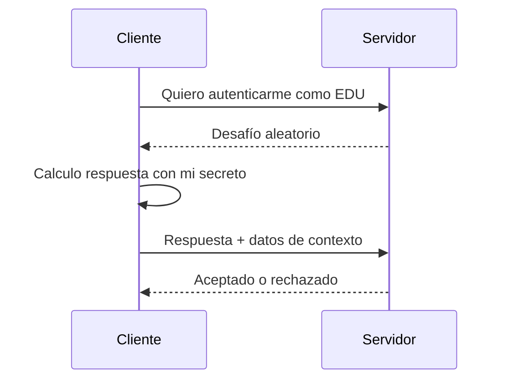

# NTLM

## Qué es

NTLM es una familia de protocolos de autenticación de Windows basada en challenge-response. Sigue apareciendo en redes modernas por compatibilidad, cuentas locales, workgroups y situaciones en las que Kerberos no puede utilizarse.

No confundas:

- **hash NT:** derivado de la contraseña y almacenado como material de verificación;
- **NTLMv2 response:** respuesta calculada para un desafío concreto;
- **NetNTLMv2:** nombre habitual del material challenge-response capturado;
- **Kerberos:** protocolo distinto basado en tickets.

## Flujo simplificado

La contraseña no viaja literalmente. Aun así, si un atacante posee el hash NT en un contexto compatible, puede generar respuestas válidas. Esa reutilización es [Pass-the-Hash](../Pass-the-Hash/README.md).

## Kerberos frente a NTLM

| Kerberos | NTLM |
|---|---|
| Tickets emitidos por KDC | Challenge-response |
| Depende de dominio, DNS y SPN | Funciona también con cuentas locales/workgroup |
| Admite autenticación mutua | Modelo más limitado |
| Preferido en AD | Compatibilidad y fallback |
| Permite TGT/TGS | No usa tickets Kerberos |

## Cuándo aparece NTLM

- acceso por IP cuando el SPN espera un nombre;
- equipo fuera del dominio;
- cuenta local;
- aplicación antigua;
- error o imposibilidad de negociación Kerberos;
- servicios expresamente configurados para ello.

## Hash NT y formato LM:NT

Muchas herramientas aceptan un par `LMHASH:NTHASH`. Como LM suele estar deshabilitado, se usa un LM vacío conocido o se omite según la herramienta. No memorices la sintaxis sin entender que el valor útil normalmente es el hash NT.

## Captura no equivale a PTH

Una respuesta NetNTLMv2 capturada no es el hash NT directo. Normalmente se audita offline con diccionarios o, en escenarios autorizados concretos, se estudian ataques de relay si las protecciones lo permiten. Pass-the-Hash utiliza el hash NT, no una respuesta NetNTLMv2 cualquiera.

## Errores de interpretación

- «Tengo un hash, por tanto tengo la contraseña»: falso.
- «El hash sirve en cualquier servicio»: falso; depende del protocolo y configuración.
- «Pwn3d significa Domain Admin»: falso; en herramientas como NetExec suele indicar privilegios administrativos sobre el host probado.
- «Si Kerberos existe, NTLM no se usa»: falso.

## Dominio práctico

Debes identificar qué material tienes, contra qué protocolo se puede probar, si la cuenta es local o de dominio y qué privilegio demuestra realmente un resultado positivo.

