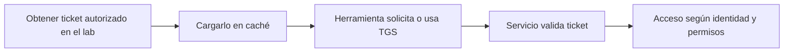

# Pass-the-Ticket

## Idea esencial

Pass-the-Ticket (PTT) consiste en reutilizar un ticket Kerberos válido para actuar como la identidad representada por ese ticket, sin volver a introducir su contraseña.

Si PTH reutiliza material que permite responder a NTLM, PTT reutiliza una credencial temporal ya emitida por Kerberos.

## Tipos de ticket relevantes

- **TGT:** permite solicitar tickets de servicio para la identidad.
- **TGS:** permite acceder al servicio concreto para el que fue emitido.

Un TGT suele ser más flexible. Un TGS de CIFS no se convierte automáticamente en acceso a WinRM o MSSQL.

## Flujo conceptual



## Uso en Linux

Las herramientas de Impacket pueden utilizar una caché Kerberos:

```bash
export KRB5CCNAME=/ruta/edu.ccache
klist
smbclient.py -k -no-pass corp.local/edu@SRV01.corp.local
```

Kerberos es sensible a FQDN, DNS y reloj. Usar directamente la IP puede impedir que el SPN coincida.

## Uso y observación en Windows

```powershell
klist
klist purge
```

Herramientas especializadas pueden importar tickets en contextos de laboratorio, pero antes debes saber qué sesión de inicio de sesión se modifica, qué ticket se carga y para qué SPN sirve.

## Golden y Silver Tickets

Son conceptos relacionados pero más avanzados:

- **Golden Ticket:** TGT fabricado con material de la cuenta `krbtgt`; implica compromiso de dominio muy grave.
- **Silver Ticket:** ticket de servicio fabricado con la clave de la cuenta del servicio.

Para eCPPT es más importante comprender TGT/TGS y reutilización de tickets que memorizar recetas de persistencia.

## Fallos frecuentes

- ticket caducado;
- reloj desincronizado;
- caché no indicada;
- SPN/FQDN incorrecto;
- ticket válido para otro servicio;
- identidad autenticada pero sin autorización;
- DNS resolviendo el host equivocado.

## Mitigación

Proteger sesiones y credenciales, reducir privilegios, aplicar tiering, rotar cuentas comprometidas, monitorizar uso anómalo de tickets y responder correctamente cuando se comprometen cuentas de servicio o `krbtgt`.

