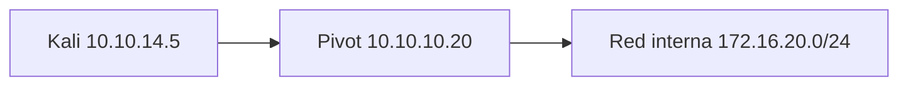
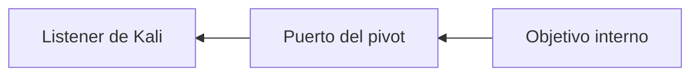

# Pivoting y túneles

## Problema que resuelven

Tu Kali puede ver un servidor comprometido, y ese servidor puede ver una red interna que Kali no alcanza. **Pivotar** es utilizar esa posición intermedia para comunicarte con nuevos objetivos.



## Tres modelos

### Port forwarding

Publica un único puerto remoto a través del pivot. Es sencillo y adecuado cuando solo necesitas un servicio.

### Proxy SOCKS

Las aplicaciones compatibles envían conexiones TCP mediante un proxy. `proxychains` puede adaptar muchas herramientas, pero no convierte automáticamente protocolos que usan UDP, raw sockets o descubrimiento de capa 2.

### Túnel de capa de red

Herramientas como Ligolo-ng crean una interfaz y rutas, haciendo que varias conexiones parezcan tráfico normal enrutado. Facilita Nmap connect scans y herramientas que no hablan SOCKS.

## SSH

```bash
# Local: el puerto 8443 de Kali llega a 172.16.20.10:443 desde el pivot
ssh -L 8443:172.16.20.10:443 edu@10.10.10.20

# Dinámico: proxy SOCKS local
ssh -D 1080 edu@10.10.10.20

# Remoto: expone en el pivot un puerto que vuelve a Kali
ssh -R 9001:127.0.0.1:9001 edu@10.10.10.20
```

## Elección

| Necesidad | Opción probable |
|---|---|
| Un panel web interno | Local forwarding |
| Varias herramientas TCP | SOCKS/proxychains |
| Enumerar una subred con muchas herramientas | Ligolo-ng o ruta equivalente |
| Hacer llegar una conexión desde el pivot | Reverse forwarding |

## Ruta de retorno

La ida no basta. Una shell inversa desde el host interno debe poder alcanzar una dirección que tenga ruta de vuelta. A veces el payload debe conectar al pivot y este reenviar a Kali.



## Diagnóstico

- comprueba interfaces y rutas del pivot;
- prueba conectividad desde el pivot antes del túnel;
- identifica si el servicio escucha en localhost o todas las interfaces;
- distingue firewall de ausencia de ruta;
- usa `-sT` con Nmap a través de proxys TCP, no SYN scan;
- resuelve nombres internos mediante un método compatible con el túnel.

## Error frecuente

Crear el túnel y asumir que todas las herramientas lo usarán. Debes entender dónde escucha cada extremo, qué destino representa y qué protocolo puede atravesarlo.

