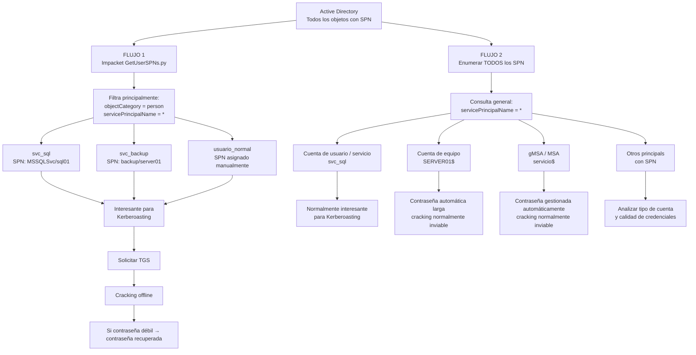

# SPN — Enumeración general vs GetUserSPNs.py

## Idea clave

`GetUserSPNs.py` de Impacket no devuelve únicamente "cuentas de servicio" como categoría formal. Por defecto busca **objetos de tipo usuario/persona que tengan un SPN** y estén habilitados.

En la práctica, muchas cuentas de servicio tradicionales en Active Directory son técnicamente **cuentas de usuario utilizadas para ejecutar servicios**, por ejemplo:

- `svc_sql`
- `svc_backup`
- `svc_web`

Por eso `GetUserSPNs.py` resulta tan útil para Kerberoasting: filtra directamente hacia cuentas de usuario con SPN, que suelen ser los objetivos interesantes.

Una cuenta de usuario normal también podría aparecer si alguien le hubiera asignado manualmente un SPN.

## Diagrama



## Los dos caminos resumidos

```text
GetUserSPNs.py
      ↓
SPN asociados a CUENTAS DE USUARIO/PERSONA
      ↓
svc_sql / svc_backup / usuario con SPN / etc.
      ↓
normalmente lo interesante para Kerberoasting
```

Frente a:

```text
Enumerar TODOS los SPN
      ↓
┌─────────────────────────────┐
│ svc_sql                     │ → interesante
│ SERVER01$                   │ → cuenta de equipo
│ gMSA$                       │ → contraseña muy fuerte
│ otros principals con SPN   │ → analizar
└─────────────────────────────┘
```

## Cuenta de usuario vs cuenta de servicio

No son sinónimos exactos.

Una **cuenta de usuario** es un objeto de usuario de Active Directory. Puede representar a una persona real o utilizarse para ejecutar un servicio.

Cuando una cuenta de usuario se crea o se reutiliza para ejecutar un servicio, suele llamarse de forma práctica **cuenta de servicio tradicional**.

```text
Objeto de usuario de AD
├── edu              → persona
├── maria            → persona
├── svc_sql          → cuenta de usuario usada como cuenta de servicio
└── svc_backup       → cuenta de usuario usada como cuenta de servicio
```

Por tanto:

> **Muchas cuentas de servicio tradicionales son técnicamente cuentas de usuario de Active Directory, pero no todas las cuentas de usuario son cuentas de servicio.**

## Matiz sobre Kerberoasting

Las cuentas de equipo y las gMSA/MSA también pueden tener SPN, pero sus contraseñas suelen ser largas, aleatorias y gestionadas automáticamente, por lo que el cracking offline suele ser muy poco práctico.

En cambio, una cuenta de usuario con SPN y una contraseña débil puede ser interesante para Kerberoasting, aunque su nombre no empiece por `svc_`.
