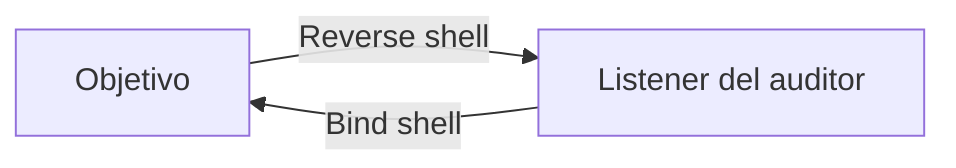

# Shells y payloads

## Shell inversa y bind shell



- **Reverse shell:** el objetivo inicia la conexión hacia el auditor. Suele atravesar mejor firewalls de entrada.
- **Bind shell:** el objetivo escucha y el auditor conecta. Requiere que el puerto sea alcanzable.

Un payload es el código o instrucción que produce el efecto posterior a la explotación. Puede abrir una shell, crear una sesión Meterpreter o ejecutar una acción mínima de prueba.

## Elecciones importantes

| Variable | Pregunta |
|---|---|
| Arquitectura | ¿x86 o x64? |
| Sistema | ¿Windows, Linux, runtime concreto? |
| Transporte | ¿TCP, HTTPS u otro permitido? |
| Ruta | ¿El objetivo ve directamente al listener? |
| Restricciones | ¿Caracteres prohibidos, longitud, encoding? |
| Contexto | ¿Qué usuario ejecutará el payload? |

## Listener y dirección correcta

`LHOST` no es «la IP de Kali» de forma abstracta. Es la dirección alcanzable desde el objetivo. En VPN puede ser `tun0`; detrás de un pivot puede ser la interfaz interna del pivot o un puerto reenviado.

```bash
ip -br address
ip route
ss -lntp
```

## TTY en Linux

Una shell inicial puede no tener control de terminal. En un laboratorio:

```bash
python3 -c 'import pty; pty.spawn("/bin/bash")'
export TERM=xterm
```

Después pueden ajustarse filas/columnas y modo de terminal. Comprende qué hace cada paso; no todas las shells ni sistemas incluyen Python.

## Staged y stageless

- **Staged:** un componente pequeño carga una etapa posterior. Reduce tamaño inicial, pero añade una transferencia y dependencia.
- **Stageless:** incluye el payload completo. Es más grande, pero evita negociar otra etapa.

## Estabilidad

Una shell se estabiliza obteniendo un canal de terminal adecuado o pasando a un mecanismo de acceso autorizado más fiable con las credenciales encontradas. No abras múltiples shells sin registrar cuál tiene qué usuario, host y ruta.

## Prueba mínima

Antes de intentar una shell completa, valida ejecución con una acción inocua y observable dentro del alcance. Esto separa «la vulnerabilidad no ejecuta» de «mi payload no puede volver».

