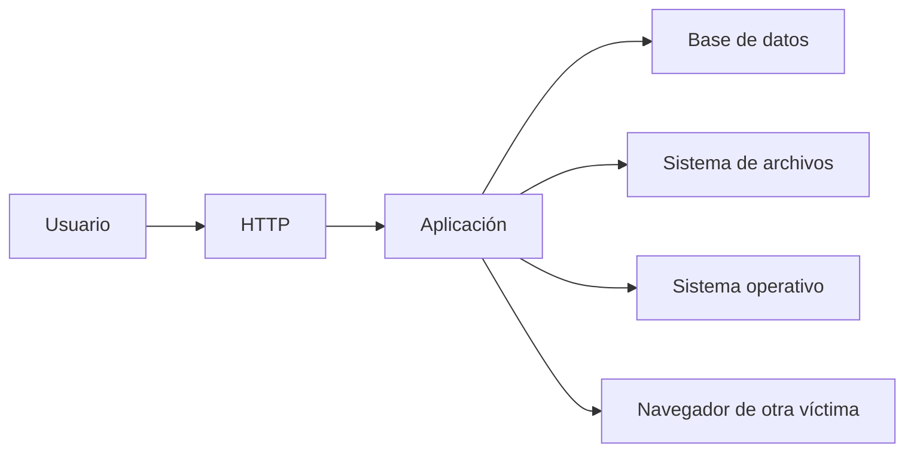

# Vulnerabilidades web esenciales

## Modelo mental

Una aplicación web transforma una petición controlada parcialmente por el usuario en operaciones de servidor, base de datos, sistema de archivos y navegador. La vulnerabilidad aparece cuando datos y autoridad cruzan una frontera sin validación o control adecuados.



## Vulnerabilidades prioritarias

| Clase | Confusión principal | Impacto posible |
|---|---|---|
| SQL injection | Datos tratados como consulta | Leer/modificar DB; credenciales; a veces RCE |
| Command injection | Datos tratados como comando | Ejecución en el servidor |
| File upload | Archivo no fiable tratado como contenido ejecutable | RCE o contenido malicioso |
| Path traversal/LFI | Ruta controlada escapa del directorio previsto | Lectura de archivos; inclusión; secretos |
| XSS | Datos tratados como código en navegador | Sesión/acciones de usuario; phishing interno |
| Authentication flaws | Identidad o sesión validadas incorrectamente | Suplantación o bypass |
| Componentes obsoletos | Dependencia con fallo conocido y aplicable | Variable: desde fuga a RCE |

## SQL injection

No empieces por `sqlmap`. Primero identifica el parámetro, construye una respuesta base y observa cambios en errores, contenido, tiempo o lógica booleana.

```text
Entrada -> consulta construida -> motor SQL -> respuesta observable
```

Tipos que debes entender: error-based, UNION-based, boolean blind y time-based. SQLmap automatiza confirmación y extracción, pero debes controlar objetivo, parámetro, método, cookies y nivel de riesgo.

## Command injection

La aplicación concatena una entrada en un comando del sistema. Valida con un efecto benigno. Considera separadores, shell subyacente, encoding, usuario del proceso y salida ciega. Una conexión inversa fallida no descarta ejecución: puede fallar la red de retorno.

## File upload

Evalúa:

- validación de extensión, MIME y contenido;
- cambio de nombre;
- ubicación final y permisos;
- si el servidor ejecuta o solo sirve el archivo;
- procesamiento posterior por librerías;
- posibilidad de sobrescribir rutas.

Subir un archivo no implica ejecutarlo.

## LFI y path traversal

Comprueba cómo se normaliza la ruta, si la aplicación añade prefijos/sufijos y qué usuario lee el archivo. La lectura de configuración puede proporcionar claves o credenciales y convertirse en acceso inicial.

## XSS

Distingue reflejado, almacenado y DOM-based. Para eCPPT importa entender contexto de salida, encoding y sesión; el objetivo no es coleccionar `alert(1)`, sino demostrar un impacto real y proporcional.

## Metodología

1. Mapea hosts virtuales, rutas, parámetros y tecnologías.
2. Intercepta una petición reproducible.
3. Cambia una variable cada vez.
4. Confirma el fallo manualmente.
5. Automatiza solo cuando conoces qué automatizas.
6. Extrae la mínima evidencia necesaria.
7. Conecta hallazgos web con sistema y red interna.

