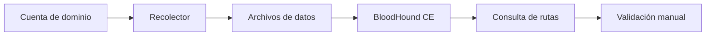

# BloodHound y SharpHound

## Componentes

- **BloodHound CE:** interfaz y motor de análisis de grafos.
- **SharpHound:** recolector habitual para AD desde Windows.
- recolectores compatibles desde Linux: útiles según entorno y versión.

La documentación actual debe prevalecer sobre tutoriales del BloodHound legacy: instalación, recolectores y esquema han evolucionado.

## Flujo



## Recogida de laboratorio

Ejemplo conceptual con SharpHound:

```powershell
SharpHound.exe -c All --outputdirectory C:\Temp
```

La colección `All` puede ser más ruidosa y tardar más. Aprende qué métodos necesitas: objetos del directorio, grupos, ACL, sesiones, administración local y trusts. Ciertos datos requieren permisos o conectividad adicionales.

## Trabajo en la interfaz

1. Importa el conjunto.
2. Busca tu usuario y márcalo como controlado.
3. Identifica objetivos de alto valor.
4. Ejecuta consultas predefinidas.
5. Abre la información de cada arista.
6. Anota precondición, técnica, impacto y reversión.
7. Valida con otra herramienta.

## Consultas que debes saber plantear

- caminos desde principales controlados a Tier Zero;
- usuarios con SPN;
- cuentas sin preautenticación;
- usuarios con administración local;
- sesiones de usuarios privilegiados;
- objetos controlables mediante ACL;
- grupos con membresías anidadas;
- caminos más cortos que sean realmente viables.

## Calidad de datos

Una ruta puede faltar porque el recolector no tuvo acceso a un host, el firewall impidió consultar sesiones o los datos están desactualizados. Registra fecha, identidad de colección, métodos y errores.

## Seguridad operativa

No subas datos reales de una organización a servicios ajenos. BloodHound CE puede desplegarse localmente. Los archivos recolectados contienen un mapa sensible de la infraestructura.

