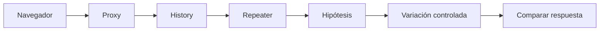

# Burp Suite

## Función

Burp Suite permite observar, modificar y repetir HTTP/S entre navegador y aplicación. Su valor principal es convertir una interacción visual en peticiones controlables.

## Componentes esenciales

| Componente | Uso |
|---|---|
| Proxy | Interceptar tráfico del navegador |
| HTTP history | Revisar todas las peticiones observadas |
| Repeater | Repetir y modificar manualmente |
| Intruder | Automatizar variaciones controladas |
| Decoder | Transformar representaciones y encodings |
| Comparer | Comparar respuestas |

## Flujo de prueba

## Qué registrar de una petición

- método y ruta;
- host y esquema;
- parámetros de URL, cuerpo y cabeceras;
- cookies y tokens;
- tipo de contenido;
- respuesta base: código, longitud, texto y tiempo;
- qué valor cambia al modificar una variable.

## Repeater antes que Intruder

Si no puedes demostrar manualmente qué respuesta distingue éxito y fallo, automatizar produce ruido. En Repeater, cambia una sola variable y conserva una petición base limpia.

## Sesiones y CSRF

Una cookie puede identificar la sesión; un token CSRF puede cambiar por petición o sesión. Cuando una reproducción falla, pregunta si el estado ha caducado, si falta una cabecera o si el navegador ejecutó una etapa previa.

## HTTPS

Instala el certificado de la CA de Burp solo en el perfil/navegador de laboratorio. No deshabilites globalmente la validación TLS en tu sistema habitual.

## Conexión con acceso inicial

Los hallazgos más valiosos para eCPPT suelen llevar a datos, credenciales o ejecución: SQLi, command injection, file upload, LFI, credenciales por defecto y componentes vulnerables. Burp proporciona la evidencia HTTP exacta.

