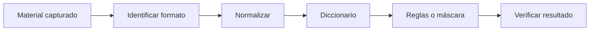

# Hashcat y John the Ripper

## Objetivo

Auditar material de autenticación offline para comprobar si una contraseña pertenece a un conjunto predecible. La parte difícil suele ser identificar bien el formato y construir candidatos, no escribir el comando.

## Flujo



## Hashcat

```bash
hashcat --example-hashes | less
hashcat -m <modo> hashes.txt diccionario.txt
hashcat -m <modo> hashes.txt diccionario.txt -r reglas.rule
hashcat -m <modo> hashes.txt --show
```

Modos frecuentes en este temario incluyen NTLM, NetNTLMv2, Kerberos AS-REP y TGS. Confirma siempre el modo en la documentación de tu versión.

## John

```bash
john --list=formats | less
john --wordlist=diccionario.txt hashes.txt
john --show hashes.txt
```

Para ciertos contenedores, John incluye scripts `*2john` que extraen un verificador; no rompen directamente el archivo.

## Estrategia de candidatos

1. Diccionario pequeño relacionado con el laboratorio.
2. Reglas de mayúsculas, sufijos y sustituciones.
3. Máscaras basadas en un patrón observado.
4. Diccionarios más grandes si el coste lo justifica.

Ejemplo de máscara conceptual para palabra desconocida no sirve; las máscaras son útiles cuando conoces estructura, como mayúscula + minúsculas + cuatro dígitos + símbolo.

## Errores

- modo incorrecto;
- línea con espacios o prefijos no esperados;
- mezclar varios tipos en un archivo;
- asumir que `exhausted` significa que el hash es falso;
- olvidar revisar potfile con `--show`;
- dedicar horas a fuerza bruta imposible en vez de buscar nuevas pistas.

