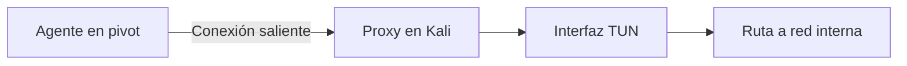

# Ligolo-ng, Chisel y SSH

## Elección rápida

| Herramienta | Modelo | Cuándo resulta cómoda |
|---|---|---|
| SSH | Forwards y SOCKS | Ya existe acceso SSH estable |
| Chisel | Túneles sobre HTTP/WebSocket | Binario pequeño y puertos concretos/SOCKS |
| Ligolo-ng | Interfaz TUN y rutas | Varias herramientas contra una subred |

## Ligolo-ng: modelo

El proxy se ejecuta en la máquina del auditor y el agente en el pivot. La conexión del agente crea una sesión; después se añade una ruta local a través de una interfaz TUN.



La sintaxis exacta cambia entre versiones. Verifica instalación, certificados, puerto de escucha, nombre de interfaz y rutas. Comprueba con `ip route` que no existe conflicto con una red local/VPN.

## Chisel: modelo

Puede ofrecer SOCKS reverso o forwards específicos. Ejemplo conceptual:

```bash
# Kali
chisel server --reverse --port 8000

# Pivot
chisel client <IP_KALI>:8000 R:socks
```

No copies este ejemplo sin revisar TLS y opciones de la versión del laboratorio.

## Pruebas por capas

1. Pivot alcanza el objetivo interno.
2. Pivot alcanza a Kali o viceversa según el diseño.
3. Proceso del túnel está escuchando/conectado.
4. Ruta o proxy existe.
5. Una conexión TCP simple funciona.
6. La herramienta final usa el camino correcto.

## Limpieza

Registra procesos, rutas, interfaces y puertos creados. Al terminar el laboratorio, elimina rutas y detén agentes para no contaminar sesiones posteriores.

