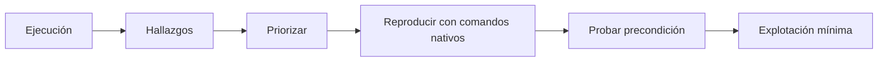

# WinPEAS, LinPEAS y herramientas nativas

## Función

PEASS-ng automatiza comprobaciones de escalada y resalta indicios. No confirma por sí solo que una ruta sea explotable. La validación manual forma parte del aprendizaje.

## Flujo correcto



## Antes de transferir binarios

Empieza con información nativa. En Windows:

```powershell
whoami /all
systeminfo
sc.exe query state= all
schtasks /query /fo LIST /v
```

En Linux:

```bash
id
uname -a
sudo -l
find / -perm -4000 -type f 2>/dev/null
```

Esto crea un punto de referencia y funciona incluso si la herramienta automatizada es bloqueada.

## Transferencia y verificación

Sirve el archivo desde un host de laboratorio, transfiérelo al directorio autorizado y verifica su hash si procede. Evita ejecutar binarios descargados de una fuente no verificada.

## Prioridad de hallazgos

1. Credenciales en claro o configuración.
2. Permisos de escritura directos sobre algo ejecutado con privilegio.
3. `sudo`, SUID, capabilities o privilegios de token claramente abusables.
4. Servicios/tareas y rutas débiles.
5. Grupos privilegiados o sockets administrativos.
6. Software vulnerable.
7. Kernel exploits como último recurso.

## Evidencia manual

Para un servicio Windows, registra cuenta del servicio, ruta del binario, permisos del archivo/directorio, capacidad de reinicio y comportamiento. Para cron, registra propietario, contenido, permisos y periodicidad. Así puedes explicar por qué funciona sin decir «lo marcó en rojo».

