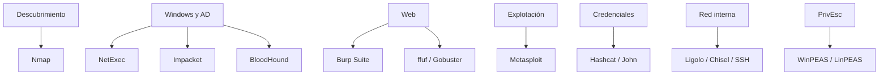

# Herramientas

La herramienta correcta es la que responde una pregunta concreta con el menor ruido y la mayor evidencia. Este bloque no pretende listar todas las utilidades de Kali, sino dominar un conjunto pequeño y transferible.

## Mapa por fase

## Orden de aprendizaje

1. Aprende qué protocolo y dato maneja la herramienta.
2. Ejecuta el caso mínimo.
3. Provoca errores deliberados para reconocerlos.
4. Automatiza lotes solo cuando el caso mínimo es claro.
5. Guarda una chuleta propia con opciones que realmente utilizas.

## Directorios

- [Nmap](Nmap/README.md)
- [NetExec](NetExec/README.md)
- [Impacket](Impacket/README.md)
- [BloodHound y SharpHound](BloodHound/README.md)
- [Metasploit](Metasploit/README.md)
- [Burp Suite](Burp-Suite/README.md)
- [ffuf y Gobuster](Fuzzing-Web/README.md)
- [Hashcat y John](Crackeo/README.md)
- [Ligolo-ng, Chisel y SSH](Pivoting/README.md)
- [WinPEAS, LinPEAS y herramientas nativas](PrivEsc/README.md)

