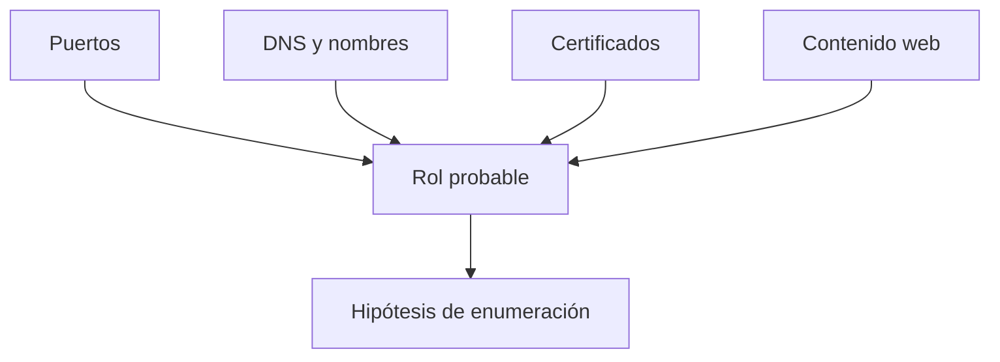

# 01. Information Gathering & Reconnaissance — 10 %

## Objetivos oficiales cubiertos

- Descubrir hosts y escanear puertos.
- Enumerar información de los servicios encontrados.

## 1. Alcance y red

Antes de escanear, identifica rangos autorizados, exclusiones, ventana y limitaciones. Calcula subredes y rutas:

```bash
ip -br address
ip route
ipcalc 10.10.10.0/24
```

Debes distinguir red local, VPN, red pivotada y dirección de retorno para payloads.

## 2. Descubrimiento de hosts

Combina técnicas porque ICMP puede estar bloqueado:

- ARP en el mismo segmento;
- ICMP echo/timestamp;
- TCP SYN/ACK a puertos probables;
- UDP selectivo;
- `-Pn` cuando ya conoces el host o no responde a probes.

Guarda una lista canónica de hosts vivos y la evidencia que los confirma.

## 3. Puertos TCP y UDP

Realiza primero una pasada amplia TCP, después enumera versiones sobre puertos confirmados. Añade UDP selectivo para DNS, SNMP, TFTP, NTP y otros servicios relevantes.

No confundas puerto con servicio: 8080 puede alojar HTTP, un proxy o algo distinto. El banner y el comportamiento importan más que el número.

## 4. Enumeración por servicio

### DNS — 53

- registros A/AAAA, MX, NS, TXT y SRV;
- nombres internos;
- transferencias de zona solo como comprobación autorizada;
- servicios de AD mediante SRV.

### FTP — 21

- acceso anónimo;
- banners y modo pasivo;
- permisos de lectura/escritura;
- archivos, copias y credenciales.

### SSH — 22

- versión y algoritmos;
- métodos de autenticación;
- reutilización de credenciales o claves obtenidas;
- no deducir vulnerabilidad solo por un banner.

### SMTP — 25/465/587

- banner y dominio;
- comandos admitidos;
- enumeración de usuarios cuando el servidor lo revela;
- relay solo con prueba segura y alcance expreso.

### HTTP/S — 80/443/otros

- título, cabeceras, certificado, cookies y redirecciones;
- tecnologías, virtual hosts y rutas;
- métodos HTTP;
- contenido, comentarios y backups.

### SMB/RPC — 139/445

- dialectos y firma;
- dominio/hostname/SO;
- shares y permisos;
- null/guest sessions;
- usuarios, grupos y políticas mediante RPC cuando sea posible.

### LDAP/Kerberos — 389/636/88

- fuerte indicio de AD;
- nombre de dominio y DC;
- bind anónimo o autenticado;
- reloj y DNS;
- usuarios, SPN y configuración de preauth con acceso válido.

### RDP/WinRM — 3389/5985/5986

- información NTLM/certificados;
- NLA y TLS;
- validar si una credencial permite inicio, no solo autenticación.

### Bases de datos

- MySQL/MariaDB 3306, MSSQL 1433, PostgreSQL 5432;
- versión, cifrado, autenticación y exposición;
- bases/metadatos si existe acceso autorizado;
- funciones que interactúan con el sistema operativo según rol.

## 5. Correlación



Un host con DNS, Kerberos, LDAP y SMB probablemente es DC. Un IIS con MSSQL y WinRM puede ser servidor de aplicación. Las inferencias se confirman con varias evidencias.

## 6. Entregable

Por host, produce IP/FQDN, SO probable, servicios/versiones, rol, acceso probado, vulnerabilidades candidatas, credenciales válidas y siguiente acción.

## Práctica obligatoria

Desde una red con al menos Windows, Linux y un DC:

1. Descubre todos los hosts sin conocer IP.
2. Escanea TCP completo y UDP top.
3. Enumera cada servicio con al menos dos herramientas o una herramienta y prueba manual.
4. Identifica el DC por evidencias.
5. Entrega tabla e hipótesis sin explotar.

## Criterio de dominio

Puedes encontrar un servicio no estándar, explicar la diferencia entre `filtered` y `closed`, enumerar SMB/HTTP/DNS y construir un inventario sin depender de un único comando agresivo.

