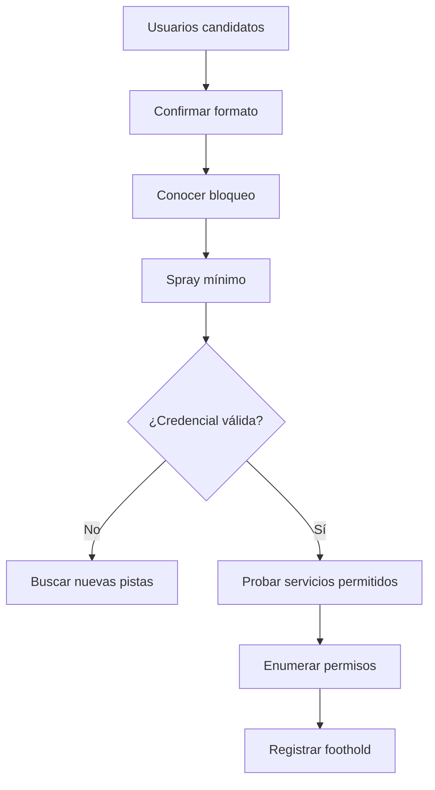

# 02. Initial Access — 15 %

## Objetivos oficiales cubiertos

- Enumerar nombres de usuario válidos.
- Password spraying.
- Fuerza bruta sobre servicios de acceso remoto.

El acceso inicial es convertir información externa en una primera identidad, sesión o capacidad de ejecución dentro del entorno.

## 1. Enumeración de usuarios

Fuentes posibles:

- web corporativa, documentos y repositorios del laboratorio;
- SMTP, RPC/SMB o LDAP;
- mensajes de error de portales;
- nombres de carpetas, perfiles o correos;
- metadatos y convenciones de nombre.

Normaliza candidatos según el patrón: `nombre.apellido`, inicial+apellido, alias. Evita tratar cada cadena como cuenta confirmada.

En AD, Kerberos puede responder de forma distinta para usuarios válidos según herramienta/configuración. En un entorno autorizado, valida con utilidades específicas y limita el ritmo.

## 2. Ataques de contraseña

| Técnica | Patrón |
|---|---|
| Brute force | Muchas contraseñas contra una cuenta |
| Password spraying | Una o pocas contraseñas contra muchos usuarios |
| Credential stuffing | Pares usuario/contraseña obtenidos previamente |
| Password reuse | Probar una credencial conocida en otro servicio |

## 3. Política de bloqueo

Antes de spraying intenta obtener:

- umbral de intentos;
- ventana de observación;
- duración del bloqueo;
- si existe smart lockout;
- qué servicios cuentan intentos de forma diferente.

Diseña rondas con margen. Un laboratorio no justifica bloquear todas las cuentas.

## 4. Servicios remotos

### SMB

Una cuenta puede autenticar pero no leer shares ni administrar. Enumera permisos después.

### WinRM

Requiere normalmente pertenencia a grupos autorizados y que el servicio/firewall estén configurados. Credencial válida por SMB no implica WinRM.

### RDP

Puede exigir NLA, pertenencia a Remote Desktop Users y políticas de inicio de sesión. Distingue autenticación de permiso interactivo.

### SSH/FTP

Comprueba métodos, chroot, shell asignada y permisos. FTP válido no implica shell del sistema.

### Aplicaciones web

Los portales pueden tener cuentas separadas o respaldadas por AD. Analiza bloqueo, MFA, recuperación, mensajes y sesiones.

## 5. Acceso por vulnerabilidad

Aunque los objetivos oficiales destacan credenciales, el acceso también puede llegar de:

- aplicación web vulnerable;
- servicio desactualizado realmente explotable;
- credencial en share anónimo;
- configuración o backup expuesto;
- componente con credenciales por defecto.

## 6. Flujo de decisión

## 7. Qué hacer al entrar

Inmediatamente registra usuario, host, servicio, grupos, privilegios, interfaces, rutas y estabilidad. No lances automatización a ciegas. Comprueba si la cuenta es local o de dominio y vuelve a enumerar.

## Práctica obligatoria

Construye una lista de usuarios a partir de fuentes del laboratorio, descubre la política, ejecuta un spraying seguro, valida el éxito en SMB y explica por qué esa misma cuenta puede fallar en WinRM o RDP.

## Criterio de dominio

Puedes diferenciar usuario válido, contraseña válida, logon permitido y privilegio administrativo; diseñas un spray sin provocar bloqueos y sabes cambiar de fuente cuando no hay resultados.

