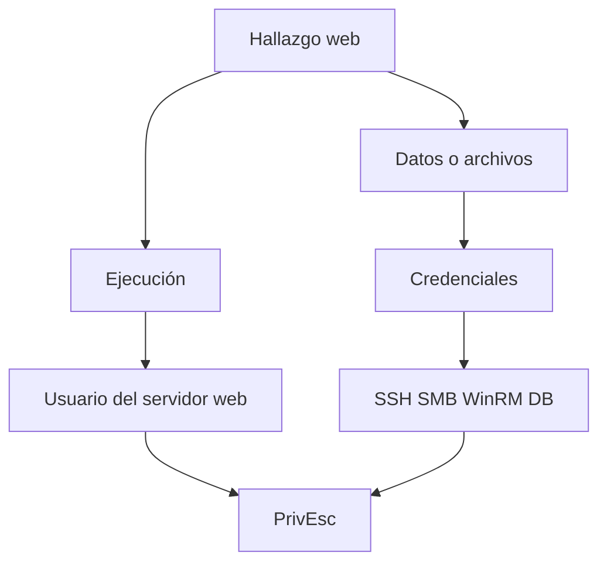

# 03. Web Application Penetration Testing — 15 %

## Objetivos oficiales cubiertos

- Enumerar aplicaciones, vulnerabilidades y misconfiguraciones.
- Explotar SQLi, XSS, command injection y fallos comunes.
- Fuerza bruta controlada de formularios.
- Explotar componentes vulnerables u obsoletos.
- Extraer datos y credenciales de aplicaciones y bases comprometidas.

## 1. Mapeo de aplicación

Documenta:

- IP, dominio, virtual hosts y TLS;
- servidor, framework, CMS y componentes;
- rutas, métodos, parámetros y APIs;
- autenticación, roles, cookies y tokens;
- formularios, subidas y puntos de entrada;
- contenido enlazado y oculto.

Usa navegador, `curl`, Burp, ffuf/Gobuster y análisis de JavaScript. No dependas únicamente de fingerprints automáticos.

## 2. HTTP que debes dominar

- métodos GET, POST, PUT, DELETE, OPTIONS;
- cabeceras Host, Authorization, Cookie, Content-Type, Origin y Referer;
- códigos 2xx, 3xx, 4xx, 5xx;
- query string, form-urlencoded, multipart y JSON;
- cookies: Secure, HttpOnly, SameSite, dominio y ruta;
- sesión frente a identidad de aplicación.

## 3. Autenticación

Prueba de manera ordenada:

- diferencias entre usuario inexistente y contraseña incorrecta;
- bloqueo y rate limiting;
- credenciales por defecto;
- recuperación de contraseña;
- control de acceso entre roles;
- manipulación de cookies o parámetros de identidad;
- sesiones que no invalidan o caducan correctamente.

Hydra solo sirve si puedes describir la petición, marcador de fallo y estado. Burp Intruder o un script pequeño pueden manejar flujos complejos con más precisión.

## 4. SQL injection

### Detección

Construye petición base y prueba comportamiento de comillas, expresiones booleanas y tiempo. Distingue error de aplicación, error SQL y variación normal.

### Explotación

Según tipo:

- UNION: alinear columnas y tipos;
- error-based: provocar salida controlada;
- boolean blind: inferir bit a bit por contenido;
- time-based: inferir por retraso, con varias mediciones.

Objetivos: confirmar DBMS, usuario/rol, bases, tablas y columnas relevantes. Extrae la mínima evidencia. Estudia las capacidades de lectura/escritura o ejecución que dependen del DBMS y privilegio.

### Automatización

Guarda una petición de Burp y úsala con `sqlmap -r request.txt` cuando la inyección esté comprendida. Controla parámetro, técnica, riesgo y datos extraídos.

## 5. Command injection

Identifica si la entrada llega a una shell, cómo se cita y si la salida es visible. Prueba primero una acción benigna. En ejecución ciega usa tiempo o una interacción de laboratorio controlada. Solo después diseña un canal de shell que tenga ruta de retorno.

## 6. File upload

Analiza validación de nombre, extensión, MIME, contenido, destino y ejecución. Casos importantes:

- upload ejecutable en webroot;
- path traversal en nombre;
- reemplazo de configuración/archivo;
- procesamiento inseguro de imagen/documento;
- exposición de datos subidos.

## 7. LFI/path traversal

Prueba normalización, encoding, prefijos y sufijos. Busca configuración, código, logs o credenciales dentro del alcance. Comprende cuándo una inclusión puede transformarse en ejecución y cuándo solo permite lectura.

## 8. XSS

Encuentra fuente y sink, contexto HTML/atributo/JavaScript/URL y persistencia. Demuestra impacto proporcional sobre sesión o acciones de un usuario de prueba. No uses `alert` como única comprensión.

## 9. Componentes obsoletos

Un número de versión es un candidato. Confirma:

1. producto y versión reales;
2. módulo vulnerable habilitado;
3. precondiciones y autenticación;
4. aplicabilidad del exploit;
5. mitigaciones/backports;
6. prueba mínima y segura.

## 10. De web a sistema

Busca conexiones a base de datos, claves, usuarios del sistema, endpoints internos y secretos de despliegue. Registra siempre de dónde salió la credencial.

## Práctica obligatoria

Resuelve una aplicación que requiera virtual host, descubrimiento de contenido, bypass de autenticación o credencial débil, una vulnerabilidad de entrada y extracción de un secreto que permita acceso al host.

## Criterio de dominio

Puedes reconstruir peticiones en Burp/curl, confirmar manualmente una inyección, explicar el contexto de XSS, distinguir upload de ejecución y convertir un hallazgo web en una hipótesis de acceso interno.

