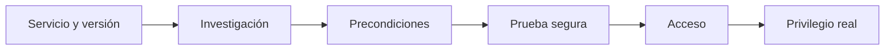

# 04. Exploitation & Post-Exploitation — 25 %

## Objetivos oficiales cubiertos

- Identificar y explotar vulnerabilidades o misconfiguraciones en servicios.
- Escalar privilegios.
- Volcar y romper hashes.
- Localizar credenciales almacenadas de forma insegura.

## 1. De versión a exploit validado



Busca advisories del fabricante, CVE y código fuente. Un exploit en Searchsploit o Metasploit no confirma vulnerabilidad. Revisa versión exacta, sistema, arquitectura, configuración, autenticación y efectos secundarios.

## 2. Explotación manual y Metasploit

Debes poder:

- leer un exploit y localizar variables;
- adaptar host, puerto, protocolo y payload;
- preparar listener y ruta de retorno;
- verificar dependencias;
- usar `check` cuando exista;
- interpretar crash, timeout, conexión sin sesión y sesión sin privilegios;
- repetir desde snapshot.

## 3. Postexplotación inicial

En cada host:

```text
identidad -> sistema -> red -> procesos/servicios -> archivos/secretos -> sesiones -> rutas
```

### Linux

`id`, `uname`, `/etc/os-release`, interfaces/rutas, sockets, procesos, montajes, variables, usuarios, sudo y cron.

### Windows

`whoami /all`, `systeminfo`, interfaces/rutas, procesos, servicios, tareas, sesiones, shares, variables y políticas.

## 4. Escalada Linux

Domina:

- sudoers y GTFOBins comprendido, no copiado;
- SUID/SGID y capabilities;
- cron/systemd con archivos modificables;
- PATH y carga de librerías/configuración;
- credenciales y claves;
- grupos con acceso a demonios o dispositivos;
- NFS y montajes;
- exploits locales solo con versión y mitigaciones verificadas.

## 5. Escalada Windows

Domina:

- ACL débiles de servicios y binarios;
- rutas sin comillas con condiciones reales;
- tareas programadas;
- credenciales guardadas y ficheros de despliegue;
- AlwaysInstallElevated;
- privilegios de token relevantes;
- cuentas de servicio y contexto SYSTEM;
- UAC frente a pertenencia a Administrators;
- parches y exploits locales con cautela.

## 6. Credenciales

Fuentes:

- archivos de configuración, `.env`, backups y scripts;
- historial, claves SSH y clientes de base de datos;
- registros, Credential Manager y LSA Secrets según privilegio;
- SAM local y NTDS del dominio según acceso;
- bases de datos de aplicaciones;
- sesiones/tickets.

Clasifica cada artefacto antes de usarlo. Un hash local, un NetNTLMv2, un TGS y una contraseña web requieren estrategias distintas.

## 7. Movimiento lateral y pivoting

Después de una credencial, construye una matriz pequeña:

| Identidad | Host | Servicio | ¿Autentica? | ¿Admin? | Evidencia |
|---|---|---|---|---|---|

Elige SMB/WinRM/RDP/SSH/MSSQL según permisos y conectividad. Para redes internas, decide port forward, SOCKS o túnel de red. Comprueba ruta de retorno de payloads.

## 8. Transferencia de archivos

Aprende varias alternativas:

- HTTP temporal en laboratorio;
- SMB;
- SCP/SFTP;
- PowerShell y herramientas nativas;
- codificación solo para archivos pequeños y cuando sea necesario.

Verifica hash y tamaño. Evita servir desde directorios con información sensible.

## 9. Estabilización y continuidad

Una shell frágil debe convertirse, si el laboratorio lo permite, en acceso estable con credenciales o un canal adecuado. Documenta procesos iniciados y no añadas persistencia salvo objetivo expreso.

## 10. Práctica obligatoria

Compromete un host con usuario limitado, encuentra una escalada de configuración, recupera una credencial distinta, muévete a un segundo host y alcanza una red interna mediante túnel. Repite sin WinPEAS/LinPEAS en la segunda vuelta.

## Criterio de dominio

Puedes explicar por qué una ruta de PrivEsc funciona, distinguir credenciales, seleccionar una técnica remota y reconstruir el camino completo con evidencias.

