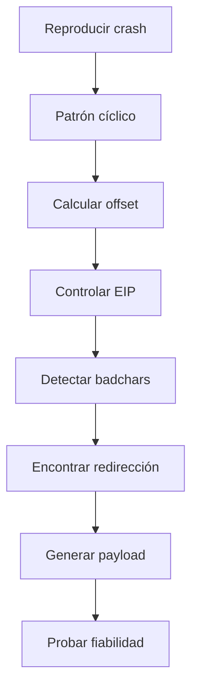

# 05. Exploit Development — 5 %

## Objetivos oficiales cubiertos

- Desarrollar o modificar código de explotación para acceso inicial/postexplotación.
- Identificar y explotar corrupción de memoria básica: stack/buffer overflow.

## 1. Lectura de código público

Antes de ejecutar:

- identifica lenguaje, versión y dependencias;
- revisa imports, red, escritura de archivos y ejecución de comandos;
- localiza objetivo, puerto, versión, arquitectura y autenticación;
- determina si incluye payload o solo provoca el fallo;
- elimina acciones irrelevantes;
- comprueba indicadores de código malicioso añadido.

## 2. Adaptación habitual

- Python 2 a Python 3: bytes/strings, `print`, sockets;
- cambio de endpoint, método HTTP, cabeceras o autenticación;
- IP/puerto del objetivo;
- callback alcanzable;
- offset y dirección de retorno;
- payload por arquitectura;
- badchars y longitud;
- encoding y terminadores de protocolo.

## 3. Depuración

Usa un depurador en VM con snapshot. Debes leer registros, pila, memoria y módulos. En el ejercicio x86 clásico:

- EIP: instruction pointer;
- ESP: punta de pila;
- patrón cíclico: calcula offset exacto;
- módulo sin mitigaciones relevantes: candidato para redirección;
- badchars: bytes que el programa transforma o corta.

## 4. Proceso de stack overflow

## 5. Payload

Configura sistema, arquitectura, transporte, LHOST/LPORT y bytes prohibidos. Asegura espacio suficiente. Una shell fallida puede significar retorno bloqueado, no exploit fallido; prueba primero un marcador o comportamiento benigno.

## 6. Mitigaciones modernas

Comprende al menos ASLR, DEP/NX, canaries, CFG y por qué un tutorial clásico selecciona un módulo vulnerable sin mitigaciones. No se espera desarrollar cadenas modernas de bypass avanzadas para cubrir este objetivo básico.

## 7. Práctica obligatoria

1. Repara un exploit Python antiguo.
2. Adapta un PoC que solo causa crash para demostrar control.
3. Completa un buffer overflow x86 deliberadamente vulnerable desde fuzzing hasta payload.
4. Explica cada campo del buffer sin consultar la receta.

## Criterio de dominio

Puedes inspeccionar código desconocido, modificarlo de forma segura, calcular un offset y diagnosticar por separado fallo de corrupción, fallo de redirección y fallo del payload.

