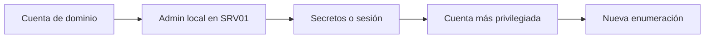
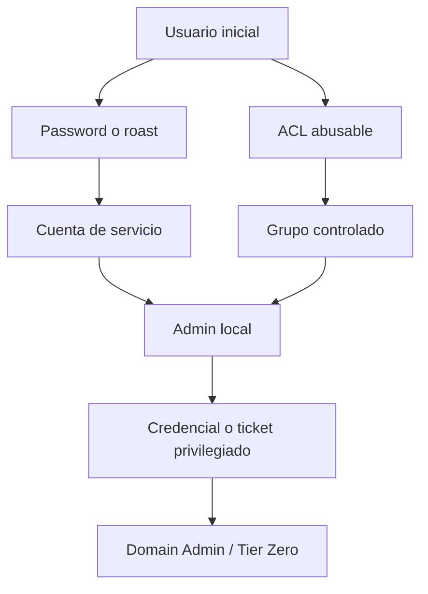

# 06. Active Directory Penetration Testing — 30 %

## Objetivos oficiales cubiertos

- Enumeración de Active Directory.
- Identificar cuentas con contraseña débil o vacía.
- AS-REP Roasting.
- Movimiento lateral con Pass-the-Hash y Pass-the-Ticket.
- Obtener acceso/privilegios de Domain Admin.

## 1. Fundamentos obligatorios

Antes de atacar, explica:

- dominio, bosque, DC, OU, GPO y trust;
- usuarios, equipos, grupos y cuentas de servicio;
- SID, ACL/ACE, SPN y UPN;
- DNS, LDAP, SMB/RPC;
- Kerberos: AS-REQ/REP, TGT, TGS, KDC;
- NTLM: hash NT y challenge-response;
- administrador local frente a Domain Admin.

Consulta los directorios de [conceptos esenciales](../../01-Conceptos-esenciales/README.md).

## 2. Identificar el entorno

Señales del DC: 53 DNS, 88 Kerberos, 389 LDAP, 445 SMB, 464 cambio de contraseña, 636 LDAPS, 3268 Global Catalog. Obtén dominio, FQDN, SID, hora y nombres de DC.

Configura DNS y sincronización. Muchos errores de Kerberos nacen aquí.

## 3. Enumeración sin credenciales

Según configuración:

- DNS y registros SRV;
- banners/certificados;
- SMB null o guest;
- RPC anónimo;
- nombres de usuario por fuentes externas;
- respuestas de Kerberos para candidatos;
- shares expuestos.

No asumas que null session existe en Windows moderno.

## 4. Enumeración con cuenta de dominio

Obtén:

- usuarios, grupos y membresías anidadas;
- equipos, SO y roles;
- SPN y cuentas de servicio;
- cuentas sin preautenticación;
- política de contraseña/bloqueo;
- trusts;
- GPO;
- ACL sobre objetos;
- administración local y sesiones;
- shares y datos sensibles.

Herramientas: LDAP/PowerShell, NetExec, Impacket, SharpHound/BloodHound. Verifica hallazgos críticos por dos vías.

## 5. Contraseñas débiles y spraying

Construye lista confirmada, consulta política, prueba contraseñas de laboratorio con ritmo seguro y detente ante signos de bloqueo. Una credencial nueva reinicia la enumeración desde esa identidad.

## 6. AS-REP Roasting

Condición: cuenta sin preautenticación. Solicita AS-REP y audita offline. Distingue «material obtenido» de «contraseña recuperada».

Ruta completa: [AS-REP Roasting](../../01-Conceptos-esenciales/AS-REP-Roasting/README.md).

## 7. Kerberoasting

Aunque el objetivo oficial destaca AS-REP, Kerberoasting es central para comprender cuentas de servicio. Con cuenta válida, enumera SPN, solicita TGS, prioriza identidades valiosas y audita offline.

Ruta completa: [Kerberoasting](../../01-Conceptos-esenciales/Kerberoasting/README.md).

## 8. ACL y grupos

Estudia relaciones que permiten:

- cambiar contraseña;
- añadir a grupo;
- escribir atributos;
- modificar DACL/owner;
- administrar equipos;
- modificar GPO;
- controlar cuentas con SPN.

BloodHound encuentra candidatos. Lee cada arista, verifica permisos y elige una prueba reversible.

## 9. Administración local y sesiones

Una cuenta puede administrar varios equipos. En esos hosts pueden existir credenciales, tokens o tickets de otras identidades. La cadena es:

## 10. Pass-the-Hash

Identifica hash NT, cuenta local/dominio y servicio NTLM compatible. Valida primero y ejecuta remotamente solo con privilegios. `Pwn3d!` en un host no significa Domain Admin.

## 11. Pass-the-Ticket

Identifica tipo de ticket, identidad, servicio, caducidad y caché. Usa FQDN, DNS y hora correctos. Un TGS sirve al SPN indicado; un TGT permite solicitar otros TGS dentro de sus límites.

## 12. Movimiento lateral

Servicios habituales:

- SMB con PsExec/SMBExec/WMI;
- WinRM/PowerShell Remoting;
- RDP;
- MSSQL;
- tareas programadas;
- SSH si existe infraestructura mixta.

Selecciona la técnica por permisos, conectividad y huella. Actualiza la matriz de credenciales.

## 13. Rutas a Domain Admin

No existe una receta única. Debes combinar autenticación débil, permisos, administración local y exposición de credenciales. Tras cada salto, vuelve a BloodHound y a enumeración manual.

## 14. Cadena de laboratorio completa

1. Descubrir DC y dominio.
2. Enumerar usuarios.
3. Obtener primera cuenta mediante pista/spray seguro.
4. Recolectar AD y construir grafo.
5. Encontrar cuenta sin preauth o SPN.
6. Auditar material offline.
7. Validar la nueva identidad.
8. Encontrar administración local/ACL.
9. Moverse al host accesible.
10. Extraer un secreto o ticket autorizado.
11. Reutilizarlo con PTH/PTT.
12. Demostrar acceso a objetivo Tier Zero con mínima acción.
13. Reconstruir la cadena y mitigaciones.

## 15. Criterio de dominio

Puedes dibujar Kerberos, distinguir todos los materiales de credencial, enumerar AD con y sin BloodHound, explicar cada arista de una ruta, moverte mediante al menos dos mecanismos y alcanzar un objetivo privilegiado en un dominio nuevo sin walkthrough.

