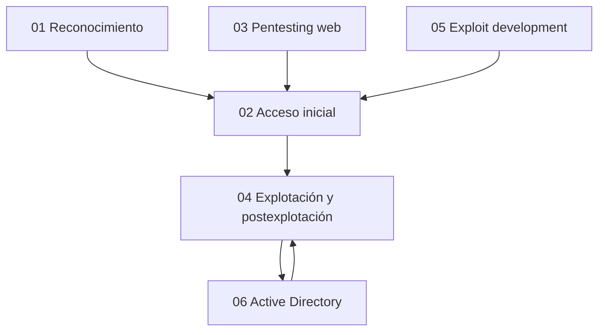

# Temario completo

Este bloque sigue los seis dominios oficiales actuales. Cada tema contiene objetivos, conocimientos, procedimiento, práctica y criterios de dominio.

## Índice

1. [Information Gathering & Reconnaissance](01-Reconocimiento/README.md)
2. [Initial Access](02-Acceso-Inicial/README.md)
3. [Web Application Penetration Testing](03-Pentesting-Web/README.md)
4. [Exploitation & Post-Exploitation](04-Explotacion-y-Postexplotacion/README.md)
5. [Exploit Development](05-Exploit-Development/README.md)
6. [Active Directory Penetration Testing](06-Active-Directory/README.md)

## Competencia final

Al terminar debes poder recibir un alcance y credenciales parciales o ninguna, construir el inventario, obtener acceso, escalar, reutilizar secretos y tickets, pivotar y alcanzar un objetivo de dominio sin seguir una guía paso a paso.

