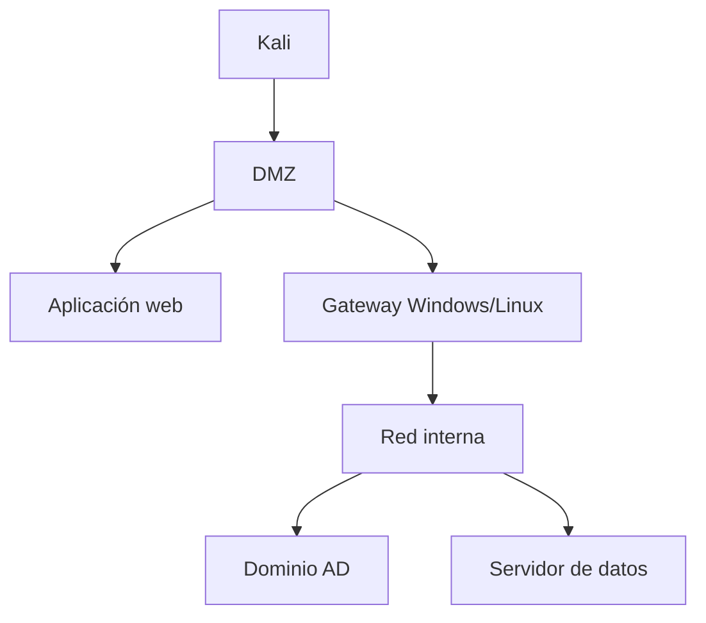

# Laboratorio 05: capstone

## Objetivo

Simular una evaluación eCPPT: red desconocida, varias rutas, información incompleta y una cadena que atraviesa web, host, pivot y AD.

## Reglas

- no walkthroughs;
- ventana de tiempo definida;
- máximo una pista estructural después de documentar hipótesis;
- no usar herramientas destructivas;
- mantener diario de evidencias;
- entregar cadena y mitigaciones.

## Arquitectura



## Condiciones mínimas del escenario

- al menos un señuelo convincente;
- un servicio en puerto alto;
- acceso web que proporcione foothold limitado;
- una escalada local por configuración;
- una credencial no reutilizada universalmente;
- pivot necesario;
- una ruta AD que combine al menos dos relaciones;
- PTH o PTT;
- un exploit que requiera una modificación pequeña de código;
- objetivo final verificable sin dañar el entorno.

## Entrega

### Resumen ejecutivo

Qué se consiguió, desde dónde y cuál es el riesgo principal.

### Cadena

```text
evidencia -> hipótesis -> acción -> resultado -> nuevo acceso
```

### Hallazgos

Para cada uno: descripción, activo, precondición, reproducción, impacto, evidencia y mitigación.

### Inventarios

Hosts, servicios, credenciales/materiales y rutas/pivots.

### Anexo técnico

Comandos mínimos, no volcados completos irrelevantes.

## Autoevaluación

| Área | 0 | 1 | 2 |
|---|---|---|---|
| Enumeración | Incompleta | Encuentra ruta con pistas | Completa y priorizada |
| Web | No confirma | Explota con automatización | Confirma manual y encadena |
| PrivEsc | Depende de PEAS | Valida hallazgo | Explica y reproduce nativo |
| AD | Comandos sueltos | Sigue ruta conocida | Construye y adapta ruta |
| Pivoting | No enruta | Túnel frágil | Diagnostica ida y vuelta |
| Evidencias | Sin contexto | Reproducibles | Claras y suficientes |

Repite el capstone si alguna área queda en 0 o si necesitaste copiar una cadena completa sin comprenderla.

