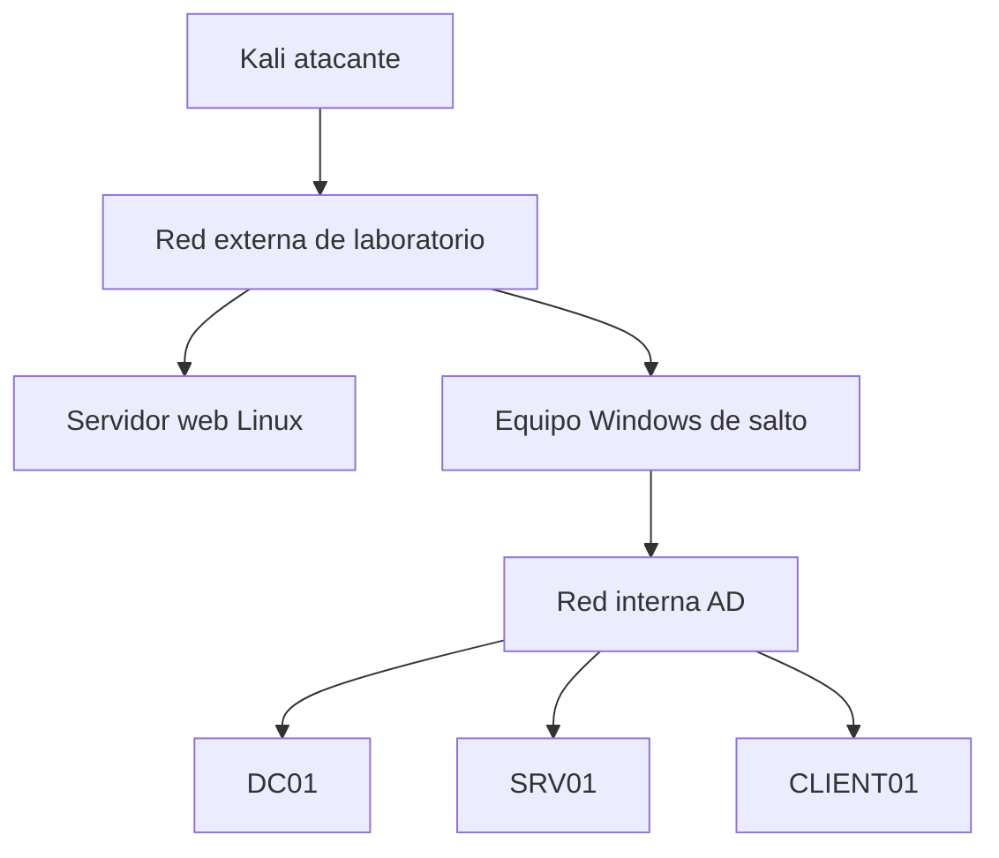

# Laboratorios

Los laboratorios deben ejecutarse únicamente en máquinas propias o plataformas que autoricen expresamente estas técnicas. Crea snapshots y separa la red de práctica de tu red doméstica.

## Topología recomendada

El pivot obliga a practicar rutas. El servidor web permite una entrada no relacionada inicialmente con AD. El dominio necesita al menos DC, miembro servidor y cliente para que sesiones, administración local y movimiento lateral tengan significado.

## Reglas

- No uses modo bridge para máquinas vulnerables.
- No reutilices contraseñas personales.
- Haz snapshot antes de cada cadena.
- Registra la configuración vulnerable y su mitigación.
- Resuelve una vez guiado y otra desde cero.
- Si un exploit puede bloquear la VM, clónala.

## Secuencia

| Laboratorio | Habilidad principal |
|---|---|
| [01](01-Reconocimiento-y-servicios.md) | Inventario sin explotación |
| [02](02-Web-a-foothold.md) | Web hasta acceso inicial |
| [03](03-Postexplotacion-y-Privesc.md) | Escalada y credenciales |
| [04](04-Active-Directory.md) | Identidad, Kerberos y movimiento lateral |
| [05](05-Capstone.md) | Cadena completa sin guía |

## Plantilla de entrega

1. Alcance y topología.
2. Inventario de hosts/servicios.
3. Hipótesis planteadas.
4. Evidencias relevantes.
5. Cadena de acceso con privilegio antes/después.
6. Intentos fallidos que cambiaron la estrategia.
7. Impacto y mitigación.
8. Comandos mínimos reproducibles.

