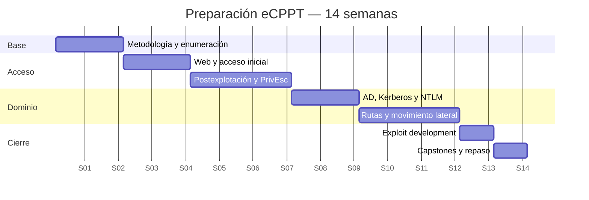

# Plan de estudio de 14 semanas

Este plan parte de eJPT aprobado. No repite desde cero Nmap, Linux o Metasploit; los consolida mientras concentra tiempo en AD, postexplotación y autonomía.

## Distribución

Las fechas son ficticias para mostrar duración; empieza cualquier lunes.

## Rutina por sesión

| Parte | Proporción | Resultado |
|---|---:|---|
| Modelo mental | 20 % | Explicación/dibujo propio |
| Práctica | 60 % | Evidencias y notas |
| Recuperación activa | 20 % | Preguntas sin consultar |

No midas avance por horas de vídeo. Mídelo por prácticas nuevas resueltas sin guía.

## Semanas 1–2: metodología y enumeración

### Contenido

- alcance, inventario e hipótesis;
- Nmap TCP/UDP y outputs;
- DNS, HTTP, SMB/RPC, LDAP, bases y acceso remoto;
- correlación de roles;
- notas y evidencias.

### Salida

Completar Laboratorio 01. Crear inventario utilizable por otra persona.

### Examen de control

Recibir una subred desconocida y encontrar todos los hosts/servicios, incluido un host sin ICMP y un puerto no estándar.

## Semanas 3–4: web y acceso inicial

### Contenido

- HTTP, Burp y fuzzing;
- auth/sesión y rate limiting;
- SQLi, command injection, upload, LFI y XSS;
- usuarios, spraying y servicios remotos;
- web a credencial/shell.

### Salida

Laboratorio 02 resuelto manualmente y con automatización comparada.

### Examen de control

Explicar una petición vulnerable y conseguir foothold sin depender de un scanner web.

## Semanas 5–7: explotación, PrivEsc y pivoting

### Contenido

- validación de CVE/PoC;
- Metasploit con comprensión;
- postexplotación Windows/Linux;
- servicios, tareas, sudo, SUID y capabilities;
- credenciales y hashes;
- shells, transferencia y túneles.

### Salida

Laboratorio 03; repetir sin PEAS. Crear una ruta pivotada y diagnosticar un fallo de retorno.

### Examen de control

Escalar en Windows y Linux explicando precondición, efecto y mitigación.

## Semanas 8–9: fundamentos de AD

### Contenido

- objetos, SID, grupos, OU, GPO y ACL;
- DNS/LDAP;
- Kerberos completo;
- NTLM y materiales de credencial;
- AS-REP y Kerberoasting;
- política y spraying.

### Salida

Dibujar AD/Kerberos de memoria, desplegar dominio de laboratorio y ejecutar ambos roasting explicando diferencias.

### Examen de control

Recibir varios artefactos (hash NT, NetNTLMv2, TGT, TGS) y decidir qué son, para qué sirven y qué no permiten.

## Semanas 10–12: rutas y movimiento lateral

### Contenido

- SharpHound/BloodHound;
- ACL y membresías;
- administración local y sesiones;
- Impacket y NetExec;
- PTH y PTT;
- WinRM/RDP/SMB/MSSQL;
- Domain Admin y Tier Zero.

### Salida

Laboratorio 04. Resolver una segunda versión con nombres/relaciones cambiados.

### Examen de control

Explicar cada arista de una ruta y demostrar al menos dos movimientos laterales distintos.

## Semana 13: exploit development

### Contenido

- lectura y reparación de PoC;
- bytes/strings y protocolos;
- patrón, offset, EIP, badchars y redirección;
- mitigaciones;
- payload y diagnóstico.

### Salida

Modificar un PoC y completar buffer overflow clásico desde snapshot.

## Semana 14: capstone

Completar Laboratorio 05 con ventana de tiempo. Después:

1. Rehacer la cadena sin notas de comandos.
2. Identificar el mayor bloqueo conceptual.
3. Crear una práctica específica para ese bloqueo.
4. Repetir solo el bloque débil.

## Semáforo de preparación

| Estado | Evidencia |
|---|---|
| Rojo | Necesitas walkthrough para avanzar |
| Amarillo | Resuelves rutas conocidas, pero te bloquean variaciones |
| Verde | Resuelves dos capstones nuevos y explicas todos los saltos |

No compres/actives un voucher por presión de calendario si sigues en rojo. Los criterios técnicos deben decidir la fecha.

