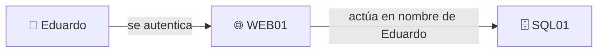
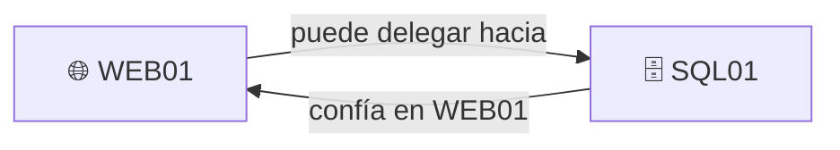
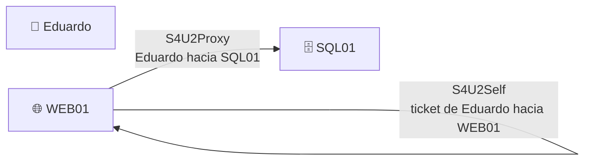

# **Kerberos Delegation**.

La idea base es esta:

> **Delegación Kerberos = permitir que un servicio pueda actuar en nombre de un usuario frente a otro servicio.**

Ejemplo humano: tú entras en una web corporativa y esa web necesita acceder a un servidor SQL usando tu identidad. En vez de pedirte otra vez usuario y contraseña, Kerberos puede permitir que la web “hable con SQL en tu nombre”.



Eso es legítimo. El problema ofensivo aparece cuando **la delegación está mal configurada** o cuando controlas una cuenta/equipo al que se le ha dado demasiada capacidad de delegación.

## 1. Unconstrained Delegation

Es la versión más permisiva.

```text
Usuario
  ↓
Servicio A
  ↓
Servicio A puede reutilizar ampliamente
la identidad Kerberos del usuario
```

Mentalmente:

> “Confío muchísimo en este servidor para que actúe en nombre de usuarios.”

Por eso es peligrosa: si comprometes ese servidor, las sesiones de usuarios privilegiados pueden convertirse en algo muy interesante.

---

## 2. Constrained Delegation

Aquí ya se limita el alcance.

```text
WEB01
→ puede actuar en nombre de usuarios
→ PERO solo contra servicios concretos
```

Ejemplo:

```text
WEB01
→ permitido delegar hacia
MSSQLSvc/SQL01
```

Eso significa:

> WEB01 puede representar a usuarios frente a SQL01, pero no frente a cualquier servicio del dominio.

Es bastante más controlado que Unconstrained.

---

## 3. RBCD

**Resource-Based Constrained Delegation**.

Aquí cambia quién decide.

En constrained delegation tradicional:

> “La cuenta origen tiene configurado hacia dónde puede delegar.”

En RBCD:

> **El recurso destino decide qué cuentas pueden actuar en nombre de otros hacia él.**

Ejemplo:

```text
SQL01 dice:
“WEB01 puede actuar en nombre de usuarios contra mí.”
```

Mentalmente:



Por eso RBCD aparece mucho en BloodHound: si tienes permisos para modificar cierto objeto `Computer`, podrías llegar a influir en esa relación de delegación.

---

## S4U2Self

Este concepto significa, simplificando:

> **Un servicio pide un ticket Kerberos para un usuario hacia sí mismo.**

Mentalmente:

```text
WEB01
↓
“quiero un ticket que represente a Eduardo
para mi propio servicio”
```

---

## S4U2Proxy

Después:

> **Ese servicio usa la delegación para pedir otro ticket hacia un segundo servicio.**

```text
WEB01
↓
tengo representación de Eduardo
↓
pido acceso hacia SQL01
en nombre de Eduardo
```

Así:



No necesitas memorizar todavía los nombres perfectos. Quédate con:

```text
S4U2Self
→ representar usuario ante MI servicio

S4U2Proxy
→ llevar esa representación hacia OTRO servicio
```

## ¿Qué tiene que ver BloodHound?

Muchísimo.

Puedes encontrarte rutas conceptuales como:

```text
Eduardo
↓ GenericWrite
WEB01
↓ Delegation
SQL01
```

Entonces la pregunta ofensiva sería:

> “Si puedo controlar suficientemente WEB01 o su configuración en AD, ¿puedo aprovechar su delegación para actuar como otra identidad frente a SQL01?”

Ese es el concepto.

La chuleta más corta sería:

```text
Unconstrained
→ delegación muy amplia

Constrained
→ delegación solo hacia servicios concretos

RBCD
→ el destino decide quién puede delegar hacia él

S4U2Self
→ ticket en nombre de usuario hacia el propio servicio

S4U2Proxy
→ llevar esa identidad hacia otro servicio
```

Lo siguiente que haría es ponerte **un ejemplo BloodHound pequeño con Delegation para que tú lo interpretes**, igual que hicimos con ACL Abuse.
