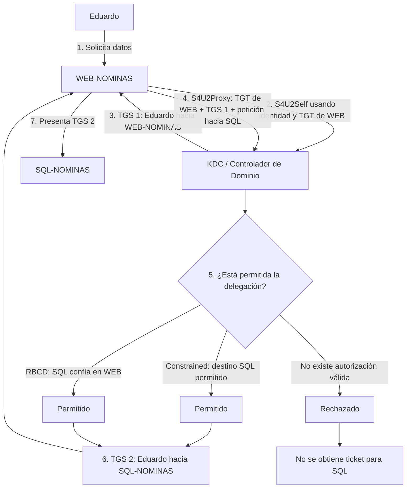

Sí. Tu procedimiento está **muy cerca**, pero hay tres correcciones importantes: `S4U2Self` y `S4U2Proxy` **no son usuarios distintos**, WEB-NOMINAS utiliza **la misma identidad de servicio** durante todo el proceso, y que Eduardo sea administrador de WEB-NOMINAS **no es necesario para que exista delegación**; basta con que sea el usuario cuya identidad la aplicación necesita representar.

Imagina que Eduardo ya está autenticado en `WEB-NOMINAS` y pulsa algo como “ver mis nóminas”. Los datos reales están en `SQL-NOMINAS`, así que WEB necesita consultar SQL **en nombre de Eduardo**.

`WEB-NOMINAS` tiene su propia identidad Kerberos, por ejemplo una cuenta de servicio, y dispone de su propio TGT. Ese TGT pertenece a **WEB**, no a Eduardo.

Primero ocurre **S4U2Self**. WEB habla con el KDC utilizando su propia identidad y le pide aproximadamente:

> «Soy WEB-NOMINAS. Quiero un ticket para mi propio servicio, pero donde el usuario representado sea Eduardo.»

El KDC devuelve un **TGS para WEB-NOMINAS cuya identidad de cliente es Eduardo**.

Tu comparación con un token es útil mentalmente:

> «Tengo una representación Kerberos de Eduardo.»

Pero técnicamente sigue siendo un **ticket Kerberos**, no un token de Windows.

Después WEB todavía **no puede presentar ese ticket directamente a SQL**, porque ese ticket está cifrado y destinado a `WEB-NOMINAS`, no a `SQL-NOMINAS`.

Por eso existe **S4U2Proxy**.

WEB vuelve a hablar con el KDC utilizando **su mismo TGT de WEB-NOMINAS** y presenta además el ticket anterior como *evidence ticket*. Le pide:

> «Estoy representando a Eduardo. Ahora quiero un ticket para `SQL-NOMINAS` en nombre de Eduardo.»

Aquí es donde el KDC comprueba si esa delegación está permitida.

Si lo está, devuelve:

```text
TGS:
Eduardo → SQL-NOMINAS
```

Ese sí es el ticket final que `WEB-NOMINAS` presenta al servicio SQL. Desde el punto de vista de SQL, la identidad que aparece es **Eduardo**.

El flujo completo queda así:



La diferencia de los casos es:

```text
Constrained Delegation
WEB dice:
"tengo permitido delegar hacia SQL"

RBCD
SQL dice:
"permito que WEB delegue hacia mí"

Sin permiso de delegación
KDC dice:
"no te doy el ticket"
```

Y una precisión importante: **Unconstrained Delegation no sigue exactamente este mismo flujo S4U2Self → S4U2Proxy**. Ahí el modelo tradicional es más amplio y puede implicar que el servidor delegado disponga del TGT reenviado del usuario. Por eso conviene estudiarlo aparte.

La idea que ya tienes correcta es:

```text
WEB sigue siendo WEB todo el tiempo.

Eduardo
= identidad representada.

TGS 1
= Eduardo ante WEB.

TGS 2
= Eduardo ante SQL.

TGS 2
= el que finalmente se presenta a SQL.
```
