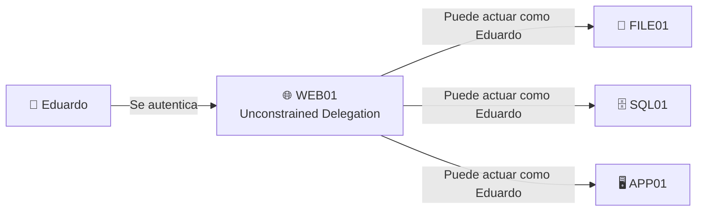
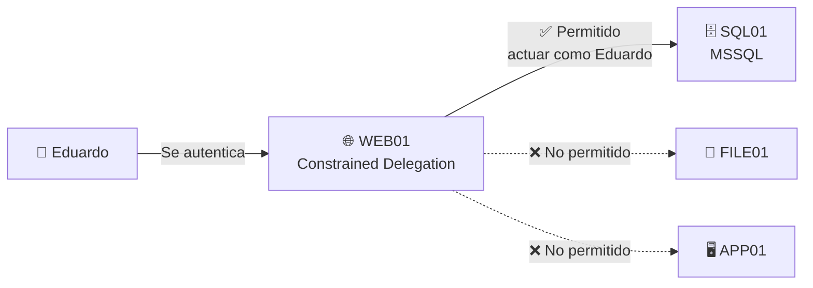
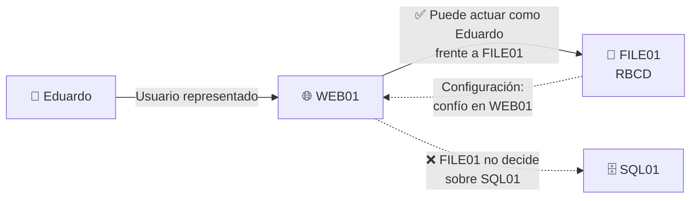

# **Unconstrained Delegation**, **Constrained Delegation** y **RBCD (Resource-Based Constrained Delegation)**. Vamos a usar exactamente el mismo escenario para que veas qué cambia.

## 1. Unconstrained Delegation — «confío muchísimo en WEB01»

Eduardo se autentica en una aplicación de `WEB01`. Esa aplicación necesita acceder a otros recursos en nombre de Eduardo.



Aquí la confianza es **muy amplia**.

La idea humana es:

> «WEB01, confío tanto en ti que cuando Eduardo venga a ti podrás representar su identidad Kerberos frente a otros servicios.»

Por eso históricamente es peligrosa. Si un usuario muy privilegiado se autentica contra un servidor con Unconstrained Delegation, ese servidor puede manejar material Kerberos muy interesante de ese usuario.

Mentalmente:

```text
Eduardo
↓
WEB01
↓
"puedo representar a Eduardo ampliamente"
↓
otros servicios
```

---

# 2. Constrained Delegation — «sí, pero SOLO hacia SQL01»

Ahora queremos solucionar el problema anterior.

WEB01 necesita representar a Eduardo, pero **únicamente para acceder al servicio SQL de SQL01**.



La configuración conceptualmente dice:

```text
WEB01 puede delegar hacia:

MSSQLSvc/SQL01
```

Entonces:

> «WEB01 puede representar a Eduardo, pero solamente frente al servicio que yo he especificado.»

Esto es mucho más restrictivo.

```text
Unconstrained
→ "puedes representar al usuario ampliamente"

Constrained
→ "puedes representarlo SOLO hacia estos servicios"
```

Aquí aparecen los conceptos que mencionamos antes:

```text
S4U2Self
→ el servicio obtiene representación de un usuario
   frente a sí mismo

S4U2Proxy
→ utiliza esa representación para solicitar
   acceso al servicio permitido
```

---

# 3. RBCD — «FILE01 decide en quién confía»

Aquí cambia la dirección de la configuración.

Supongamos que `WEB01` necesita representar a Eduardo frente a `FILE01`.

Con **RBCD**, es `FILE01` quien dice:

> «Permito que WEB01 actúe en nombre de usuarios contra mí.»



Aquí piensa al revés.

En **Constrained Delegation tradicional**:

```text
WEB01 dice:

"Yo puedo delegar hacia SQL01."
```

En **RBCD**:

```text
FILE01 dice:

"WEB01 puede delegar hacia mí."
```

Por eso se llama:

**Resource-Based Constrained Delegation**

porque la confianza se configura **en el recurso destino**.

---

# Los tres juntos

La diferencia fundamental es esta:

```text
UNCONSTRAINED

WEB01
→ "puedo representar usuarios ampliamente"
```

```text
CONSTRAINED

WEB01
→ "puedo representar usuarios,
   pero SOLO hacia SQL01/MSSQL"
```

```text
RBCD

FILE01
→ "yo soy el destino
   y decido que WEB01
   puede representar usuarios contra mí"
```

Y para BloodHound, la pregunta ofensiva que vas a hacerte más adelante es muy sencilla:

```text
¿Controlo algún usuario/equipo?
        ↓
¿Ese objeto participa en una delegación?
        ↓
¿Hacia qué servicio/equipo?
        ↓
¿En nombre de qué identidad
podría llegar a actuar?
```

La que suele costar más al principio es **RBCD**, porque mentalmente tienes que darle la vuelta a la flecha: **en RBCD manda el destino**.
