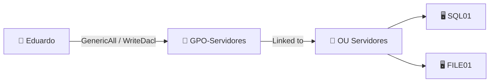

**ACL Abuse** es el concepto general. Consiste en aprovechar permisos mal asignados entre objetos de Active Directory. BloodHound puede enseñarte relaciones como `GenericAll`, `GenericWrite`, `WriteDacl`, `WriteOwner`, `ForceChangePassword` o `AddMember`. Eso significa que tu usuario puede modificar, controlar o influir sobre otro usuario, grupo, equipo o incluso una GPO.

**GPO Abuse** es un caso más concreto. Ocurre cuando, gracias a esos permisos, puedes modificar una GPO que está vinculada a una OU, dominio o sitio. Como esa GPO puede afectar a muchos usuarios o equipos, controlar una sola GPO puede darte influencia sobre muchos hosts a la vez.

Por ejemplo:



La interpretación sería:

> Eduardo tiene un permiso ACL potente sobre `GPO-Servidores`.
> Esa GPO afecta a `OU Servidores`.
> Dentro de esa OU están `SQL01` y `FILE01`.
> Por tanto, controlar la GPO puede convertirse en una ruta para influir sobre esos equipos.

En un laboratorio autorizado, el flujo mental sería:

```text
Credenciales válidas
↓
BloodHound
↓
veo permisos ACL interesantes
↓
¿sobre qué objeto?
↓
usuario / grupo / equipo / GPO
↓
si es una GPO:
¿a qué OU está vinculada?
↓
¿qué equipos o usuarios reciben esa GPO?
↓
modifico una configuración útil
↓
la política se aplica
↓
obtengo una posición mejor
```

Así que quédate con esta frase:

> **ACL Abuse = “tengo permisos indebidos sobre un objeto”.**
> **GPO Abuse = “ese objeto que controlo es una GPO y puedo aprovechar su alcance sobre otros equipos o usuarios”.**

De hecho, muchas veces **GPO Abuse nace de ACL Abuse**. BloodHound te muestra el permiso, y tú te das cuenta de que ese permiso termina llevándote a una GPO muy interesante.
