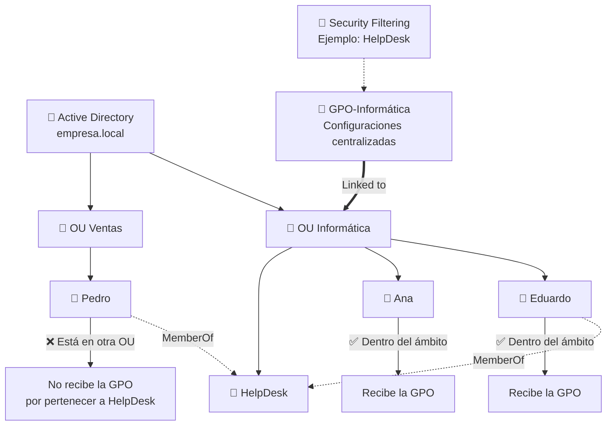

Una **unidad organizativa u OU** sirve principalmente para organizar objetos dentro de Active Directory. Podemos colocar dentro usuarios, equipos, grupos y otras OUs. El mero hecho de colocar a un usuario dentro de una OU no le concede automáticamente ningún permiso ni privilegio. Su función principal es organizar la estructura y permitir administrar objetos de forma conjunta.

Los **grupos** también permiten agrupar objetos, pero tienen una finalidad diferente. Un usuario puede pertenecer a un grupo como `HelpDesk`, `Developers` o `Server-Admins`. El hecho de pertenecer al grupo tampoco concede necesariamente un permiso por sí solo. Sin embargo, otros recursos pueden conceder permisos al grupo. Por ejemplo, un host puede configurar que los miembros de `HelpDesk` sean administradores locales. En ese caso, Eduardo obtiene indirectamente ese privilegio porque pertenece al grupo.

Las **GPO**, o Group Policy Objects, son conjuntos de configuraciones centralizadas de Active Directory. Pueden configurar aspectos como el fondo de pantalla, el firewall, servicios, scripts, restricciones, el Administrador de tareas y muchas otras opciones de Windows. Normalmente se vinculan a un **Site, Domain u OU**.

Si una GPO está vinculada a `OU Informática`, se aplicará a los **usuarios y equipos cuyo objeto se encuentre dentro del ámbito de esa OU**. Si Eduardo y Ana están ubicados allí, podrán recibir esa política.

Aquí aparece una diferencia muy importante con los grupos. Si el objeto `HelpDesk` está guardado dentro de `OU Informática`, la GPO **no entra dentro del grupo para buscar a Eduardo, Pedro y el resto de sus miembros**. La membresía del grupo es una relación diferente.

Por ejemplo, Pedro puede estar ubicado en:

```text
OU Ventas
└── Pedro
```

y simultáneamente pertenecer a:

```text
Pedro
└── MemberOf → HelpDesk
```

Aunque el grupo `HelpDesk` esté guardado en `OU Informática`, Pedro **no pasa a formar parte de esa OU** y no recibe su GPO por ese motivo.

El **Security Filtering** tampoco hace que la GPO atraviese grupos situados dentro de la OU. Su función es distinta: permite decir **qué usuarios o equipos, de entre los que ya están dentro del ámbito de la GPO, están autorizados a aplicarla**.

Por ejemplo:

```text
GPO-Informática
↓
Linked to → OU Informática

OU Informática
├── Eduardo → HelpDesk
├── Ana → Developers
└── Juan → HelpDesk

Security Filtering:
HelpDesk
```

Resultado:

```text
Eduardo ✅
Juan    ✅
Ana     ❌
```

Es decir, la **OU define el ámbito** y el **Security Filtering restringe quién dentro de ese ámbito recibe finalmente la GPO**.
