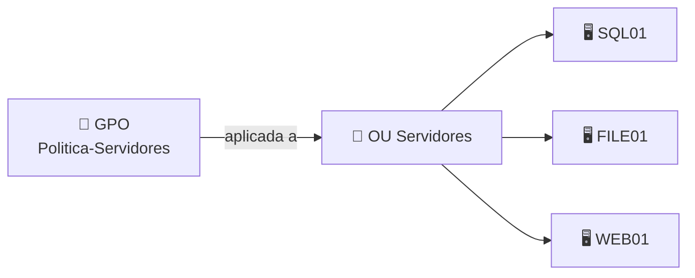
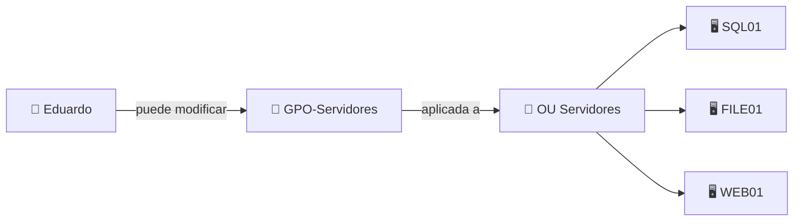

Sí. **GPO Abuse** es mucho más fácil si piensas en una GPO como un **“mando a distancia centralizado” de Windows**.

### ¿Qué es una GPO?

Una **Group Policy Object** contiene configuraciones que Active Directory puede aplicar automáticamente a usuarios y ordenadores.

Por ejemplo:

```text
GPO: "Política Servidores"

→ desactivar una función
→ configurar Firewall
→ ejecutar scripts
→ configurar servicios
→ definir grupos locales
→ aplicar configuraciones de seguridad
```

La GPO normalmente está vinculada a un ámbito como una **OU**.



Eso significa que una única configuración puede afectar a **muchas máquinas de golpe**.

---

## ¿Qué es GPO Abuse?

Ahora imagina que BloodHound descubre:

```text
Eduardo
   ↓
GenericAll / WriteDacl / algún permiso de modificación
   ↓
GPO-Servidores
```

Eso significa conceptualmente:

> **Eduardo puede modificar una política que afecta a otros equipos.**

Y ahí aparece el abuso.



Lo importante es que Eduardo **no necesita ser administrador directamente de SQL01, FILE01 y WEB01**.

Puede existir una ruta:

```text
Eduardo
   ↓
controla GPO
   ↓
GPO afecta a OU Servidores
   ↓
SQL01
FILE01
WEB01
```

---

## ¿Qué podría conseguir alguien controlando una GPO?

Dependiendo de la política y del ámbito, potencialmente podría provocar cambios como:

```text
añadir una cuenta a un grupo local privilegiado

ejecutar un script en los equipos

crear/configurar tareas

modificar configuraciones de seguridad

cambiar servicios

aplicar determinadas configuraciones
```

Por eso una GPO mal protegida es tan interesante: **un único objeto de Active Directory puede darte influencia sobre decenas o cientos de máquinas**.

---

## Relación con ACL Abuse

Aquí conecta perfectamente con lo que acabamos de estudiar.

```text
ACL Abuse
   ↓
descubro que tengo permisos
sobre una GPO
   ↓
GPO Abuse
   ↓
la GPO afecta a muchos hosts
```

Es decir:

> **ACL Abuse = cómo consigo capacidad de modificar el objeto.**
> **GPO Abuse = qué puedo conseguir aprovechando el control de una GPO.**

### Chuleta para memorizar

```text
GPO
→ configuración centralizada de Windows

GPO se vincula a
→ dominio / OU / ámbito determinado

GPO Abuse
→ puedo modificar una GPO que afecta a otros equipos

Pregunta clave:
¿A QUÉ EQUIPOS/USUARIOS SE APLICA ESTA GPO?

Gran peligro:
1 GPO comprometida
→ muchos hosts afectados
```

Y en BloodHound tu pensamiento debería ser:

> **“Puedo controlar esta GPO. Vale… ¿a qué OU está vinculada y qué ordenadores hay dentro?”**

Esa es prácticamente toda la base conceptual que necesitas antes de empezar a interpretar ejemplos.
