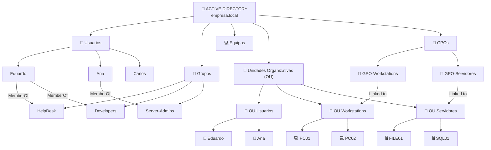
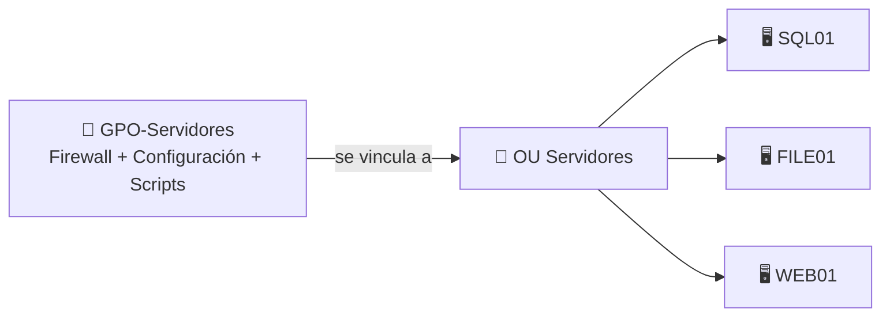

Sí. La estructura mental correcta sería esta, con una corrección importante: **una OU no es un grupo**. Se parece en que “contiene cosas”, pero su función es organizar objetos de AD y servir, entre otras cosas, como ámbito para aplicar GPOs.



La idea sería:

```text
USUARIOS
→ Eduardo
→ Ana
→ Carlos

GRUPOS
→ HelpDesk
→ Developers
→ Server-Admins

Eduardo
→ puede pertenecer a HelpDesk y Developers

OU
→ organiza objetos
→ puede contener usuarios
→ puede contener equipos
→ puede contener otras OUs
→ también puede contener grupos
```

Pero lo más importante:

> **Pertenecer a un grupo y estar dentro de una OU son cosas completamente distintas.**

Ejemplo:

```text
Eduardo
├─ MemberOf → HelpDesk
└─ ubicado en → OU Usuarios
```

`HelpDesk` te dice **qué membresías/permisos puede heredar Eduardo**.

`OU Usuarios` te dice **dónde está organizado el objeto Eduardo dentro de AD**.

### Y las GPO

Aquí lo has entendido prácticamente bien.

Una GPO normalmente se **vincula** a:

```text
Site
Domain
OU
```

No directamente a:

```text
Usuario individual
Grupo individual
```

Ejemplo:



Así que:

```text
GPO-Servidores
        ↓
OU Servidores
        ↓
SQL01
FILE01
WEB01
```

Los **equipos que están dentro de esa OU** reciben la configuración de equipo de esa GPO, siempre que se cumplan las condiciones de aplicación.

Y para usuarios igual:

```text
GPO-Usuarios
     ↓
OU Usuarios
     ↓
Eduardo
Ana
Carlos
```

### Un matiz importante sobre los grupos

Has dicho:

> “Por eso es importante meter los grupos o equipos en las OUs para aplicar GPOs.”

Los **equipos y usuarios**, sí.

Los **grupos**, no exactamente.

Las GPO no se procesan “sobre un grupo” como si el grupo fuese el objetivo principal. Se procesan sobre **usuarios y equipos**. Lo que sí puedes hacer es utilizar grupos para **filtrar** quién recibe una GPO.

Por ejemplo:

```text
GPO
 ↓ vinculada a
OU Servidores
 ↓

SQL01
FILE01
WEB01

pero:

Security Filtering
→ solo ciertos usuarios/equipos/grupos autorizados
```

Para tu cabeza:

> **OU = dónde coloco los objetos.**
> **Grupo = qué usuarios/equipos están relacionados por membresía.**
> **GPO = qué configuración quiero aplicar.**

Y:

```text
GPO
→ se vincula a una OU
→ la OU contiene usuarios/equipos
→ esos usuarios/equipos reciben la política
```

Ese es el modelo que necesitas para entender después **GPO Abuse**.
